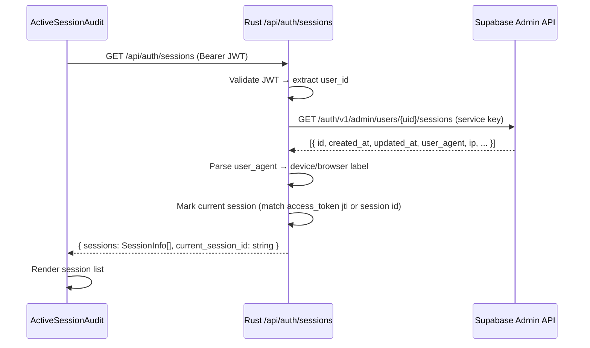
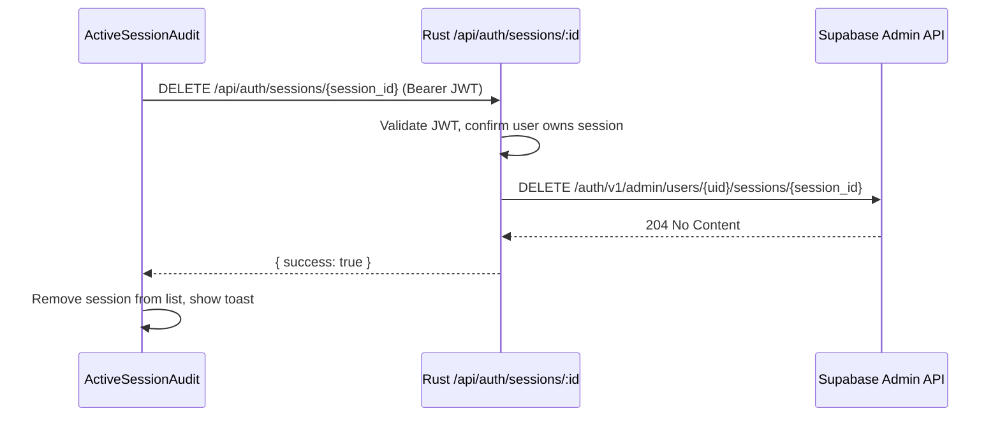
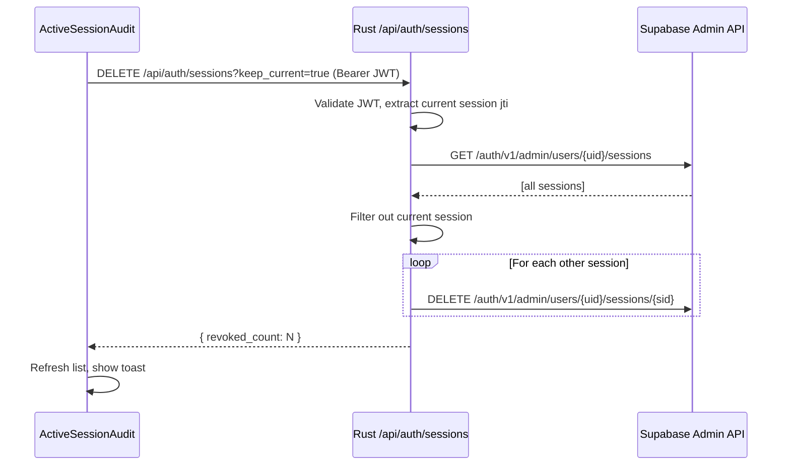

# Design Document: Active Session Audit

## Overview

The Active Session Audit feature gives Likelee users visibility into every active login session on their account — showing device, browser, approximate location, and last-active time — and lets them revoke individual sessions or sign out all other devices in one action. It also surfaces a paginated login history trail. The feature lives inside the existing **Security & Legal** settings tab present in all three dashboards (Creator/Brand/Agency) and replaces the current "Coming Soon" placeholder button.

The feature spans three layers:
1. **Supabase Auth** — the source of truth for session tokens; revocation is performed via the Supabase Admin API (`DELETE /auth/v1/admin/users/{uid}/sessions/{sid}` and `DELETE /auth/v1/admin/users/{uid}/sessions`).
2. **Rust backend** (`likelee-server`) — a thin proxy layer that holds the Supabase service key, enforces JWT authentication, and exposes safe REST endpoints to the frontend.
3. **React frontend** (`likelee-ui`) — a new `ActiveSessionAudit` component rendered inside the Security & Legal tab of each dashboard.

---

## Architecture

```mermaid
graph TD
    subgraph Browser
        A[Security & Legal Tab]
        B[ActiveSessionAudit Component]
        C[useSessionAudit Hook]
        D[api/sessions.ts]
    end

    subgraph Rust Server
        E[/api/auth/sessions GET]
        F[/api/auth/sessions/:id DELETE]
        G[/api/auth/sessions DELETE]
        H[/api/auth/login-history GET]
        I[AuthUser extractor]
    end

    subgraph Supabase
        J[auth.sessions table]
        K[Supabase Admin API]
        L[auth.audit_log_entries]
    end

    A --> B
    B --> C
    C --> D
    D -->|Bearer JWT| E
    D -->|Bearer JWT| F
    D -->|Bearer JWT| G
    D -->|Bearer JWT| H
    E --> I --> K --> J
    F --> I --> K
    G --> I --> K
    H --> I --> L
```

---

## Sequence Diagrams

### Load Sessions



### Revoke Single Session



### Sign Out All Other Sessions



---

## Components and Interfaces

### Component: `ActiveSessionAudit`

**Location**: `likelee-ui/src/components/security/ActiveSessionAudit.tsx`

**Purpose**: Self-contained panel that renders the session list, login history, and revocation controls. Designed to be dropped into any dashboard's Security & Legal tab.

**Interface**:
```typescript
interface ActiveSessionAuditProps {
  /** Visual style variant to match the host dashboard */
  variant?: "brand" | "agency" | "creator";
}
```

**Responsibilities**:
- Fetch and display active sessions on mount
- Identify and badge the current session
- Provide per-session revoke button (disabled for current session)
- Provide "Sign out all other devices" bulk action
- Render a collapsible login history section (last 30 events)
- Handle loading, empty, and error states

---

### Component: `SessionCard`

**Location**: `likelee-ui/src/components/security/SessionCard.tsx`

**Purpose**: Renders a single session row with device icon, metadata, and revoke action.

**Interface**:
```typescript
interface SessionCardProps {
  session: SessionInfo;
  isCurrent: boolean;
  onRevoke: (sessionId: string) => void;
  isRevoking: boolean;
}
```

---

### Hook: `useSessionAudit`

**Location**: `likelee-ui/src/hooks/useSessionAudit.ts`

**Purpose**: Encapsulates all data-fetching and mutation logic for the session audit panel.

**Interface**:
```typescript
interface UseSessionAuditReturn {
  sessions: SessionInfo[];
  loginHistory: LoginEvent[];
  currentSessionId: string | null;
  isLoading: boolean;
  isRevoking: boolean;
  error: string | null;
  revokeSession: (sessionId: string) => Promise<void>;
  revokeAllOtherSessions: () => Promise<void>;
  refresh: () => void;
}
```

---

### API Module: `api/sessions.ts`

**Location**: `likelee-ui/src/api/sessions.ts`

**Purpose**: Typed wrappers around the Rust backend session endpoints, following the same pattern as `api/functions.ts`.

**Interface**:
```typescript
export const listSessions: () => Promise<ListSessionsResponse>
export const revokeSession: (sessionId: string) => Promise<void>
export const revokeAllOtherSessions: () => Promise<RevokeAllResponse>
export const getLoginHistory: (params?: { limit?: number }) => Promise<LoginHistoryResponse>
```

---

### Rust Handler Module: `sessions/`

**Location**: `likelee-server/src/sessions/` (directory module, matching the pattern of `team/`, `studio/`, `services/`)

**File layout**:
- `mod.rs` — public re-exports and sub-module declarations
- `types.rs` — all shared structs (`SessionInfo`, `LoginEvent`, response types)
- `ua_parser.rs` — `parse_user_agent` function
- `current_session.rs` — `identify_current_session` function
- `handlers.rs` — the four axum handler functions

**Purpose**: Handles all session-related HTTP requests, proxying to the Supabase Admin API using the service key stored in `AppState`.

**Interface**:
```rust
pub async fn list_sessions(
    State(state): State<AppState>,
    user: AuthUser,
) -> impl IntoResponse

pub async fn revoke_session(
    State(state): State<AppState>,
    user: AuthUser,
    Path(session_id): Path<String>,
) -> impl IntoResponse

pub async fn revoke_all_other_sessions(
    State(state): State<AppState>,
    user: AuthUser,
) -> impl IntoResponse

pub async fn get_login_history(
    State(state): State<AppState>,
    user: AuthUser,
    Query(params): Query<LoginHistoryParams>,
) -> impl IntoResponse
```

---

## Data Models

### `SessionInfo` (shared frontend type)

```typescript
interface SessionInfo {
  id: string;
  created_at: string;        // ISO 8601 — session start time
  last_active_at: string;    // ISO 8601 — last token refresh
  ip_address: string | null;
  user_agent: string | null;
  // Parsed from user_agent by the backend
  device_label: string;      // e.g. "Chrome on macOS", "Safari on iPhone"
  device_type: "desktop" | "mobile" | "tablet" | "unknown";
  is_current: boolean;
}
```

**Validation Rules**:
- `id` must be a non-empty UUID string
- `created_at` and `last_active_at` must be valid ISO 8601 timestamps
- `device_label` is always non-empty (falls back to `"Unknown Device"`)
- `is_current` is set server-side by comparing the session id embedded in the caller's JWT

---

### `LoginEvent` (shared frontend type)

```typescript
interface LoginEvent {
  id: string;
  event_type: "login" | "logout" | "token_refreshed" | "mfa_verified";
  created_at: string;
  ip_address: string | null;
  user_agent: string | null;
  device_label: string;
}
```

---

### `ListSessionsResponse` (API response)

```typescript
interface ListSessionsResponse {
  sessions: SessionInfo[];
  current_session_id: string;
}
```

---

### `LoginHistoryResponse` (API response)

```typescript
interface LoginHistoryResponse {
  events: LoginEvent[];
  total: number;
}
```

---

### Rust `SessionInfo` struct

```rust
#[derive(Debug, Serialize, Deserialize)]
pub struct SessionInfo {
    pub id: String,
    pub created_at: String,
    pub last_active_at: String,
    pub ip_address: Option<String>,
    pub user_agent: Option<String>,
    pub device_label: String,
    pub device_type: String,
    pub is_current: bool,
}
```

---

## Key Functions with Formal Specifications

### `parse_user_agent(ua: &str) -> (String, String)`

Parses a raw User-Agent string into a human-readable label and device type.

**Preconditions**:
- `ua` is a UTF-8 string (may be empty)

**Postconditions**:
- Returns `(label, device_type)` where `label` is never empty (falls back to `"Unknown Device"`)
- `device_type` ∈ `{"desktop", "mobile", "tablet", "unknown"}`
- No side effects

**Loop Invariants**: N/A (pattern matching, no loops)

---

### `identify_current_session(sessions: &[SupabaseSession], jwt_claims: &Claims) -> Option<String>`

Determines which session in the list corresponds to the caller's active JWT.

**Preconditions**:
- `sessions` is a non-empty slice of valid Supabase session objects
- `jwt_claims.sub` is a valid user UUID

**Postconditions**:
- Returns `Some(session_id)` if a matching session is found
- Returns `None` if no match (e.g. session was already revoked)
- Does not mutate input

**Matching strategy**: Compare `jwt_claims.session_id` (the `sid` claim Supabase embeds in JWTs) against `session.id`.

---

### `revokeSession(sessionId: string): Promise<void>` (frontend)

Calls the backend to revoke a specific session and updates local state.

**Preconditions**:
- `sessionId` is a non-empty string
- `sessionId` does not equal `currentSessionId` (enforced by disabling the button in UI)

**Postconditions**:
- On success: session is removed from the `sessions` array in hook state; success toast is shown
- On failure: error toast is shown; `sessions` array is unchanged
- `isRevoking` returns to `false` in both cases

---

### `revokeAllOtherSessions(): Promise<void>` (frontend)

Calls the backend to revoke all sessions except the current one.

**Preconditions**:
- User has confirmed the action via a confirmation dialog

**Postconditions**:
- On success: `sessions` array contains only the current session; success toast shown with revoked count
- On failure: error toast shown; state unchanged
- Confirmation dialog is closed in both cases

---

## Algorithmic Pseudocode

### Main Session Load Algorithm

```pascal
ALGORITHM loadSessions(userId)
INPUT: userId — authenticated user's UUID
OUTPUT: { sessions: SessionInfo[], currentSessionId: string }

BEGIN
  ASSERT userId IS NOT NULL AND NOT EMPTY

  // Step 1: Fetch raw sessions from Supabase Admin API
  rawSessions ← supabase_admin.GET("/auth/v1/admin/users/{userId}/sessions")

  IF rawSessions IS ERROR THEN
    RETURN Error("Failed to fetch sessions")
  END IF

  // Step 2: Identify current session from JWT claims
  jwtClaims ← extract_claims(caller_access_token)
  currentSessionId ← identify_current_session(rawSessions, jwtClaims)

  // Step 3: Transform each raw session
  sessions ← []
  FOR each raw IN rawSessions DO
    ASSERT raw.id IS NOT NULL

    (label, deviceType) ← parse_user_agent(raw.user_agent OR "")
    session ← SessionInfo {
      id: raw.id,
      created_at: raw.created_at,
      last_active_at: raw.updated_at OR raw.created_at,
      ip_address: raw.ip,
      user_agent: raw.user_agent,
      device_label: label,
      device_type: deviceType,
      is_current: raw.id = currentSessionId
    }
    sessions.append(session)
  END FOR

  // Step 4: Sort — current session first, then by last_active_at descending
  sessions ← sort(sessions, key: (s) => (NOT s.is_current, DESC s.last_active_at))

  ASSERT sessions.length >= 1  // caller's own session must always be present

  RETURN { sessions, currentSessionId }
END
```

---

### Revoke All Other Sessions Algorithm

```pascal
ALGORITHM revokeAllOtherSessions(userId, currentSessionId)
INPUT: userId — authenticated user's UUID
       currentSessionId — session ID to preserve
OUTPUT: { revoked_count: integer }

BEGIN
  ASSERT userId IS NOT NULL
  ASSERT currentSessionId IS NOT NULL

  // Step 1: Fetch all sessions
  allSessions ← supabase_admin.GET("/auth/v1/admin/users/{userId}/sessions")

  IF allSessions IS ERROR THEN
    RETURN Error("Failed to fetch sessions")
  END IF

  // Step 2: Filter out current session
  toRevoke ← FILTER allSessions WHERE session.id ≠ currentSessionId

  // Step 3: Revoke each session individually
  revokedCount ← 0
  FOR each session IN toRevoke DO
    ASSERT session.id ≠ currentSessionId  // Loop invariant: never revoke current

    result ← supabase_admin.DELETE("/auth/v1/admin/users/{userId}/sessions/{session.id}")
    IF result IS SUCCESS THEN
      revokedCount ← revokedCount + 1
    END IF
    // Non-fatal: continue even if one revocation fails
  END FOR

  RETURN { revoked_count: revokedCount }
END
```

---

## Example Usage

### Rendering the component in BrandDashboard

```typescript
// In BrandDashboard.tsx — Security & Legal tab
import { ActiveSessionAudit } from "@/components/security/ActiveSessionAudit";

// Replace the existing "Coming Soon" placeholder:
<TabsContent value="security" className="space-y-6 mt-0">
  <div className="grid md:grid-cols-2 gap-6">
    <Card className="p-8 bg-white border border-gray-200 rounded-none shadow-none">
      <h3 className="text-xl font-black text-gray-900 mb-8 uppercase tracking-tighter flex items-center gap-3">
        <Shield className="w-6 h-6" /> Security Settings
      </h3>
      <div className="space-y-4">
        <Button variant="outline" onClick={() => navigate("/forgot-password")} ...>
          Reset Admin Password
        </Button>
        <Button variant="outline" onClick={() => navigate("/TwoFactorSetup")} ...>
          Enable 2FA Protection
        </Button>
        {/* NEW: replaces the disabled "Coming Soon" button */}
        <Button variant="outline" onClick={() => setShowSessionAudit(true)} ...>
          Active Session Audit
        </Button>
      </div>
    </Card>
    ...
  </div>

  {/* Session audit panel — shown inline or in a sheet */}
  {showSessionAudit && <ActiveSessionAudit variant="brand" />}
</TabsContent>
```

### Using the hook directly

```typescript
const {
  sessions,
  loginHistory,
  currentSessionId,
  isLoading,
  revokeSession,
  revokeAllOtherSessions,
} = useSessionAudit();

// Revoke a specific session
await revokeSession("session-uuid-here");

// Sign out all other devices
await revokeAllOtherSessions();
```

### Backend endpoint registration (router.rs)

```rust
// Add to build_router() in likelee-server/src/router.rs
.route(
    "/api/auth/sessions",
    get(crate::sessions::list_sessions)
        .delete(crate::sessions::revoke_all_other_sessions),
)
.route(
    "/api/auth/sessions/:session_id",
    delete(crate::sessions::revoke_session),
)
.route(
    "/api/auth/login-history",
    get(crate::sessions::get_login_history),
)
```

---

## Correctness Properties

*A property is a characteristic or behavior that should hold true across all valid executions of a system — essentially, a formal statement about what the system should do. Properties serve as the bridge between human-readable specifications and machine-verifiable correctness guarantees.*

### Property 1: Current session is never revocable

*For any* session `s` in the rendered list, if `s.is_current === true` then the revoke button for `s` is disabled in the UI, and the DELETE endpoint returns HTTP 403 if `session_id` matches the caller's own JWT `sid` claim.

**Validates: Requirements 3.4, 3.5**

---

### Property 2: Session ownership is enforced

*For any* revocation request, the backend verifies that the target session belongs to the authenticated user (`user_id` from JWT matches the session's user) before calling the Supabase Admin API. A request targeting a session belonging to a different user is rejected.

**Validates: Requirements 6.6**

---

### Property 3: Idempotent revocation

*For any* session ID that has already been revoked (Supabase returns 404), the backend treats the response as success and returns HTTP 200 — the session is gone either way.

**Validates: Requirements 6.9**

---

### Property 4: Sort stability — current session first

*For any* array of `SessionInfo` objects, the sorted output always places the item with `is_current === true` at index 0, with remaining sessions ordered by `last_active_at` descending.

**Validates: Requirements 2.4**

---

### Property 5: Device label completeness

*For any* user-agent string (including empty string, null, or unrecognized formats), `parse_user_agent` returns a non-empty `device_label` string — the parser never returns an empty label.

**Validates: Requirements 7.1, 9.1**

---

### Property 6: Device type is always a valid enum value

*For any* user-agent string, `parse_user_agent` returns a `device_type` that is exactly one of `"desktop"`, `"mobile"`, `"tablet"`, or `"unknown"`.

**Validates: Requirements 7.2, 9.1**

---

### Property 7: Bulk revoke never touches the current session

*For any* set of sessions and any `currentSessionId`, the `revokeAllOtherSessions` operation never includes `currentSessionId` in the set of sessions sent to the Supabase Admin API for deletion.

**Validates: Requirements 4.3**

---

### Property 8: Session list display completeness

*For any* `SessionInfo` object, the rendered `SessionCard` output contains the device label, device type icon, IP address, and last active timestamp.

**Validates: Requirements 2.2**

---

### Property 9: Login history ordering and cap

*For any* set of `LoginEvent` objects returned by the backend, the displayed list is ordered by `created_at` descending and contains at most 50 events (or the specified `limit`, up to 100).

**Validates: Requirements 5.3**

---

### Property 10: JWT validation on every request

*For any* request to a session endpoint that carries an invalid, expired, or missing JWT, the backend rejects the request before executing any session operation.

**Validates: Requirements 6.5**

---

## Error Handling

### Supabase Admin API unavailable

**Condition**: The Rust server cannot reach the Supabase Auth Admin API (network error, timeout, or 5xx).  
**Response**: Return HTTP 502 with `{ error: "session_service_unavailable" }`.  
**Frontend recovery**: Show an inline error state with a "Retry" button; do not crash the settings page.

### Session not found (already revoked)

**Condition**: DELETE to Supabase returns 404 for a session ID.  
**Response**: Treat as success — the session is gone. Return HTTP 200 with `{ success: true }`.  
**Frontend recovery**: Remove the session from the list as normal.

### Attempting to revoke own session

**Condition**: The `session_id` path parameter matches the `sid` claim in the caller's JWT.  
**Response**: Return HTTP 403 with `{ error: "cannot_revoke_current_session" }`.  
**Frontend recovery**: The revoke button is disabled for the current session in the UI, so this is a defence-in-depth guard.

### JWT missing `sid` claim

**Condition**: Older Supabase JWTs may not include a `sid` claim.  
**Response**: Fall back to matching by `user_agent` + `created_at` proximity (best-effort). If no match, `is_current` is `false` for all sessions and a warning is logged server-side.  
**Frontend recovery**: No current-session badge is shown; all sessions show a revoke button.

---

## Testing Strategy

### Unit Testing Approach

- `parse_user_agent` — test with common UA strings (Chrome/macOS, Safari/iPhone, Firefox/Windows, empty string, garbage input). Assert correct `device_label` and `device_type` for each.
- `identify_current_session` — test with matching `sid` claim, non-matching claim, and empty session list.
- `useSessionAudit` hook — test with `vitest` + `@testing-library/react-hooks`. Mock `api/sessions.ts`. Assert state transitions for load, revoke, and revoke-all flows.
- `SessionCard` — test that the revoke button is disabled when `isCurrent === true`.

### Property-Based Testing Approach

**Property Test Library**: `fast-check` (already available in the project's ecosystem)

- **Property**: For any array of `SessionInfo` objects, the sorted output always places the item with `is_current === true` at index 0.
- **Property**: For any non-empty `user_agent` string, `parse_user_agent` returns a non-empty `device_label`.
- **Property**: `revokeAllOtherSessions` never includes the `currentSessionId` in the set of revoked IDs.

### Integration Testing Approach

- Test the full round-trip: authenticate a test user, call `GET /api/auth/sessions`, verify the response shape, call `DELETE /api/auth/sessions/:id` for a non-current session, verify it disappears from a subsequent `GET`.
- Use a dedicated Supabase test project or a local Supabase instance via `supabase start`.

---

## Performance Considerations

- The Supabase Admin API `listUserSessions` call is O(sessions per user) — typically 1–10 sessions. No pagination is needed for the session list.
- Login history is capped at 50 events per request (configurable via `limit` query param, max 100) to keep response sizes small.
- The `revokeAllOtherSessions` endpoint issues N sequential DELETE calls to Supabase. For users with many sessions (>10), these should be issued concurrently using `tokio::join_all` in Rust to keep latency acceptable.
- The frontend uses `React.useState` + manual refresh (no polling). A "Refresh" button is provided for users who want up-to-date data without a page reload.

---

## Security Considerations

- **Service key never exposed to frontend**: All Supabase Admin API calls are made server-side in the Rust backend. The `supabase_service_key` is only available in `AppState` and never returned in any API response.
- **JWT validation on every request**: The existing `AuthUser` extractor in `auth.rs` validates the JWT signature and expiry before any handler runs. No additional auth middleware is needed.
- **Session ownership check**: Before revoking, the backend confirms the target session belongs to the authenticated user by fetching the user's session list and checking membership — preventing one user from revoking another user's sessions.
- **IP address handling**: IP addresses are returned to the frontend for display purposes only. They are not stored in any Likelee database table — they come directly from Supabase's session metadata and are treated as transient display data.
- **Rate limiting**: The revoke endpoints should be covered by any existing rate-limiting middleware on the Rust server to prevent abuse.

---

## Dependencies

| Dependency | Location | Purpose |
|---|---|---|
| `supabase-js` (existing) | `likelee-ui` | Client-side session access (`getSession`) |
| Supabase Admin REST API | `likelee-server` | Server-side session list and revocation |
| `reqwest` (existing) | `likelee-server` | HTTP client for Supabase Admin API calls |
| `serde` / `serde_json` (existing) | `likelee-server` | JSON serialization of session data |
| `axum` (existing) | `likelee-server` | HTTP routing and handler framework |
| `ua-parser` or regex | `likelee-server` | User-agent parsing (new, lightweight crate or custom regex) |
| `fast-check` (new, dev-only) | `likelee-ui` | Property-based testing |
| `lucide-react` (existing) | `likelee-ui` | Icons (`Monitor`, `Smartphone`, `Tablet`, `MapPin`, `Clock`) |
| `shadcn/ui` components (existing) | `likelee-ui` | `Card`, `Badge`, `Button`, `Dialog`, `Skeleton` |
