# Likelee AI Database Schema

**Version**: 2.0  
**Last Updated**: 2026-05-06  

This document provides a comprehensive entity-relationship diagram for all tables in the Likelee AI database.

---

## Core Entities

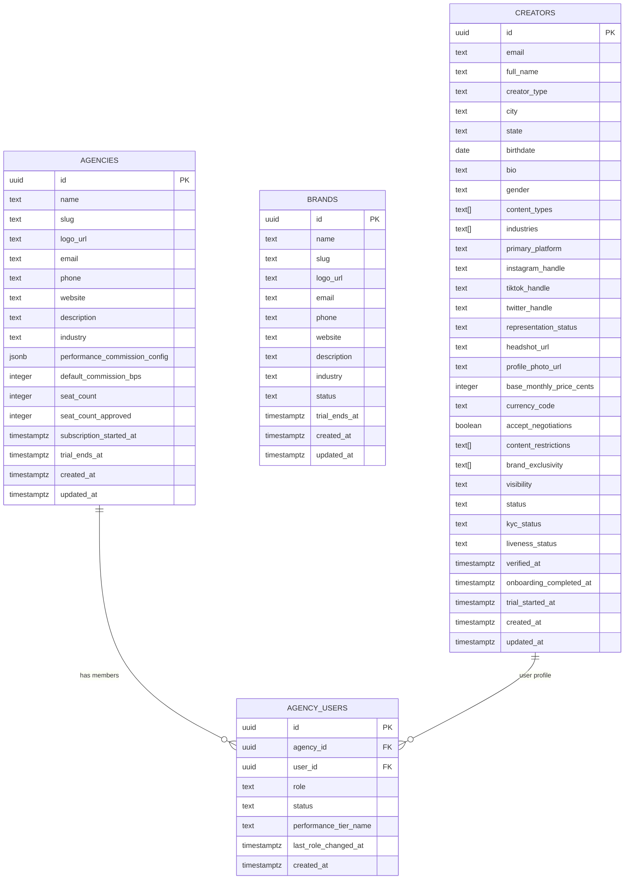

---

## Agency Talent Management

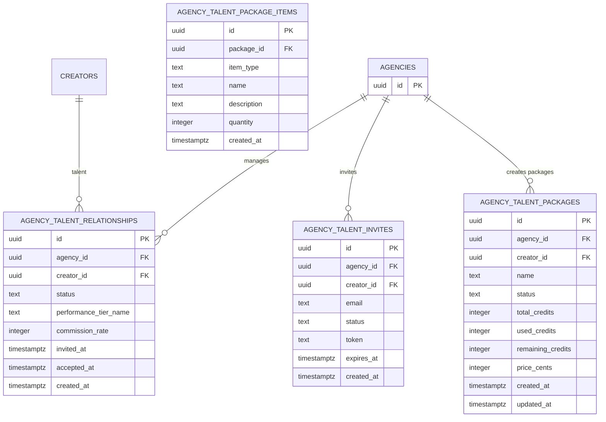

---

## Bookings & Calendar

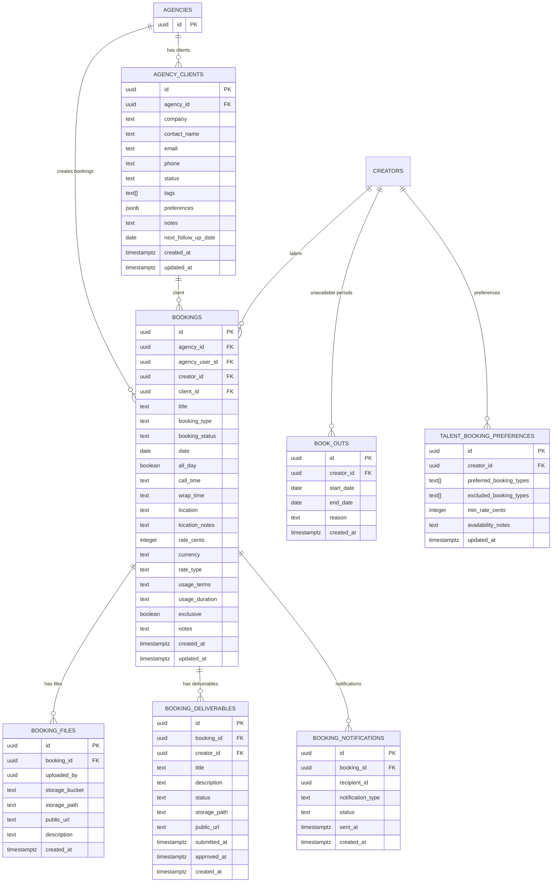

---

## Brand Campaigns & Offers

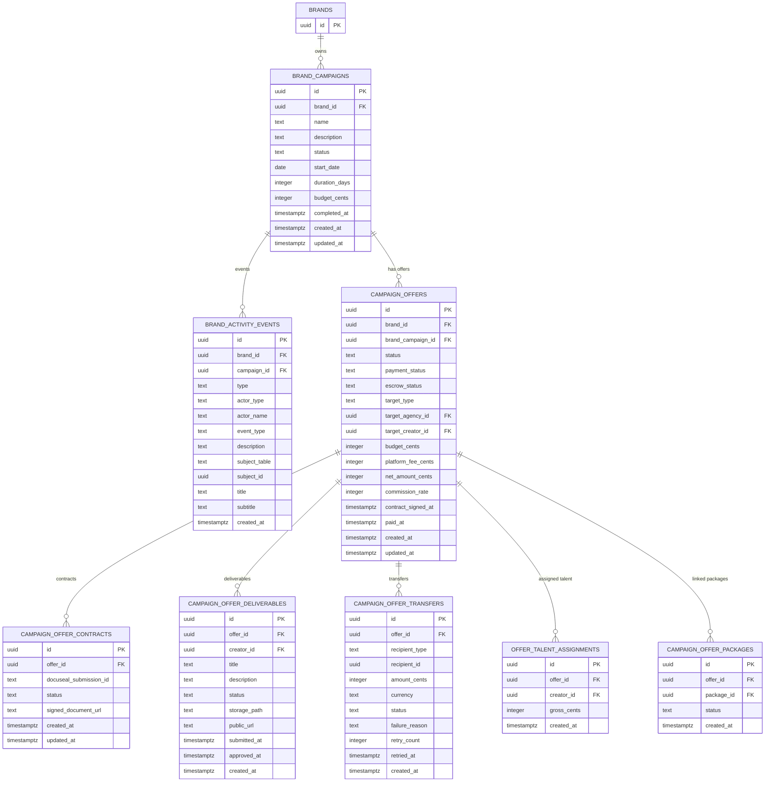

---

## Licensing & Packages

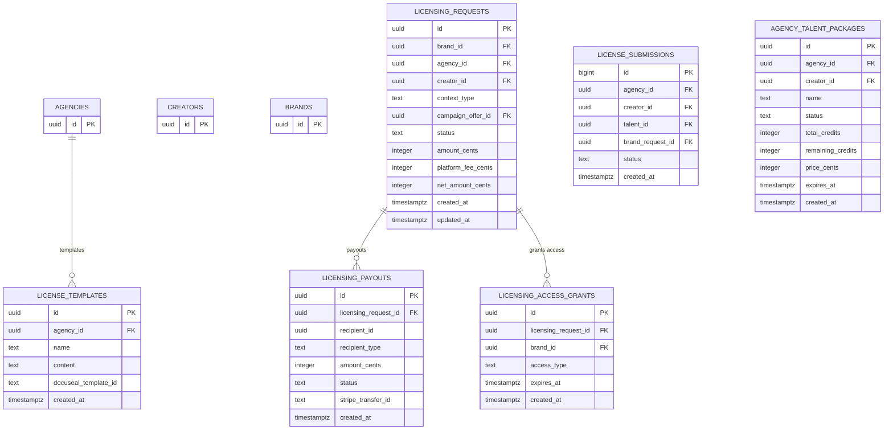

---

## Messaging & Connections

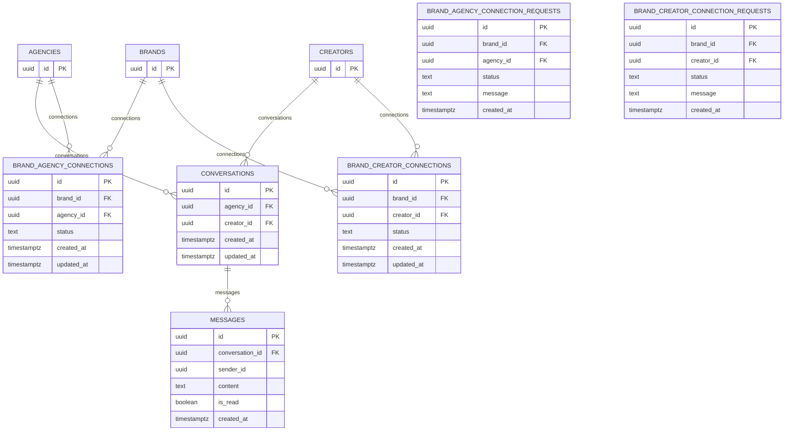

---

## Studio & AI Generation

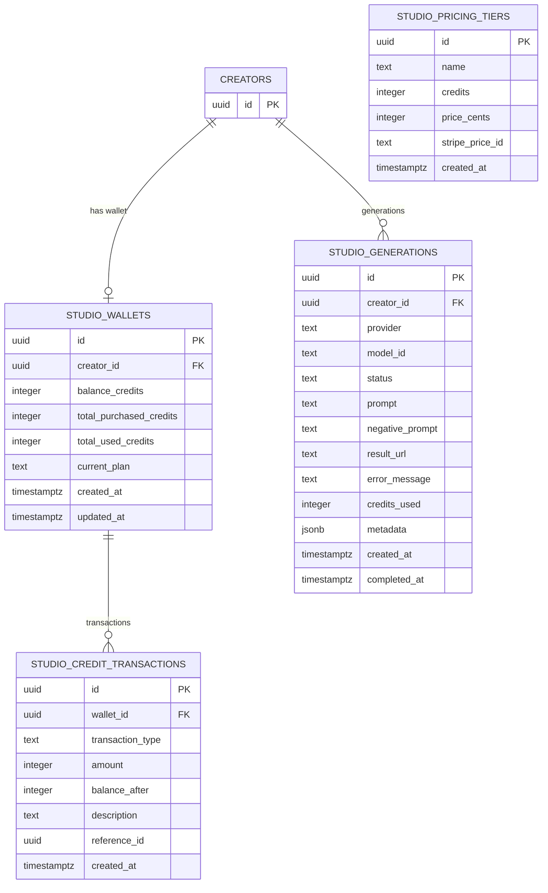

---

## Storage & Assets

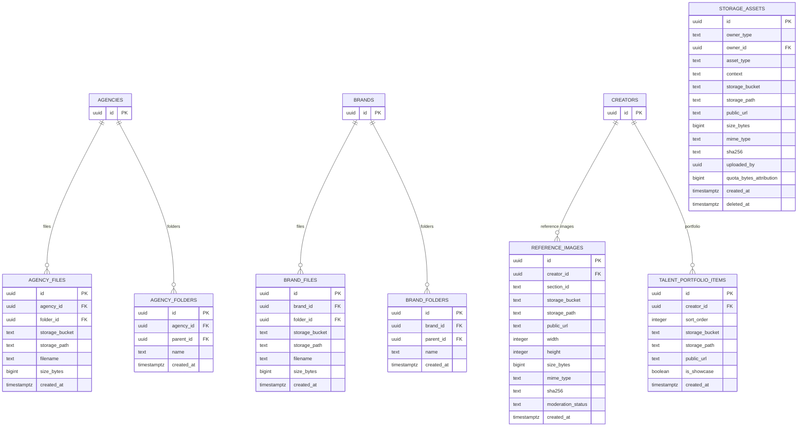

---

## Voice Assets

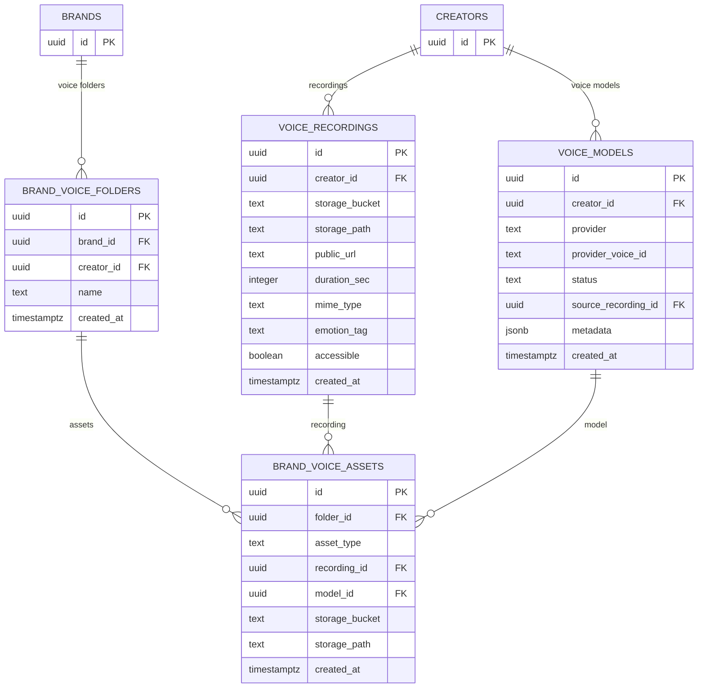

---

## Invoicing & Payments

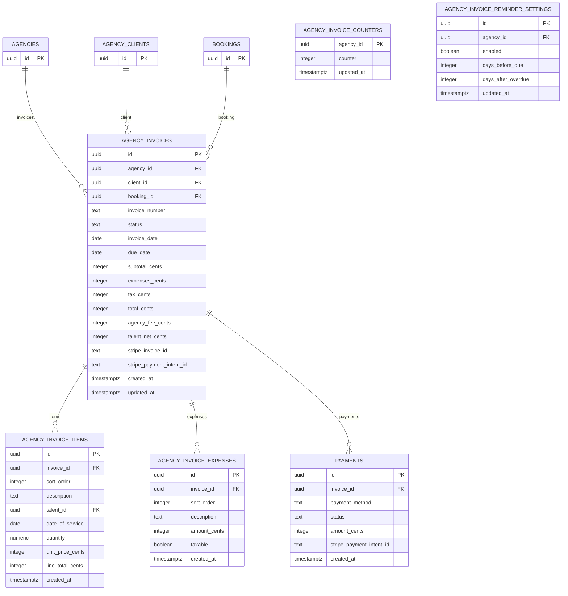

---

## Payouts & Balances

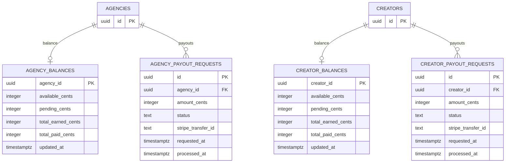

---

## Subscriptions & Billing

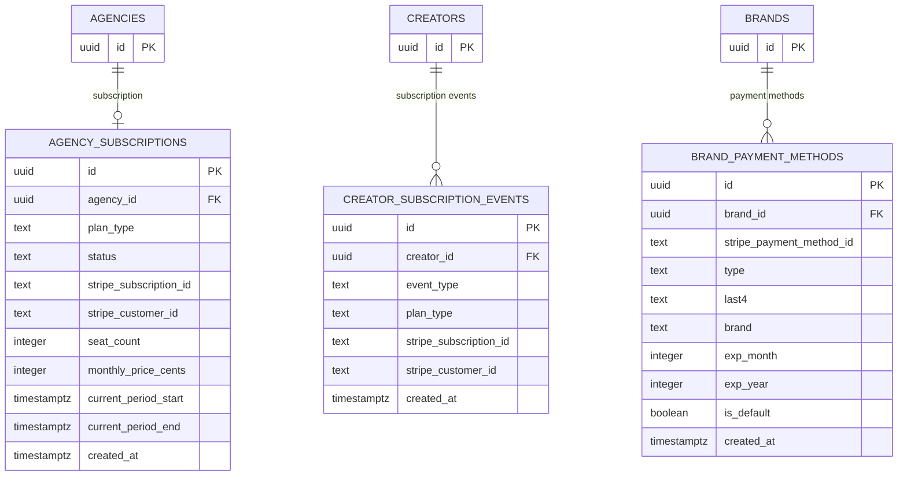

---

## Notifications & Settings

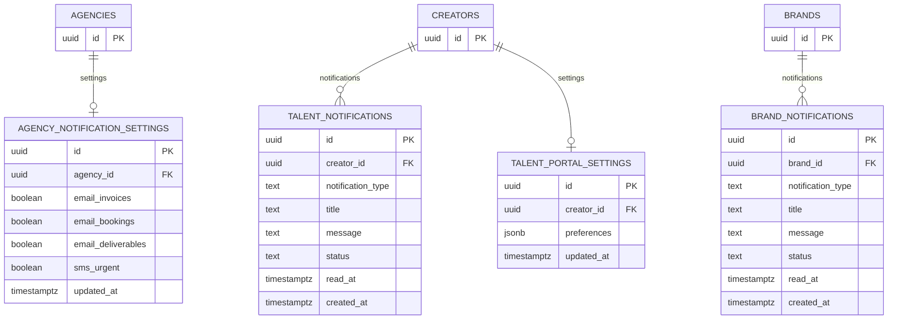

---

## Scouting Module

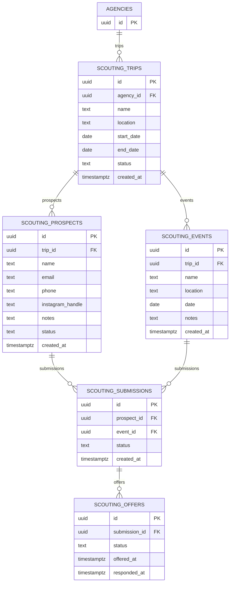

---

## Webhooks & Integrations

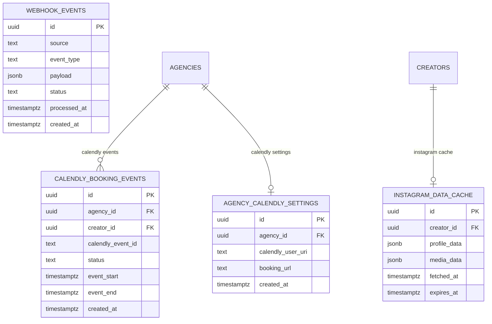

---

## Tax & Compliance

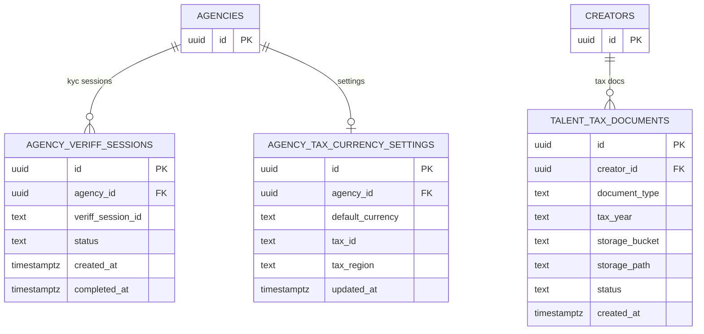

---

## Table Count Summary

| Domain | Table Count |
|--------|-------------|
| Core Entities | 4 |
| Agency Talent Management | 4 |
| Bookings & Calendar | 7 |
| Brand Campaigns & Offers | 8 |
| Licensing & Packages | 6 |
| Messaging & Connections | 7 |
| Studio & AI Generation | 4 |
| Storage & Assets | 7 |
| Voice Assets | 4 |
| Invoicing & Payments | 7 |
| Payouts & Balances | 6 |
| Subscriptions & Billing | 3 |
| Notifications & Settings | 5 |
| Scouting Module | 5 |
| Webhooks & Integrations | 4 |
| Tax & Compliance | 3 |
| **Total** | **74 tables** |

---

## Notes

1. **Primary Keys**: All tables use `uuid` primary keys with `gen_random_uuid()` default
2. **Timestamps**: Standard pattern uses `created_at` and `updated_at` columns
3. **Soft Deletes**: Tables like `storage_assets` use `deleted_at` for soft deletes
4. **RLS**: All tables have Row Level Security policies enforced
5. **Foreign Keys**: References use `ON DELETE CASCADE` for dependent records, `ON DELETE SET NULL` for optional references
