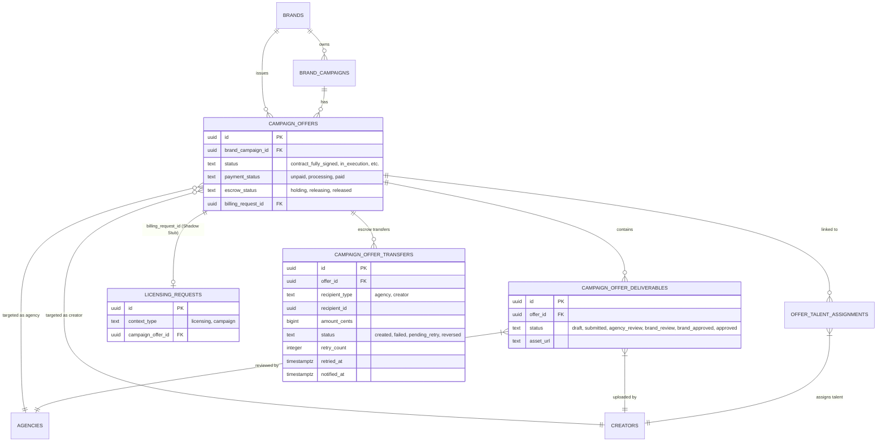

# Repository Architecture & Database Relationships

This document outlines the core relationships and interaction flows between Brands, Agencies, and Creators, specifically focusing on the **Campaign Offer Payment Gate, Deliverables, and Escrow Release** system.

## Database ER Diagram

The following diagram shows the relationships between campaigns, offers, payments (billing stubs), and deliverables.



## Interaction Flow (Payment & Deliverables)

This sequence diagram illustrates the lifecycle of a campaign offer from signing to final deliverable approval, highlighting the **Payment Gate** and **Escrow Release**.

```mermaid
sequenceDiagram
    participant B as Brand
    participant S as Server/Stripe
    participant A as Agency
    participant C as Creator

    Note over B,C: 1. Contract Phase
    B->>A: Send Offer Link (DocuSeal)
    A->>B: Sign Contract
    B->>B: Sign Contract
    Note over B: Status: contract_fully_signed

    Note over B,S: 2. Escrow Payment Phase (Checkout)
    B->>S: Click "Pay Offer" (Stripe Checkout)
    S-->>B: Payment Successful
    S->>Server: Webhook: Update payment_status = 'paid'

    Note over A,C: 3. Execution Phase (GATED)
    A->>Server: Request Upload (Checks payment_status)
    Server-->>A: [IF PAID] Allow Upload
    C->>Server: Upload Deliverable
    Server->>Server: Status: agency_review

    Note over A,B: 4. Review Phase
    A->>Server: Approve Deliverable
    Server->>Server: Status: brand_review
    B->>Server: Approve deliverable (first approval triggers escrow)
    Server->>Server: escrow_status: holding -> releasing -> released
    Server->>S: Stripe Transfers (agency + talent splits)
    Note over Server: Internal "held" balances remain until transfer succeeds; "cashout" is Stripe available on connected accounts
    Note over A: Payout Status panel shows per-recipient transfer state
    Note over A: Failed transfers can be retried via POST /api/agency/campaign-offers/:id/retry-transfers
```

## Key Interactions

### 1. The Payment Gate

The system enforces a financial boundary at the start of the `in_execution` phase.

- **Back-end Check**: API endpoints for uploading and submitting deliverables verify that the parent `campaign_offer.payment_status` is `'paid'`.
- **Front-end Gating**: UI components (Agency & Creator dashboards) disable action buttons and show warning indicators if the offer is unpaid.

### 1b. Stable Campaign Status (Active vs Pending)

Campaign tab placement must not depend on deliverable/workflow status strings.

- **Backend-derived flag**: offers include `is_fully_signed` computed from DocuSeal contract completion.
- **Rule**: a campaign is **Active** if it has **any fully signed offer**, and remains Active until completed/expired/cancelled by campaign/timing rules.

### 2. The Billing Shadow Stub

To leverage existing financial infrastructure without duplicating logic, campaign payments utilize a "Shadow Stub" in the `licensing_requests` table:

- **`licensing_requests.context_type = 'campaign'`**: Distinguishes it from standard licensing deals.
- **`campaign_offers.billing_request_id`**: Links the offer to its financial record for tracking escrow and payouts.

### 3. Review Hierarchy

Deliverables follow a strictly enforced pipeline:

1. **Creator Draft**: Private to the creator.
2. **Submitted to Agency**: Visible to Agency for review.
3. **Submitted to Brand**: Agency-approved work is sent to the Brand.
4. **Brand Approved**: First brand approval can trigger escrow release (once per offer).
5. **Approved**: Final state for the deliverable.

### 4. Distribution & Commission (Agency collaborator offers)

For offers where the collaborator is an **agency**, the brand’s payment is collected into platform escrow and then distributed on escrow release (first brand deliverable approval trigger).

Key rules:

- The payout pool is the **net** amount (`budget_creator_payment` / `net_amount_cents`). The platform fee is tracked separately.
- Assigned recipients come from `offer_talent_assignments` and are keyed by `creator_id` (connected creators may have `talent_id = NULL`).
- If per-creator payment weights exist (`payments.gross_cents` rows for the offer billing stub), they are used as allocation weights; otherwise the net is split evenly across assigned creators.

Commission semantics (important):

- `commission_rate` is interpreted as the **agency commission percent** for each creator’s share.
- `creator_payout_percent = 100 - commission_rate`
- `creator_earnings = gross_share_cents * creator_payout_percent`
- `agency_earnings = gross_share_cents - creator_earnings`

Commission resolution order (per `creator_id`):

1. `agency_creator_commissions(agency_id, creator_id).commission_rate` (override, if present)
2. `agencies.performance_commission_config[tier].commission_rate` (tier default)
   - tier comes from `agency_talent_relationships.performance_tier_name` for connected creators
   - `agency_users.performance_tier_name` overrides when present for roster creators

Example (net = 5,000 USD, 3 creators, agency commission = 12%):

- Each creator share ≈ 1,666.67
- Each creator earns 88% ≈ 1,466.67
- Agency earns 12% ≈ 200.00 per creator → 600.00 total

### 5. Transfer Failure Recovery & Retry

Stripe transfers to connected accounts can fail silently (e.g. account not fully onboarded, transfers capability not active). The system handles this without blocking escrow release.

**Key principle**: Escrow release is the brand's obligation being fulfilled. Whether the recipient can *receive* the funds is a separate operational concern. Funds that fail to transfer remain on the platform's Stripe balance until a retry succeeds.

#### Transfer Status Lifecycle

```
escrow_status = "released"  (permanent — set on brand approval)
campaign_offer_transfers per recipient:
  "created"       → Stripe transfer succeeded, funds in recipient's connected account
  "failed"        → Transfer failed; funds held on platform Stripe balance
  "pending_retry" → Retry in progress (transient state)
  "reversed"      → Transfer was reversed by Stripe
```

#### Retry Rules

- Retry is only available when `escrow_status = "released"` (brand has approved).
- Only rows with `status = "failed"` are retried — succeeded rows are never touched.
- Each retry increments `retry_count` and sets `retried_at`.
- The retry endpoint re-fetches the recipient's current Stripe account ID, so if they fix their onboarding between attempts the retry will succeed.

#### API Endpoints

| Method | Path | Description |
|--------|------|-------------|
| `GET` | `/api/agency/campaign-offers/:offer_id/transfer-status` | Live Stripe account health + transfer row status per recipient |
| `POST` | `/api/agency/campaign-offers/:offer_id/retry-transfers` | Retry all failed transfers for an offer |

Both endpoints require `manage_billing` permission and verify the offer belongs to the calling agency.

#### `GET /api/agency/campaign-offers/:offer_id/transfer-status` Response

```json
{
  "offer_id": "...",
  "escrow_status": "released",
  "payment_status": "paid",
  "recipients": [
    {
      "recipient_type": "agency",
      "recipient_id": "...",
      "name": "Tecno Agency",
      "amount_cents": 4000,
      "currency": "USD",
      "transfer_status": "created",
      "failure_reason": null,
      "retry_count": 0,
      "retried_at": null,
      "stripe_connected": true,
      "stripe_transfers_enabled": true,
      "stripe_payouts_enabled": true,
      "stripe_details_submitted": true,
      "stripe_account_id": "acct_..."
    },
    {
      "recipient_type": "creator",
      "recipient_id": "...",
      "name": "Marcello",
      "amount_cents": 6000,
      "currency": "USD",
      "transfer_status": "failed",
      "failure_reason": "insufficient_capabilities_for_transfer: ...",
      "retry_count": 1,
      "retried_at": "2026-04-22T14:00:00Z",
      "stripe_connected": true,
      "stripe_transfers_enabled": false,
      "stripe_payouts_enabled": false,
      "stripe_details_submitted": false,
      "stripe_account_id": "acct_..."
    }
  ]
}
```

#### `POST /api/agency/campaign-offers/:offer_id/retry-transfers` Response

```json
{
  "offer_id": "...",
  "nothing_to_retry": false,
  "retried": [
    {
      "recipient_type": "creator",
      "recipient_id": "...",
      "name": "Marcello",
      "amount_cents": 6000,
      "result": "succeeded",
      "failure_reason": null,
      "stripe_transfer_id": "tr_..."
    }
  ]
}
```

Possible `result` values: `succeeded`, `failed`, `skipped_no_account`.

#### Error Codes

| Code | HTTP | Meaning |
|------|------|---------|
| `escrow_not_released` | 400 | Brand has not approved yet — retry not allowed |
| `offer_not_paid` | 400 | Offer payment not completed |
| `offer_not_found` | 404 | Offer does not belong to this agency |

#### DB Schema Changes (migration `2026-04-22_campaign_offer_transfer_retry.sql`)

```sql
-- New columns on campaign_offer_transfers
retry_count   integer     NOT NULL DEFAULT 0
retried_at    timestamptz
notified_at   timestamptz

-- Status constraint now includes pending_retry
status IN ('created', 'failed', 'pending_retry', 'reversed')

-- New RPCs
mark_transfer_pending_retry(p_offer_id, p_recipient_type, p_recipient_id)
mark_transfer_notified(p_offer_id, p_recipient_type, p_recipient_id)
```

#### Frontend (AgencyDeliverablesView)

When an offer's `escrow_status` is `"released"` and the offer card is expanded, a **Payout Status** panel is shown inline:

- One row per recipient (agency + each assigned talent)
- Shows: name, type, amount, Stripe health indicator, transfer status badge
- Failed transfers show a human-readable failure reason
- **Refresh** button re-polls the status endpoint
- **Retry failed** button (only visible when at least one transfer has `status: failed`) calls the retry endpoint and refreshes the panel
