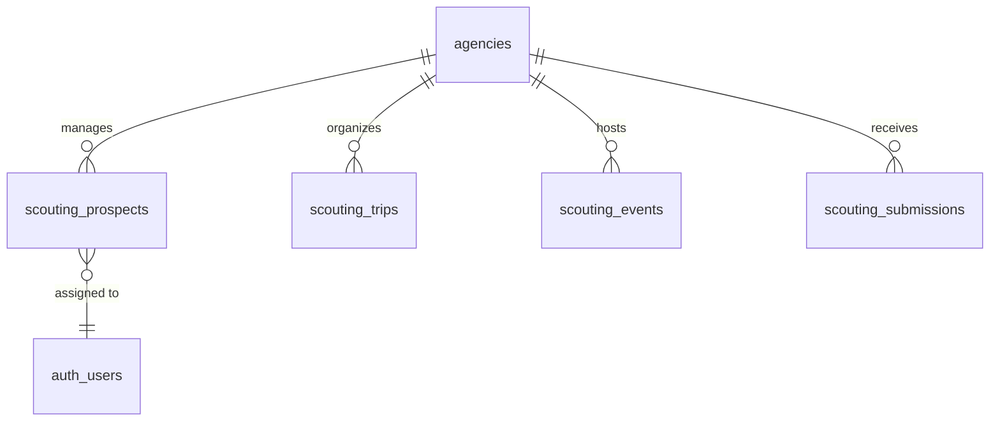

 # Likelee AI — Design
 
 ## Accounting & Invoicing (Agency Dashboard)
 
 ### Goals
 - Enable agencies to create, manage, and send invoices to their clients.
 - Support invoice creation from an existing booking (preferred path) and manual entry.
 - Provide consistent financial calculations (totals, commission split, tax/discount) with an auditable record.
 - Keep invoices tenant-isolated (agency-only) using Supabase RLS and server-side enforcement.
 
 ### Non-Goals (Initial MVP)
 - Payment processing / Stripe invoice issuing.
 - Automated dunning (reminders), partial payments, credit notes.
 - Full accounting ledger / double-entry accounting.
 - PDF rendering and emailing from the backend (a preview endpoint can be added first).
 
 ### Key Concepts
 - An invoice belongs to exactly one agency and one agency client.
 - An invoice can be created from a booking:
   - Booking provides suggested talent, date of service, and base rate.
 - An invoice contains:
   - Header fields (number, dates, PO/project reference)
   - Line items (services)
   - Optional expenses
   - Financial settings (commission, currency, tax, discount)
   - Notes and payment instructions
 
 ### Invoice Lifecycle
 - `draft`
   - Editable by the agency.
 - `sent`
   - Invoice has been issued to the client (MVP: marked manually).
   - Editing rules: limited in later phases (MVP can allow edits if needed).
 - `paid`
   - Marked paid (manual for MVP).
 - `void`
   - Cancelled invoice (manual for MVP).
 
 ### Data Model (Supabase)
 
 #### `agency_invoices`
 - **Ownership**
   - `agency_id` (uuid, FK to `public.agencies(id)`)
 - **Associations**
   - `client_id` (uuid, FK to `public.agency_clients(id)`)
   - `booking_id` (uuid, optional, FK to `public.bookings(id)`)
 - **Identity**
   - `invoice_number` (text)
   - `status` (text enum-like constraint: `draft`, `sent`, `paid`, `void`)
 - **Dates**
   - `invoice_date` (date) b
   - `due_date` (date)
   - `sent_at` (timestamptz, nullable)
   - `paid_at` (timestamptz, nullable)
 - **Client snapshot**
   - `bill_to_company` (text)
   - `bill_to_contact_name` (text)
   - `bill_to_email` (text)
   - `bill_to_phone` (text)
 - **Commercial fields**
   - `po_number` (text, nullable)
   - `project_reference` (text, nullable)
   - `currency` (text, default `USD`)
   - `payment_terms` (text, default `net_30`)
 - **Financial settings**
   - `agency_commission_bps` (integer, default `2000` for 20.00%)
   - `tax_rate_bps` (integer, default `0`)
   - `tax_exempt` (boolean, default `false`)
   - `discount_cents` (integer, default `0`)
 - **Notes**
   - `notes_internal` (text, nullable)
   - `payment_instructions` (text, nullable)
   - `footer_text` (text, nullable)
 - **Computed totals (stored)**
   - `subtotal_cents`
   - `expenses_cents`
   - `tax_cents`
   - `total_cents`
   - `agency_fee_cents`
   - `talent_net_cents`
 - **Audit**
   - `created_at`, `updated_at`
 
 #### `agency_invoice_items`
 - `invoice_id` (uuid, FK to `agency_invoices(id)`)
 - `sort_order` (integer)
 - `description` (text)
 - `talent_id` (uuid, nullable)
 - `talent_name` (text, nullable)
 - `date_of_service` (date, nullable)
 - `rate_type` (text, nullable; aligns to booking rate types when sourced from booking)
 - `quantity` (numeric)
 - `unit_price_cents` (integer)
 - `line_total_cents` (integer)
 - `created_at`
 
 #### `agency_invoice_expenses` (optional, MVP)
 - `invoice_id` (uuid, FK to `agency_invoices(id)`)
 - `sort_order` (integer)
 - `description` (text)
 - `amount_cents` (integer)
 - `taxable` (boolean, default false)
 - `created_at`
 
 ### Calculation Rules (MVP)
 - `line_total_cents = round(quantity * unit_price_cents)`
 - `subtotal_cents = sum(line_total_cents)`
 - `expenses_cents = sum(expense.amount_cents)`
 - `discount_cents` is applied once at invoice level.
 - `taxable_base_cents` defaults to `subtotal_cents + (sum(taxable_expenses)) - discount_cents`, not below zero.

 ### Invoice Numbering (MVP)
 - Invoice id is stored as a uuid.
 - Default generation is performed server-side at creation time.
 - Format: `INVC[A-Z][0-9]{7}` (example: `INVCZ9930308`).
 - Invoice number is system-generated and cannot be provided or edited by users.

 ### Permissions & RLS
 - Agencies can only read/write their own invoices and related rows.
 - Ownership is by `agency_id` matching the authenticated agency user id.
 - When a server endpoint accepts `invoice_id`, it must validate `agency_id = auth_user.id`.

 ### Backend API (likelee-server)

 #### Existing dependencies
 - Bookings and clients already exist and can be used for invoice creation:
   - `GET /api/bookings`
   - `GET /api/agency/clients`
   - `GET /api/agency/talents`

 #### New endpoints (MVP)
 - `GET /api/invoices`
   - List invoices for the agency (filters: status, date range optional).
 - `POST /api/invoices`
   - Create invoice draft.
   - Supports `source_booking_id` optional.
 - `GET /api/invoices/:id`
   - Get invoice header + items + expenses.
 - `POST /api/invoices/:id`
   - Update invoice draft fields and replace/update items/expenses.
 - `POST /api/invoices/:id/mark-sent`
   - Set status to `sent` and `sent_at = now()`.
 - `POST /api/invoices/:id/mark-paid`
   - Set status to `paid` and `paid_at = now()`.
 - `POST /api/invoices/:id/void`
   - Set status to `void`.
 
 ### UI (likelee-ui)
 - Add “Accounting & Invoicing” section under the Agency Dashboard.
 - Invoice Generation page supports:
   - Create from Existing Booking
   - Manual Entry
 
## Configuration Management

- No new environment variables are required for the initial Accounting & Invoicing MVP.
- If/when we add PDF rendering, emailing, or payment providers:
  - Add new variables to `likelee-server/src/config.rs` using `envconfig`.
  - Keep `likelee-server/.env.example` in sync.
  - Document the variables here under this section.

### Stripe Connect (Agency Bank Connection)

- `PAYOUTS_ENABLED` (bool)
  - Enables Stripe Connect onboarding endpoints.
- `STRIPE_SECRET_KEY`
  - Stripe secret key used server-side.
- `STRIPE_CLIENT_ID`
  - Stripe Connect client id (kept for future OAuth flows; current implementation uses Account Links).
- `STRIPE_RETURN_URL`
  - URL Stripe redirects to after a successful onboarding.
- `STRIPE_REFRESH_URL`
  - URL Stripe redirects to if the user abandons or needs to restart onboarding.
- `STRIPE_WEBHOOK_SECRET`
  - Used to validate Stripe webhook signatures.

# Likelee-AI – Global Design

Voice assets and brand delivery (Supabase):

- `voice_recordings` (private bucket) store Face-owned audio samples, with `accessible` flag to control inclusion in licensed delivery.
- `voice_models` register cloned voice metadata per provider (e.g., ElevenLabs `provider_voice_id`).
- `brand_licenses` link `brand_org_id` (brands.id) ↔ `face_user_id` with status and validity window.
- `brand_voice_folders` and `brand_voice_assets` expose licensed voice assets under the Brand’s workspace without duplicating binaries.

Version: 0.1 (draft)

Owner: Shanel Pouatcha

---

## 1. Vision

Likelee AI builds the world’s first AI-creation ecosystem keeping humans at the center. It transforms faces (likeness) into monetizable assets while protecting consent, identity, and attribution.

## 2. Personas and Goals

| Persona          | Goal                                                                                          | Core Value                                                                             |
| ---------------- | --------------------------------------------------------------------------------------------- | -------------------------------------------------------------------------------------- |
| Faces (Talents)  | License their likeness, get discovered, earn royalties.                                       | Turn face into an asset; visibility, royalties, usage tracking.                        |
| Brands & Studios | Find approved likenesses, generate ethical content, manage contracts.                         | Verified pool of talents/creators; one interface for discovery → creation → licensing. |
| AI Creators      | Collaborate, access paid opportunities, showcase portfolios, license faces for creative work. | Gigs, licensed usage, portfolio.                                                       |

## 3. Key User Flows

- Creator core flow (P1):
  1. Discover Faces with filters.
  2. Add Face to project basket; checkout via Stripe.
  3. Obtain short-term likeness license; generate in Likelee Studio via Model Router and Simple Prompt UI.
  4. Collaborate via simple chat thread.
- Agency onboarding (P0 for MRR):
  1. KYC (owner) → “Create Agency”.
  2. Purchase seats in blocks of 50 via Stripe ($35/seat/month).
  3. Import talents (CSV/drag-and-drop) to trigger invites.
  4. Seat activates when Face accepts terms.

### Scouting Module (P0 for Agencies)

- **Prospects**: Manage talent leads with status tracking, ratings, and agent assignments.
- **Trips**: Plan and track physical scouting journeys.
- **Events (Open Calls)**: Organize and manage casting events, both physical and virtual.
- **Submissions**: Process talent applications received via the agency's website.

## 4. Architecture Overview

- Web SPA (likelee-ui): React + TypeScript + Vite + Tailwind.
- Backend/Data: Supabase (Auth, Postgres, Storage) with service APIs (Rust axum server).
- Core services (logical):
  - Royalty Ledger: record bookings and expose reads for dashboards.
  - Scouting Hub: Full CRM for talent discovery and event management.
  - Watermark API: apply invisible watermark to exports; hash tied to booking ID.
  - Payments (Stripe Connect): split payments Brand → Platform → Face + Creator; Stripe Express payouts.
  - Likelee Studio: Model Router (Replicate/HF/Together) + Simple Prompt UI.
  - i18n: Default EN; ES and FR prioritized for MVP.
  - Authentication/Authorization: Supabase Auth (OIDC/OAuth2/Email).

## 5. Tech Stack

- Frontend: React 18.2.0, TypeScript, Vite 6.5, Tailwind CSS 3.4.16.
- Backend: Supabase (Auth, Postgres, Storage) + Rust axum server.

## 6. External Integrations

| Capability               | Provider/Tech                                                       |
| ------------------------ | ------------------------------------------------------------------- |
| Payments & Billing       | Stripe Connect, Stripe Checkout                                     |
| AI Generation/Rendering  | Replicate API, Hugging Face APIs, Together.ai                       |
| Voice Cloning (optional) | ElevenLabs                                                          |
| Storage & Database       | Supabase (Auth, Postgres, Storage)                                  |
| Asset Traceability       | Truepic Lens (invisible watermarking)                               |
| Moderation & Liveness    | AWS Rekognition (Moderation, Face Liveness)                         |
| Royalty Tracking (P2)    | Meta Ads, TikTok Ads, Google Ads, Shopify Admin, Stripe (read-only) |

## 7. Data Model (Conceptual)

- Core entities: Face, Creator, Brand/Agency, Project, Booking, License, Asset, Experience, Session.
- Scouting entities: Prospect, Trip, Event, Submission.
- Separation of concerns:
  - PII vs content data stored separately where feasible.
  - Booking → Ledger entry (immutable) with references to payments, C2PA/watermark hash.
- Consent:
  - Explicit consent steps for uploading face photos and licensing terms.

### Scouting ER Diagram

Reference images storage model (Supabase):

- `reference_images` table stores creator reference images (including the three cameo angles). Columns include: user_id, section_id (e.g., headshot_neutral, headshot_smiling, etc.), storage_bucket, storage_path, public_url (if public), width, height, size_bytes, mime_type, sha256, moderation_status, moderation_reason, created_at, created_by, deleted_at.
- The three cameo images (front/left/right) are fully migrated into `reference_images` and no longer kept as separate columns on profiles for new writes. Legacy reads can be supported via a one-time backfill or view.

## 8. Security, Compliance, and Ethics

- Verification: KYC + liveness for Faces and before agency creation.
- Privacy-first: consented uploads, minimization, encryption in transit/at rest, DSRs.
- Trust & Traceability: invisible watermarking; C2PA manifest (P2) for attribution.
- AuthN/AuthZ: Supabase Auth; roles for Faces, Creators, Brands, Admins.
- Moderation: automated image checks (Rekognition) + policy guardrails.
- Auth Restrictions: New signups via Google OAuth are disabled to ensure controlled onboarding.

## 9. Monetization Model

| Model         | Description                            | Tracking/Attribution                                 | Priority |
| ------------- | -------------------------------------- | ---------------------------------------------------- | -------- |
| Flat Fee      | Fixed price per time unit set by Face. | Royalty Ledger entry at booking payment.             | P0/P1    |
| Spend-Share   | % of real ad spend earned by Face.     | OAuth to ad APIs; nightly retrieval of cost metrics. | Phase 2  |
| Revenue-Share | % of sales earned by Face.             | UTM or Face-specific coupons + Shopify/Stripe data.  | Phase 2  |

Royalty model analogy: a digital bank ledger. Instead of a one-time sale, earnings flow from brand spend/revenue. C2PA acts like a serial number on a banknote to keep flows attributable to the face’s owner.

## 10. Non-Functional Requirements (NFRs)

- Performance: P95 interaction latency < TODO ms for key journeys.
- Availability: 99.9% monthly for public experiences.
- Security: No critical vulns; SOC2-ready controls (TBD).
- Accessibility: WCAG 2.1 AA baseline; responsive.
- Internationalization: EN; ES/FR prioritized.

## 11. Deployment & Operations

- Environments: Dev, Staging, Prod (TBD confirmation).
- Hosting: Firebase-backed MVP; future containerized services or Functions as needed.
- CI/CD: Lint, tests, build; deploy via pipeline (TBD tooling).
- Observability: Centralized logs/metrics/traces; alerts on SLOs.
- CDN: For static assets and AI outputs as appropriate.

## 12. Roadmap (Phases)

- P0: Agency onboarding (KYC, seats purchase, import/invites, activation).
- P1: Creator core flow, Stripe bookings, Royalty Ledger, Watermark API, Model Router + Prompt UI, i18n EN.
- P2: Spend-/Revenue-Share tracking (Ads/Shopify integrations), C2PA manifests, extended locales (ES/FR), enhanced moderation.

## 13. Configuration Management

- Runtime configuration is centralized via the Rust `envconfig` crate.
- Service reads configuration from environment variables (with dotenv support in dev).
- Single source of truth struct: `ServerConfig` (`likelee-server/src/config.rs`).

### Migration Structure (Supabase)

Migrations are organized into a sequential structure to ensure clean database initialization:

1. `0001_core_profiles.sql`: Core tables (creators, brands, agencies, royalty_ledger) and auth restrictions.
2. `0002_scouting_module.sql`: Scouting Hub entities (prospects, trips, events, submissions) and RLS.
3. `0003_assets_storage_moderation.sql`: Storage buckets, moderation events, reference images, and voice assets.
4. `0004_business_logic_and_pricing.sql`: Creator rates, business logic columns, and pricing functions.
5. `0005_external_integrations.sql`: Tracking columns and legacy transition fields for external services (e.g., Creatify).

### Environment Variables (Backend – likelee-server)

- SUPABASE_URL (required)
- SUPABASE_SERVICE_KEY (required)
- SUPABASE_BUCKET_PRIVATE (default: likelee-private)
- SUPABASE_BUCKET_PUBLIC (default: likelee-public)
- SUPABASE_BUCKET_TEMP (default: likelee-temp)
- PORT (default: 8787)
- VERIFF_BASE_URL (required)
- VERIFF_API_KEY (required)
- VERIFF_SHARED_SECRET (required)
- DUIX_BASE_URL (default: http://127.0.0.1:7860)
- DUIX_AUTH_TOKEN (default: change-me)
- MODERATION_ENABLED (default: "1", set to "0" to disable Rekognition image moderation)
- AWS_REGION (default: us-east-1)
- ELEVENLABS_API_KEY (optional; required to enable server-side voice cloning)

- CREATIFY_BASE_URL (default: https://creatify.ai)
- CREATIFY_API_ID (required for Creatify API auth)
- CREATIFY_API_KEY (required for Creatify API auth)
- CREATIFY_CALLBACK_URL (optional; public HTTPS URL for Creatify webhooks hitting /webhooks/creatify)

Notes:

- All runtime config is read only via `ServerConfig` (envconfig). Do NOT call `std::env::var` in application code.
- Keep `likelee-server/.env.example` in sync with these variables and defaults.

### Environment Variables (Frontend – likelee-ui)

- VITE_API_BASE_URL – e.g. http://localhost:8787
- VITE_AWS_REGION – must be a valid AWS region (e.g., us-east-1, eu-west-1)
- VITE_COGNITO_IDENTITY_POOL_ID – e.g., us-east-1:xxxxxxxx-xxxx-xxxx-xxxxxxxxxxxx

### Storage Architecture (Supabase)

- Buckets
  - likelee-private (private): sensitive creator assets and drafts.
  - likelee-public (public): publicly viewable reference images and approved assets.
  - likelee-temp (private): temporary uploads prior to moderation.
- Paths
  - likelee-public: `likeness/{user_id}/sections/{section_id}/{ts}.{ext}` (images section is public by design.)
  - likelee-private:
    - `likeness/{user_id}/voice/recordings/{ts}.{ext}` (Face voice recordings)
    - other legacy paths migrated into structured tables
  - likelee-temp: `tmp/{user_id}/{uuid}.{ext}` (auto-clean TTL ~24h).
- Access
  - Public bucket is read-public; writes via server only.
  - Private/temp buckets are non-public; access via signed URLs when required (e.g., brand consumption of licensed voice recordings).
- Moderation Flow
  - Pre-scan bytes → upload → post-scan (best-effort) → DB mark `approved` or move to quarantine.
- Migration note
  - The three cameo images (front, left, right) are fully moved into `reference_images` using section_ids (e.g., `cameo_front`, `cameo_left`, `cameo_right`) or mapped to existing headshot sections. Profiles no longer store separate cameo URL columns for new writes.

### Rekognition Face Liveness – Region Alignment

- Face Liveness is available only in specific regions. Use a supported region (e.g., us-east-1 or eu-west-1).
- The following must MATCH the same region:
  - Backend `AWS_REGION`
  - Frontend `VITE_AWS_REGION`
  - Cognito Identity Pool region
- Invalid regions (e.g., `eu-east-1`) or mismatched regions will cause DNS errors or AccessDenied.

### Rekognition Face Liveness – Browser IAM Permissions (Cognito Identity Pool Role)

- Required actions (unauth or auth role depending on usage):
  - `cognito-identity:GetId`
  - `cognito-identity:GetCredentialsForIdentity`
  - `rekognition:StartFaceLivenessSession`
- Trust policy must scope to your pool and amr:
  - `"cognito-identity.amazonaws.com:aud": "<IDENTITY_POOL_ID>"`
  - `"ForAnyValue:StringLike": { "cognito-identity.amazonaws.com:amr": "unauthenticated" }`

### IAM Requirements

- Server IAM principal (keys used by likelee-server):
  - `rekognition:CreateFaceLivenessSession`
  - `rekognition:GetFaceLivenessSessionResults`
- Browser (Cognito Identity Pool role used by the web app):
  - `rekognition:StartFaceLivenessSession`
- Cognito Role Trust Policy must restrict to your Identity Pool and amr:
  - `"cognito-identity.amazonaws.com:aud": "<IDENTITY_POOL_ID>"`
  - `"ForAnyValue:StringLike": { "cognito-identity.amazonaws.com:amr": "unauthenticated" }` (or `authenticated` if using auth role)
- Ensure the Rekognition service-linked role exists (AWSServiceRoleForRekognition) or allow `iam:CreateServiceLinkedRole`.

### Frontend Integration Notes (Amplify UI Face Liveness)

- Prefer `FaceLivenessDetectorCore` for explicit credentials control when debugging credential issues.
- Import styles in `src/main.tsx`:
  - `@aws-amplify/ui-react/styles.css`
  - `@aws-amplify/ui-react-liveness/styles.css`
- Provide credentials via one of the following patterns (in order of preference):
  - Pre-resolve credentials and pass as `credentials` and/or via `credentialProvider`/`credentialsProvider` props.
  - Use Amplify `fetchAuthSession()` to obtain creds; fallback to `fromCognitoIdentityPool` when needed.
- Open the detector in a portal-based modal to avoid stacking/overflow issues.
- Pin region consistently (e.g., `us-east-1`).

### Face Liveness Integration Playbook

- Goal: ensure the browser can start the WebRTC/WebSocket session with Rekognition using Cognito creds; avoid “Missing credentials” loops.
- Steps:
  1. Create session on server: `create_face_liveness_session` (server role permissions required).
  2. Pre-resolve browser credentials before rendering the detector.
     - Try Amplify `fetchAuthSession()` first.
     - Fallback to `fromCognitoIdentityPool({ region, identityPoolId })`.
  3. Render `FaceLivenessDetectorCore` only when both `sessionId` and credentials are present.
  4. Handle `onAnalysisComplete` to POST `/api/liveness/result` and update status.
  5. Replace the detector with a lightweight result panel (success/failure). Do not keep the detector rendering once a result is known.
  6. Color-code status in the parent UI (green approved, red rejected, yellow pending, gray not started).

### UI Lifecycle Requirements (Detector Modal)

- Render states:
  - Waiting: show detector only while `livenessOutcome` is null.
  - Result: replace detector with a result card (tick/cross, status, confidence, hints).
  - Close: allow Close button; optionally auto-close on success.
- Safety polling: while modal is open and `sessionId` exists, optionally poll `/api/liveness/result` to handle cases where `onAnalysisComplete` doesn’t fire. Stop polling once a result is obtained.
- Retry: either reuse the same session (if allowed) or create a fresh session. Recommended: create a fresh session for reliability.

### Diagnostics & Observability

- Frontend logs:
  - Log pre-resolved credential source and partial AccessKeyId.
  - Log session creation, modal open/close, analysis complete, and result payload.
- Network expectations:
  - With pre-resolved creds you may not see Cognito calls, but must see Rekognition `StartFaceLivenessSession`/stream.
- CloudTrail checks (region-aligned):
  - Server: `CreateFaceLivenessSession`, `GetFaceLivenessSessionResults`.
  - Client: `StartFaceLivenessSession`.

### Pitfalls to Avoid

- Passing wrong or unsupported prop names to older versions of `@aws-amplify/ui-react-liveness`. If stuck, upgrade `aws-amplify` and `@aws-amplify/ui-react-liveness` to latest.
- Region mismatch among server, frontend, and Cognito Identity Pool.
- Not granting `cognito-identity:*` actions to the unauth role.
- Rendering the detector after the result arrives (leads to perpetual “Verifying…”).
- Reading env vars directly in runtime code outside the config module (server). Always use `ServerConfig`.

### Build/Test Checklist (Face Liveness)

- Config
  - Backend `AWS_REGION` == Frontend `VITE_AWS_REGION` == Cognito pool region.
  - `COGNITO_IDENTITY_POOL_ID` configured on server and `VITE_COGNITO_IDENTITY_POOL_ID` on frontend.
  - `LIVENESS_ENABLED=1` on server for liveness endpoints.
- IAM
  - Server policy for Rekognition create/get.
  - Unauth/auth role: `cognito-identity:GetId`, `GetCredentialsForIdentity`, `rekognition:StartFaceLivenessSession`.
  - Trust policy scoped to the pool and `amr`.
- UX
  - Modal opens only when session+creds exist.
  - Detector stops and result panel appears after result.
  - Footer status shows color-coded liveness.
- Diagnostics
  - Console shows source of creds and session id.
  - CloudTrail shows expected Rekognition activity in the chosen region.

### Operational Guidance

- If session creation succeeds but UI stays pending: verify CloudTrail for `StartFaceLivenessSession` in the selected region.
- If no event appears: fix Cognito role trust/policy or region mismatch; ensure camera/mic are allowed.

### Signup Flow State Persistence & Data Recovery

To ensure a robust multi-step signup flow (especially after external redirects like Veriff), the following mechanisms are implemented:

- **Robust Finalization**: The `finalizeProfile` function uses the recovered/merged data and validates critical fields (like pricing) before the final upsert, preventing amnesia-related data loss or constraint violations.
- **Pricing Validation**: Hard fallbacks for pricing are avoided. If pricing data is missing after recovery, the user is redirected back to the pricing step to ensure explicit consent and data integrity.

---

Appendix: Add Context/Container/Component/Deployment diagrams. Link ADRs for IdP, Stripe model, watermarking/C2PA, model routing providers.
