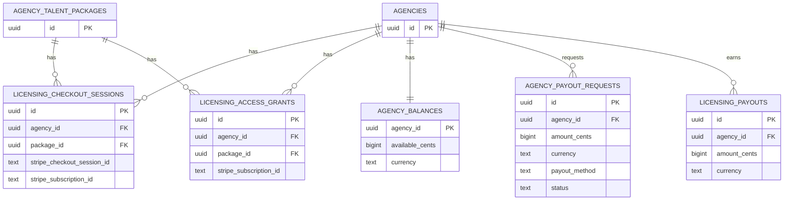

# Likelee AI — Design

## Accounting & Invoicing (Agency Dashboard)

### Goals

- Enable agencies to create, manage, and send invoices to their clients.
- Support invoice creation from an existing booking (preferred path) and manual entry.
- Provide consistent financial calculations (totals, commission split, tax/discount) with an auditable record.
- Keep invoices tenant-isolated (agency-only) using Supabase RLS and server-side enforcement.

### Non-Goals (Initial MVP)

- Payment processing / Stripe invoice issuing.
- Automated dunning (reminders), partial payments, credit notes.
- Full accounting ledger / double-entry accounting.
- PDF rendering and emailing from the backend (a preview endpoint can be added first).

### Key Concepts

- An invoice belongs to exactly one agency and one agency client.
- An invoice can be created from a booking:
  - Booking provides suggested talent, date of service, and base rate.
- An invoice contains:
  - Header fields (number, dates, PO/project reference)
  - Line items (services)
  - Optional expenses
  - Financial settings (commission, currency, tax, discount)
  - Notes and payment instructions

### Invoice Lifecycle

- `draft`
  - Editable by the agency.
- `sent`
  - Invoice has been issued to the client (MVP: marked manually).
  - Editing rules: limited in later phases (MVP can allow edits if needed).
- `paid`
  - Marked paid (manual for MVP).
- `void`
  - Cancelled invoice (manual for MVP).

### Data Model (Supabase)

#### `agency_invoices`

- **Ownership**
  - `agency_id` (uuid, FK to `public.agencies(id)`)
- **Associations**
  - `client_id` (uuid, FK to `public.agency_clients(id)`)
  - `booking_id` (uuid, optional, FK to `public.bookings(id)`)
- **Identity**
  - `invoice_number` (text)
  - `status` (text enum-like constraint: `draft`, `sent`, `paid`, `void`)
- **Dates**
  - `invoice_date` (date) b
  - `due_date` (date)
  - `sent_at` (timestamptz, nullable)
  - `paid_at` (timestamptz, nullable)
- **Client snapshot**
  - `bill_to_company` (text)
  - `bill_to_contact_name` (text)
  - `bill_to_email` (text)
  - `bill_to_phone` (text)
- **Commercial fields**
  - `po_number` (text, nullable)
  - `project_reference` (text, nullable)
  - `currency` (text, default `USD`)
  - `payment_terms` (text, default `net_30`)
- **Financial settings**
  - `agency_commission_bps` (integer, default `2000` for 20.00%)
  - `tax_rate_bps` (integer, default `0`)
  - `tax_exempt` (boolean, default `false`)
  - `discount_cents` (integer, default `0`)
- **Notes**
  - `notes_internal` (text, nullable)
  - `payment_instructions` (text, nullable)
  - `footer_text` (text, nullable)
- **Computed totals (stored)**
  - `subtotal_cents`
  - `expenses_cents`
  - `tax_cents`
  - `total_cents`
  - `agency_fee_cents`
  - `talent_net_cents`
- **Audit**
  - `created_at`, `updated_at`

#### `agency_invoice_items`

- `invoice_id` (uuid, FK to `agency_invoices(id)`)
- `sort_order` (integer)
- `description` (text)
- `talent_id` (uuid, nullable)
- `talent_name` (text, nullable)
- `date_of_service` (date, nullable)
- `rate_type` (text, nullable; aligns to booking rate types when sourced from booking)
- `quantity` (numeric)
- `unit_price_cents` (integer)
- `line_total_cents` (integer)
- `created_at`

#### `agency_invoice_expenses` (optional, MVP)

- `invoice_id` (uuid, FK to `agency_invoices(id)`)
- `sort_order` (integer)
- `description` (text)
- `amount_cents` (integer)
- `taxable` (boolean, default false)
- `created_at`

### Calculation Rules (MVP)

- `line_total_cents = round(quantity * unit_price_cents)`
- `subtotal_cents = sum(line_total_cents)`
- `expenses_cents = sum(expense.amount_cents)`
- `discount_cents` is applied once at invoice level.
- `taxable_base_cents` defaults to `subtotal_cents + (sum(taxable_expenses)) - discount_cents`, not below zero.

### Invoice Numbering (MVP)

- Invoice id is stored as a uuid.
- Default generation is performed server-side at creation time.
- Format: `INVC[A-Z][0-9]{7}` (example: `INVCZ9930308`).
- Invoice number is system-generated and cannot be provided or edited by users.

### Permissions & RLS

- Agencies can only read/write their own invoices and related rows.
- Ownership is by `agency_id` matching the authenticated agency user id.
- When a server endpoint accepts `invoice_id`, it must validate `agency_id = auth_user.id`.

### Backend API (likelee-server)

#### Existing dependencies

- Bookings and clients already exist and can be used for invoice creation:
  - `GET /api/bookings`
  - `GET /api/agency/clients`
  - `GET /api/agency/talents`

#### New endpoints (MVP)

- `GET /api/invoices`
  - List invoices for the agency (filters: status, date range optional).
- `POST /api/invoices`
  - Create invoice draft.
  - Supports `source_booking_id` optional.
- `GET /api/invoices/:id`
  - Get invoice header + items + expenses.
- `POST /api/invoices/:id`
  - Update invoice draft fields and replace/update items/expenses.
- `POST /api/invoices/:id/mark-sent`
  - Set status to `sent` and `sent_at = now()`.
- `POST /api/invoices/:id/mark-paid`
  - Set status to `paid` and `paid_at = now()`.
- `POST /api/invoices/:id/void`
  - Set status to `void`.

### UI (likelee-ui)

- Add “Accounting & Invoicing” section under the Agency Dashboard.
- Invoice Generation page supports:
  - Create from Existing Booking
  - Manual Entry

## Configuration Management

- No new environment variables are required for the initial Accounting & Invoicing MVP.
- If/when we add PDF rendering, emailing, or payment providers:
  - Add new variables to `likelee-server/src/config.rs` using `envconfig`.
  - Keep `likelee-server/.env.example` in sync.
  - Document the variables here under this section.

### Studio Providers (AI Generation)

- `FAL_API_KEY`
  - API key used by the backend to submit/poll Fal Studio generation jobs.
  - Default: empty.
- `FAL_API_URL`
  - Base URL for Fal API.
  - Default: `https://api.fal.ai`.
- `HIGGSFIELD_API_KEY`
  - API key used by the backend to submit/poll Higgsfield generation jobs.
  - Default: empty.
- `HIGGSFIELD_API_URL`
  - Base URL for Higgsfield API.
  - Default: `https://api.higgsfield.ai`.
- `KIVE_API_KEY`
  - API key used by the backend to submit/poll Kive generation jobs.
  - Default: empty.
- `KIVE_API_URL`
  - Base URL for Kive API.
  - Default: `https://api.kive.ai`.

### SMTP (Admin + Sales/Contact)

- `SMTP_HOST`, `SMTP_PORT`, `SMTP_USER`, `SMTP_PASSWORD`
  - Admin/default SMTP transport used for all existing server-sent emails.
- `EMAIL_FROM`
  - Admin/default sender address.
- `SMTP_SALES_HOST`, `SMTP_SALES_PORT`, `SMTP_SALES_USER`, `SMTP_SALES_PASSWORD`
  - Sales/Contact SMTP transport (separate account/credentials).
- `EMAIL_FROM_SALES`
  - Sales/Contact sender address (default `operations@likelee.ai`).
- `EMAIL_SALES_TO`
  - Internal recipient address used by the backend to classify “sales/contact” emails (default `operations@likelee.ai`).

### KYC / Veriff

- `KYC_BYPASS_VERIFF_LIMIT` (bool, default `false`)
  - Temporary testing flag to bypass the agency Veriff monthly session limit.
  - Must remain disabled in normal environments.

### Stripe Subscriptions (Agency Billing)
- `STRIPE_CHECKOUT_SUCCESS_URL`
  - URL Stripe redirects to after successful checkout.
- `STRIPE_CHECKOUT_CANCEL_URL`
  - URL Stripe redirects to after checkout is canceled.

### Stripe (Studio credit packs)

- `STRIPE_STUDIO_SUCCESS_URL`
  - URL Stripe redirects to after a successful Studio credits checkout.
  - Should include `{CHECKOUT_SESSION_ID}` so the frontend can show status.
- `STRIPE_STUDIO_CANCEL_URL`
  - URL Stripe redirects to after a canceled Studio credits checkout.

- `STRIPE_STUDIO_LITE_PRICE_IDS`
  - Mapping of credit amounts to Stripe Price IDs for the Lite plan.
  - Format: `credits:price_id` pairs separated by commas.
  - Example: `300:price_123`.

- `STRIPE_STUDIO_PRO_PRICE_IDS`
  - Mapping of credit amounts to Stripe Price IDs for the Pro plan.
  - Format: `credits:price_id` pairs separated by commas.
  - Example: `2000:price_123,5000:price_456,10000:price_789`.

- `STRIPE_STUDIO_PRICE_IDS`
  - Backwards-compatible fallback mapping (used if the plan-specific mapping is not set).

### Stripe Subscriptions (Client Licensing / Package Paywall)

- `STRIPE_LICENSING_BASIC_PRICE_ID`
  - Stripe Price ID for Basic licensing tier.
- `STRIPE_LICENSING_PRO_PRICE_ID`
  - Stripe Price ID for Pro licensing tier.
- `STRIPE_LICENSING_ENTERPRISE_PRICE_ID`
  - Stripe Price ID for Enterprise licensing tier.
- `STRIPE_LICENSING_SUCCESS_URL`
  - URL Stripe redirects to after successful licensing checkout (should route back to `/share/package/:token`).
  - Should include Stripe's `{CHECKOUT_SESSION_ID}` placeholder.
- `STRIPE_LICENSING_CANCEL_URL`
  - URL Stripe redirects to after licensing checkout is canceled.

### Stripe Connect (Agency Bank Connection)

- `PAYOUTS_ENABLED` (bool)
  - Enables Stripe Connect onboarding endpoints.
- `INSTANT_PAYOUTS_ENABLED` (bool)
  - Enables instant payouts.
  - Standard payouts are not supported.
- `STRIPE_SECRET_KEY`
  - Stripe secret key used server-side.
- `STRIPE_CLIENT_ID`
  - Stripe Connect client id (kept for future OAuth flows; current implementation uses Account Links).
- `STRIPE_RETURN_URL`
  - URL Stripe redirects to after a successful onboarding.
- `STRIPE_REFRESH_URL`
  - URL Stripe redirects to if the user abandons or needs to restart onboarding.
- `STRIPE_WEBHOOK_SECRET`
  - Used to validate Stripe webhook signatures.

### Agency Payout Scheduler

- `AGENCY_PAYOUT_SCHEDULER_ENABLED` (bool, default `false`)
  - Enables the background job that schedules agency payouts based on payout settings.
- `AGENCY_PAYOUT_SCHEDULER_INTERVAL_SECS` (u64, default `3600`)
  - The interval at which the scheduler wakes up to check due payouts.

## Supabase ER Diagram (Migrations 0035-0037)

```mermaid
erDiagram
  AGENCIES {
    uuid id PK
  }
  AGENCY_TALENT_PACKAGES {
    uuid id PK
  }
  LICENSING_CHECKOUT_SESSIONS {
    uuid id PK
    uuid agency_id FK
    uuid package_id FK
    text stripe_checkout_session_id
    text stripe_subscription_id
  }
  LICENSING_ACCESS_GRANTS {
    uuid id PK
    uuid agency_id FK
    uuid package_id FK
    text stripe_subscription_id
  }
  AGENCY_BALANCES {
    uuid agency_id PK
    bigint available_cents
    text currency
  }
  AGENCY_PAYOUT_REQUESTS {
    uuid id PK
    uuid agency_id FK
    bigint amount_cents
    text currency
    text payout_method
    text status
  }
  LICENSING_PAYOUTS {
    uuid id PK
    uuid agency_id FK
    bigint amount_cents
    text currency
  }

  AGENCIES ||--o{ LICENSING_CHECKOUT_SESSIONS : "has"
  AGENCY_TALENT_PACKAGES ||--o{ LICENSING_CHECKOUT_SESSIONS : "has"

  AGENCIES ||--o{ LICENSING_ACCESS_GRANTS : "has"
  AGENCY_TALENT_PACKAGES ||--o{ LICENSING_ACCESS_GRANTS : "has"

  AGENCIES ||--|| AGENCY_BALANCES : "has"
  AGENCIES ||--o{ AGENCY_PAYOUT_REQUESTS : "requests"
  AGENCIES ||--o{ LICENSING_PAYOUTS : "earns"
```

## Licensing Fees

### Unified Fee Structure
The licensing flow has been simplified to use a single "License Fee" source of truth.

- **Primary Source**: `public.license_submissions.license_fee` (stored as `BIGINT` in cents).
- **Redundancy Removal**: The `budget_min` and `budget_max` columns in `public.licensing_requests` have been removed.
- **Backend Resolution**: All licensing-related views (Licensing Requests, Active Licenses, Talent View) now fetch the fee directly from the linked `license_submissions` table.
- **UI Representation**: The frontend displays a single `License Fee` instead of a `Budget Range`.

## Studio Wallet & Transactions

The Studio Wallet system manages virtual credits used for AI image and video generation. It provides a detailed ledger for all credit movements and integrates with Stripe for purchasing credit packs.

### Data Model (Supabase)

#### `studio_wallets`
Stores the current credit balance and subscription plan for each user.
- `id` (uuid, PK)
- `user_id` (uuid, Unique): Link to the platform user.
- `balance` (bigint): Current available credits (defaults to 0).
- `current_plan` (text): The user's active plan (e.g., `lite`, `pro`).
- `created_at`, `updated_at` (timestamptz)

#### `studio_credit_transactions`
Atomic ledger tracking every credit delta.
- `id` (uuid, PK)
- `wallet_id` (uuid, FK to `studio_wallets`): The affected wallet.
- `delta` (bigint): Credit change (negative for deductions, positive for adds/refunds).
- `balance_after` (bigint): The balance immediately following the transaction.
- `reason` (text): Transaction category (`purchase`, `generation_deduction`, `generation_refund`, `generation_refund_reconcile`, `generation_extra_deduction`).
- `provider` (text, optional): The AI provider involved.
- `generation_id` (uuid, optional): Link to the specific generation job.
- `stripe_session_id` (text, optional): Stripe checkout session ID for purchase transactions.
- `metadata` (jsonb): Additional context for the transaction.
- `created_at` (timestamptz)

#### `studio_provider_costs`
Pricing configuration for different AI models and providers.
- `id` (uuid, PK)
- `provider` (text): e.g., `fal`, `kling`.
- `generation_type` (text): `image`, `video`.
- `model` (text): Specific model identifier.
- `cost_per_generation` (bigint): Base credit cost.
- `cost_modifiers` (jsonb): Advanced pricing rules (e.g., duration-based).
- `enabled` (boolean): Whether the model is available for use.

### Core Workflows

#### 1. Wallet Lifecycle
Wallets are created automatically the first time a user interacts with the Studio or checks their balance. If no wallet exists for a `user_id`, a new one is initialized with 0 credits.

#### 2. Purchasing Credits
1. **Initiation**: User selects a credit pack in the UI. Frontend calls `POST /api/stripe/create-checkout-session` (`billing.rs`).
2. **Checkout**: Backend creates a Stripe Checkout Session with `billing_domain: studio` and `credits` in metadata.
3. **Completion**: Stripe sends a `checkout.session.completed` webhook.
4. **Provisioning**: The webhook handler (`payouts.rs`) verifies the metadata and calls `add_credits` (`wallet.rs`), which:
    - Increments the wallet balance.
    - Records a `purchase` transaction with the `stripe_session_id`.
    - Updates the `current_plan` based on the purchased tier.

#### 3. Generation Flow & Deductions
1. **Pre-check**: Before submitting a job to a provider, the backend checks if the user has enough credits (`check_balance`).
2. **Deduction**: The estimated cost is deducted immediately (`deduct_credits`). A `generation_deduction` transaction is logged.
3. **Failure Handling**: If the job fails locally or at the provider, credits are fully refunded (`refund_credits`) with a `generation_refund` reason.
4. **Reconciliation**: When a job completes, if the provider returns actual billing data (e.g., exact seconds of video generated), the backend adjusts the balance (`reconcile_credits`):
    - Overcharged: `generation_refund_reconcile` (surplus returned).
    - Undercharged: `generation_extra_deduction` (additional credits taken).

### Persistence & Identity

The Studio Wallet is tied directly to the user's permanent `user_id` in the database. 

- **Session Independence**: Credits and transaction history are persistent. Logging out or clearing browser sessions has no effect on the wallet balance.
- **Identity Matching**: When a user logs back in, the system uses the unique `user_id` from their authentication token to fetch the corresponding record in `studio_wallets`.
- **Atomic Reliability**: All credit movements are recorded as atomic deltas in `studio_credit_transactions`, ensuring that the balance remains accurate and verifiable regardless of user activity or session state.

### Implementation

- **Backend Logic**: `likelee-server/src/studio/wallet.rs`
- **Pricing Configuration**: `public.studio_provider_costs` (DB)
- **Routes**: `likelee-server/src/studio/routes.rs` (generation endpoints)
- **Billing Integration**: `likelee-server/src/billing.rs` and `likelee-server/src/payouts.rs` (webhooks)
