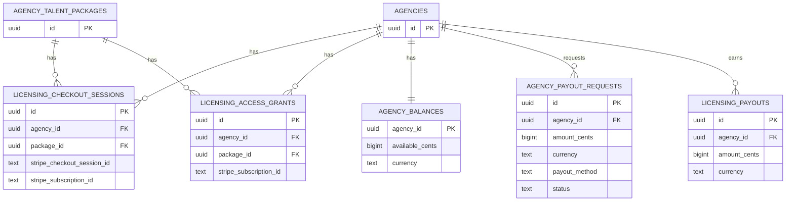

# Likelee AI — Design

> **Technical Documentation**: See [`docs/knowledge/`](./knowledge/) for detailed technical docs:
> - [Architecture Overview](./knowledge/architecture.md) - System architecture, components, data flow
> - [API Reference](./api-reference.md) - All API endpoints and webhooks
> - [Coding Conventions](./knowledge/coding-conventions.md) - Naming, formatting, and code review checklist
> - [Development Setup](./knowledge/development-setup.md) - Local development environment setup

## Overview

Likelee AI is a comprehensive talent management and licensing platform that connects agencies, brands, and creators (faces/talents). The system supports:

- **Agency Portal**: Manage talent rosters, licensing requests, invoices, bookings, and payouts
- **Talent Portal**: Creators manage their profiles, approve licenses, track earnings, and receive payouts
- **Brand Portal**: Brands discover talent, create campaigns, make offers, and manage deliverables
- **Studio**: AI-powered image and video generation using Fal and other providers
- **Marketplace**: Public-facing talent discovery and connection requests

## Architecture Summary

| Component | Technology | Location |
|-----------|------------|----------|
| Backend | Rust + Axum | `likelee-server/` |
| Frontend | React SPA | `likelee-ui/` |
| Database | Supabase (PostgreSQL) | `supabase/migrations/` |
| Storage | Supabase Storage | Buckets: `likelee-private`, `likelee-public`, `likelee-temp` |
| Auth | Supabase JWT | `likelee-server/src/auth.rs` |
| Config | envconfig | `likelee-server/src/config.rs` |

See [Architecture Overview](./knowledge/architecture.md) for full details.

---

## Accounting & Invoicing (Agency Dashboard)

### Goals

- Enable agencies to create, manage, and send invoices to their clients.
- Support invoice creation from an existing booking (preferred path) and manual entry.
- Provide consistent financial calculations (totals, commission split, tax/discount) with an auditable record.
- Keep invoices tenant-isolated (agency-only) using Supabase RLS and server-side enforcement.

### Non-Goals (Initial MVP)

- Payment processing / Stripe invoice issuing.
- Automated dunning (reminders), partial payments, credit notes.
- Full accounting ledger / double-entry accounting.
- PDF rendering and emailing from the backend (a preview endpoint can be added first).

### Key Concepts

- An invoice belongs to exactly one agency and one agency client.
- An invoice can be created from a booking:
  - Booking provides suggested talent, date of service, and base rate.
- An invoice contains:
  - Header fields (number, dates, PO/project reference)
  - Line items (services)
  - Optional expenses
  - Financial settings (commission, currency, tax, discount)
  - Notes and payment instructions

### Invoice Lifecycle

- `draft`
  - Editable by the agency.
- `sent`
  - Invoice has been issued to the client (MVP: marked manually).
  - Editing rules: limited in later phases (MVP can allow edits if needed).
- `paid`
  - Marked paid (manual for MVP).
- `void`
  - Cancelled invoice (manual for MVP).

### Data Model (Supabase)

#### `agency_invoices`

- **Ownership**
  - `agency_id` (uuid, FK to `public.agencies(id)`)
- **Associations**
  - `client_id` (uuid, FK to `public.agency_clients(id)`)
  - `booking_id` (uuid, optional, FK to `public.bookings(id)`)
- **Identity**
  - `invoice_number` (text)
  - `status` (text enum-like constraint: `draft`, `sent`, `paid`, `void`)
- **Dates**
  - `invoice_date` (date) b
  - `due_date` (date)
  - `sent_at` (timestamptz, nullable)
  - `paid_at` (timestamptz, nullable)
- **Client snapshot**
  - `bill_to_company` (text)
  - `bill_to_contact_name` (text)
  - `bill_to_email` (text)
  - `bill_to_phone` (text)
- **Commercial fields**
  - `po_number` (text, nullable)
  - `project_reference` (text, nullable)
  - `currency` (text, default `USD`)
  - `payment_terms` (text, default `net_30`)
- **Financial settings**
  - `agency_commission_bps` (integer, default `2000` for 20.00%)
  - `tax_rate_bps` (integer, default `0`)
  - `tax_exempt` (boolean, default `false`)
  - `discount_cents` (integer, default `0`)
- **Notes**
  - `notes_internal` (text, nullable)
  - `payment_instructions` (text, nullable)
  - `footer_text` (text, nullable)
- **Computed totals (stored)**
  - `subtotal_cents`
  - `expenses_cents`
  - `tax_cents`
  - `total_cents`
  - `agency_fee_cents`
  - `talent_net_cents`
- **Audit**
  - `created_at`, `updated_at`

#### `agency_invoice_items`

- `invoice_id` (uuid, FK to `agency_invoices(id)`)
- `sort_order` (integer)
- `description` (text)
- `talent_id` (uuid, nullable)
- `talent_name` (text, nullable)
- `date_of_service` (date, nullable)
- `rate_type` (text, nullable; aligns to booking rate types when sourced from booking)
- `quantity` (numeric)
- `unit_price_cents` (integer)
- `line_total_cents` (integer)
- `created_at`

#### `agency_invoice_expenses` (optional, MVP)

- `invoice_id` (uuid, FK to `agency_invoices(id)`)
- `sort_order` (integer)
- `description` (text)
- `amount_cents` (integer)
- `taxable` (boolean, default false)
- `created_at`

### Calculation Rules (MVP)

- `line_total_cents = round(quantity * unit_price_cents)`
- `subtotal_cents = sum(line_total_cents)`
- `expenses_cents = sum(expense.amount_cents)`
- `discount_cents` is applied once at invoice level.
- `taxable_base_cents` defaults to `subtotal_cents + (sum(taxable_expenses)) - discount_cents`, not below zero.

### Invoice Numbering (MVP)

- Invoice id is stored as a uuid.
- Default generation is performed server-side at creation time.
- Format: `INVC[A-Z][0-9]{7}` (example: `INVCZ9930308`).
- Invoice number is system-generated and cannot be provided or edited by users.

### Permissions & RLS

- Agencies can only read/write their own invoices and related rows.
- Ownership is by `agency_id` matching the authenticated agency user id.
- When a server endpoint accepts `invoice_id`, it must validate `agency_id = auth_user.id`.

### Backend API (likelee-server)

#### Existing dependencies

- Bookings and clients already exist and can be used for invoice creation:
  - `GET /api/bookings`
  - `GET /api/agency/clients`
  - `GET /api/agency/talents`

#### New endpoints (MVP)

- `GET /api/invoices`
  - List invoices for the agency (filters: status, date range optional).
- `POST /api/invoices`
  - Create invoice draft.
  - Supports `source_booking_id` optional.
- `GET /api/invoices/:id`
  - Get invoice header + items + expenses.
- `POST /api/invoices/:id`
  - Update invoice draft fields and replace/update items/expenses.
- `POST /api/invoices/:id/mark-sent`
  - Set status to `sent` and `sent_at = now()`.
- `POST /api/invoices/:id/mark-paid`
  - Set status to `paid` and `paid_at = now()`.
- `POST /api/invoices/:id/void`
  - Set status to `void`.

### UI (likelee-ui)

- Add "Accounting & Invoicing" section under the Agency Dashboard.
- Invoice Generation page supports:
  - Create from Existing Booking
  - Manual Entry

## Configuration Management

- No new environment variables are required for the initial Accounting & Invoicing MVP.
- If/when we add PDF rendering, emailing, or payment providers:
  - Add new variables to `likelee-server/src/config.rs` using `envconfig`.
  - Keep `likelee-server/.env.example` in sync.
  - Document the variables here under this section.

### Core Supabase

- `SUPABASE_URL`
  - Supabase project URL (required).
- `SUPABASE_SERVICE_KEY`
  - Service role key for backend operations (required).
- `SUPABASE_JWT_SECRET`
  - JWT secret for token verification (required).
- `SUPABASE_BUCKET_PRIVATE`
  - Private storage bucket name (default `likelee-private`).
- `SUPABASE_BUCKET_PUBLIC`
  - Public storage bucket name (default `likelee-public`).
- `SUPABASE_BUCKET_TEMP`
  - Temporary storage bucket name (default `likelee-temp`).

### Server Configuration

- `PORT`
  - Server port (default `8787`).
- `FRONTEND_URL`
  - Frontend URL for Stripe redirects and email links (default `http://localhost:5173`).
  - Must be an absolute URL starting with `http://` or `https://`.

### AWS & Moderation

- `AWS_REGION`
  - AWS region for Rekognition (default `us-east-1`).
- `MODERATION_ENABLED`
  - Enable content moderation via AWS Rekognition (default `1`).
  - Set to `0` to disable.

### Liveness Detection

- `LIVENESS_ENABLED`
  - Enable face liveness detection via AWS Rekognition (default `0`).
  - Requires Rekognition client initialization.
- `LIVENESS_MIN_SCORE`
  - Minimum confidence score for liveness check (default `0.90`).

### Multi-Level Cache

The server implements a three-level hierarchical caching strategy to reduce database load:

- **L1 (Request)**: Per-request scope, auto-cleanup on request completion
- **L2 (Session)**: User-scoped cache keyed by session ID with TTL
- **L3 (Application)**: Global shared data with background refresh

Idempotency keys (`Idempotency-Key` header) can be used on mutating endpoints (POST/PATCH/DELETE) to safely support retries.

- The middleware can replay cached responses for repeated keys.
- Handlers must store the result only after a successful commit (via `store_idempotency_result`).
- Replayed responses preserve the original `Content-Type` when it is stored (otherwise defaults to `application/json`).

Configuration variables:

- `CACHE_L2_TTL_SECS`
  - TTL for L2 session cache entries (default `1800` = 30 minutes).
- `CACHE_L3_TTL_SECS`
  - TTL for L3 application cache entries (default `3600` = 1 hour).
- `CACHE_L3_REFRESH_SECS`
  - Interval for L3 background refresh (default `300` = 5 minutes).
- `CACHE_L2_MAX_ENTRIES`
  - Maximum entries in L2 session cache (default `10000`).
- `CACHE_L3_MAX_ENTRIES`
  - Maximum entries in L3 application cache (default `1000`).
- `CACHE_IDEMPOTENCY_TTL_SECS`
  - TTL for idempotency key records (default `86400` = 24 hours).

### Voice & Audio

- `ELEVENLABS_API_KEY`
  - API key for ElevenLabs text-to-speech synthesis (optional).

### Studio Providers (AI Generation)

- `FAL_API_KEY`
  - API key used by the backend to submit/poll Fal Studio generation jobs.
  - Default: empty.
- `FAL_API_URL`
  - Base URL for Fal API queue endpoint.
  - Default: `https://queue.fal.run`.
- `HIGGSFIELD_API_KEY`
  - API key used by the backend to submit/poll Higgsfield generation jobs.
  - Default: empty.
- `HIGGSFIELD_API_URL`
  - Base URL for Higgsfield API.
  - Default: `https://api.higgsfield.ai`.
- `KIVE_API_KEY`
  - API key used by the backend to submit/poll Kive generation jobs.
  - Default: empty.
- `KIVE_API_URL`
  - Base URL for Kive API.
  - Default: `https://api.kive.ai`.

### SMTP (Admin + Sales/Contact)

- `SMTP_HOST`, `SMTP_PORT`, `SMTP_USER`, `SMTP_PASSWORD`
  - Admin/default SMTP transport used for all existing server-sent emails.
- `EMAIL_FROM`
  - Admin/default sender address.
- `EMAIL_CONTACT_TO`
  - Contact email recipient (optional).
- `SMTP_SALES_HOST`, `SMTP_SALES_PORT`, `SMTP_SALES_USER`, `SMTP_SALES_PASSWORD`
  - Sales/Contact SMTP transport (separate account/credentials).
- `EMAIL_FROM_SALES`
  - Sales/Contact sender address (default `operations@likelee.ai`).
- `EMAIL_SALES_TO`
  - Internal recipient address used by the backend to classify "sales/contact" emails (default `operations@likelee.ai`).

### KYC / Veriff

- `VERIFF_BASE_URL`
  - Veriff API base URL.
- `VERIFF_API_KEY`
  - Veriff API key.
- `VERIFF_SHARED_SECRET`
  - Veriff webhook signing secret.
- `KYC_BYPASS_VERIFF_LIMIT` (bool, default `false`)
  - Temporary testing flag to bypass the agency Veriff monthly session limit.
  - Must remain disabled in normal environments.

### Stripe Subscriptions (Agency Billing)

- `STRIPE_AGENCY_PRICE_ID`
  - Stripe Price ID for legacy agency subscription.
- `STRIPE_SCALE_PRICE_ID`
  - Stripe Price ID for scale tier.
- `STRIPE_AGENCY_BASIC_BASE_PRICE_ID`
  - Stripe Price ID for Agency Basic plan (new pricing pages).
- `STRIPE_AGENCY_PRO_BASE_PRICE_ID`
  - Stripe Price ID for Agency Pro plan (new pricing pages).
- `STRIPE_CHECKOUT_SUCCESS_URL`
  - URL Stripe redirects to after successful checkout.
- `STRIPE_CHECKOUT_CANCEL_URL`
  - URL Stripe redirects to after checkout is canceled.

### Stripe (Studio credit packs)

- `STRIPE_STUDIO_SUCCESS_URL`
  - URL Stripe redirects to after a successful Studio credits checkout.
  - Should include `{CHECKOUT_SESSION_ID}` so the frontend can show status.
- `STRIPE_STUDIO_CANCEL_URL`
  - URL Stripe redirects to after a canceled Studio credits checkout.

- `STRIPE_STUDIO_LITE_PRICE_IDS`
  - Mapping of credit amounts to Stripe Price IDs for the Lite plan.
  - Format: `credits:price_id` pairs separated by commas.
  - Example: `300:price_123`.

- `STRIPE_STUDIO_PRO_PRICE_IDS`
  - Mapping of credit amounts to Stripe Price IDs for the Pro plan.
  - Format: `credits:price_id` pairs separated by commas.
  - Example: `2000:price_123,5000:price_456,10000:price_789`.

- `STRIPE_STUDIO_PRICE_IDS`
  - Backwards-compatible fallback mapping (used if the plan-specific mapping is not set).

### Stripe Subscriptions (Client Licensing / Package Paywall)

- `STRIPE_LICENSING_BASIC_PRICE_ID`
  - Stripe Price ID for Basic licensing tier.
- `STRIPE_LICENSING_PRO_PRICE_ID`
  - Stripe Price ID for Pro licensing tier.
- `STRIPE_LICENSING_ENTERPRISE_PRICE_ID`
  - Stripe Price ID for Enterprise licensing tier.
- `STRIPE_LICENSING_SUCCESS_URL`
  - URL Stripe redirects to after successful licensing checkout (should route back to `/share/package/:token`).
  - Should include Stripe's `{CHECKOUT_SESSION_ID}` placeholder.
- `STRIPE_LICENSING_CANCEL_URL`
  - URL Stripe redirects to after licensing checkout is canceled.

### Stripe Connect (Agency Bank Connection)

- `PAYOUTS_ENABLED` (bool)
  - Enables Stripe Connect onboarding endpoints.
- `INSTANT_PAYOUTS_ENABLED` (bool)
  - Enables instant payouts.
  - Standard payouts are not supported.
- `STRIPE_SECRET_KEY`
  - Stripe secret key used server-side.
- `STRIPE_CLIENT_ID`
  - Stripe Connect client id (kept for future OAuth flows; current implementation uses Account Links).
- `STRIPE_RETURN_URL`
  - URL Stripe redirects to after a successful onboarding.
- `STRIPE_REFRESH_URL`
  - URL Stripe redirects to if the user abandons or needs to restart onboarding.
- `STRIPE_WEBHOOK_SECRET`
  - Used to validate Stripe webhook signatures.

### Agency Payout Scheduler

- `AGENCY_PAYOUT_SCHEDULER_ENABLED` (bool, default `false`)
  - Enables the background job that schedules agency payouts based on payout settings.
- `AGENCY_PAYOUT_SCHEDULER_INTERVAL_SECS` (u64, default `3600`)
  - The interval at which the scheduler wakes up to check due payouts.

### Payout Settings

- `PAYOUT_AUTO_APPROVE_THRESHOLD_CENTS` (u32, default `500000`)
  - Amount below which payouts are auto-approved.
- `MIN_PAYOUT_AMOUNT_CENTS` (u32, default `1000`)
  - Minimum payout amount.
- `INSTANT_PAYOUTS_ENABLED` (bool, default `true`)
  - Enable instant payouts via Stripe Connect.
- `PAYOUT_FEE_BPS` (u32, default `100`)
  - Payout fee in basis points (1% = 100 bps).
- `PAYOUT_CURRENCY` (String, default `USD`)
  - Default payout currency.
- `PAYOUT_ALLOWED_CURRENCIES` (String, default `USD,EUR`)
  - Comma-separated list of allowed currencies.

### DocuSeal (Contract Management)

- `DOCUSEAL_API_KEY`
  - API key for DocuSeal document signing.
- `DOCUSEAL_API_URL`
  - DocuSeal API base URL (default `https://api.docuseal.com`).
- `DOCUSEAL_APP_URL`
  - DocuSeal app URL for document viewing (default `https://docuseal.co`).
- `DOCUSEAL_WEBHOOK_URL`
  - DocuSeal webhook URL used for **scouting offers**.
  - Campaign and licensing webhooks use **separate endpoints** (see below).
- `DOCUSEAL_USER_EMAIL`
  - DocuSeal account email.
- `DOCUSEAL_MASTER_TEMPLATE_ID`
  - Master template ID for license contracts.
- `DOCUSEAL_MASTER_TEMPLATE_NAME`
  - Master template name for license contracts.

## Supabase ER Diagram (Migrations 0035-0037)


```mermaid
erDiagram
  AGENCIES {
    uuid id PK
  }
  AGENCY_TALENT_PACKAGES {
    uuid id PK
  }
  LICENSING_CHECKOUT_SESSIONS {
    uuid id PK
    uuid agency_id FK
    uuid package_id FK
    text stripe_checkout_session_id
    text stripe_subscription_id
  }
  LICENSING_ACCESS_GRANTS {
    uuid id PK
    uuid agency_id FK
    uuid package_id FK
    text stripe_subscription_id
  }
  AGENCY_BALANCES {
    uuid agency_id PK
    bigint available_cents
    text currency
  }
  AGENCY_PAYOUT_REQUESTS {
    uuid id PK
    uuid agency_id FK
    bigint amount_cents
    text currency
    text payout_method
    text status
  }
  LICENSING_PAYOUTS {
    uuid id PK
    uuid agency_id FK
    bigint amount_cents
    text currency
  }

  AGENCIES ||--o{ LICENSING_CHECKOUT_SESSIONS : "has"
  AGENCY_TALENT_PACKAGES ||--o{ LICENSING_CHECKOUT_SESSIONS : "has"

  AGENCIES ||--o{ LICENSING_ACCESS_GRANTS : "has"
  AGENCY_TALENT_PACKAGES ||--o{ LICENSING_ACCESS_GRANTS : "has"

  AGENCIES ||--|| AGENCY_BALANCES : "has"
  AGENCIES ||--o{ AGENCY_PAYOUT_REQUESTS : "requests"
  AGENCIES ||--o{ LICENSING_PAYOUTS : "earns"
```

## Licensing Fees

### Unified Fee Structure

The licensing flow has been simplified to use a single "License Fee" source of truth.

- **Primary Source**: `public.license_submissions.license_fee` (stored as `BIGINT` in cents).
- **Redundancy Removal**: The `budget_min` and `budget_max` columns in `public.licensing_requests` have been removed.
- **Backend Resolution**: All licensing-related views (Licensing Requests, Active Licenses, Talent View) now fetch the fee directly from the linked `license_submissions` table.
- **UI Representation**: The frontend displays a single `License Fee` instead of a `Budget Range`.

## Campaign Deliverables

### Goals
- Allow creators to upload media assets (images/videos) as deliverables for campaign offers.
- Support a multi-stage review workflow: Creator -> Agency -> Brand.
- Ensure assets are stored securely and accessed only by authorized parties.

### Workflow
1. **Draft Stage**: Creators and agencies can upload assets as deliverables. These assets start in a `draft` state (default) and are only visible to the submitting party until submitted.
2. **Submission**: Creators explicitly "Submit to Agency". This updates the deliverable status to `submitted` and notifies the agency.
3. **Agency Review**: Agencies can `approve` or `request_changes` on deliverables.
4. **Brand Review**: Once approved by the agency, deliverables are visible to the Brand for final approval.

### Secure Media Authentication
To protect private assets stored in Supabase, all deliverable media is accessed via a backend proxy:
- **Proxy Endpoint**: `/api/campaign-offers/:offer_id/deliverables/:id/file`
- **Authentication**: Since browser `` and `<video />` tags do not natively support custom headers (like `Authorization: Bearer <token>`), the backend supports a fallback authentication mechanism.
- **Token Fallback**: If the `Authorization` header is missing, the server extracts the JWT from the `token` query parameter. This allows secure, authenticated access to private media files directly within HTML media elements.

### Payment Gating
To ensure financial security:
- **Deliverable Gating**: Deliverable uploads and submissions (both creator and agency) are disabled until the campaign offer's `payment_status` is `paid`.
- **Escrow Flow**: When a brand "Pays" an offer, funds are collected via Stripe Checkout. The `payment_status` switches from `unpaid` -> `processing` -> `paid`. For agency offers, funds are released via Stripe **Transfers** to the connected accounts after brand approval triggers escrow release.
- **UI Gating**: Frontend components (`AgencyDeliverablesView`, `CreatorDashboard`) conditionally disable upload/review buttons and show "Awaiting Brand Payment" indicators based on the offer's payment status.

### Escrow Status & Transfers
Agency campaign offers track escrow release separately from deliverable workflow:
- `campaign_offers.escrow_status`: `holding` → `releasing` → `released`
- Transfer attempts are recorded in `campaign_offer_transfers` per recipient (agency + creators).
- Dashboard balances distinguish:
  - **Held (pending transfer)**: internal Likelee tracking
  - **cashout (Stripe)**: Stripe connected-account available balance (actual withdrawable funds)

#### Commission semantics (agency campaign offers)
When distributing a campaign offer payout for an **agency** collaborator, `commission_rate` is interpreted as the **agency commission percent** for each creator share.

- `creator_payout_percent = 100 - commission_rate`
- `creator_earnings = gross_share_cents * creator_payout_percent`
- `agency_earnings = gross_share_cents - creator_earnings`

Commission resolution order (per assigned `creator_id`):
1) `agency_creator_commissions(agency_id, creator_id).commission_rate` (override, if present)
2) Tier default from `agencies.performance_commission_config[tier].commission_rate`
   - tier comes from `agency_talent_relationships.performance_tier_name` for connected creators
   - `agency_users.performance_tier_name` overrides when present for roster creators
3) Fallback default (used only when no config is present)
### Calendly Integration (IRL Booking)

#### System Configuration
- `CALENDLY_BOOKING_URL`: The system-wide fallback scheduling link.
- `CALENDLY_WEBHOOK_SIGNING_KEY`: Secret used to verify Calendly webhook signatures.

#### Agency-Specific Configuration
Agencies can override the system default Calendly settings with their own API tokens and event mappings.

##### Data Model: `agency_calendly_settings`
- `agency_id` (uuid, PK): Link to `public.agencies(id)`.
- `calendly_api_token` (text, nullable): The agency's personal access token.
- `is_enabled` (boolean): Whether the custom integration is active.
- `mappings` (jsonb): A map of platform booking types to Calendly event slugs.
  - Keys: `default`, `agency_discovery`, `talent_interview`, `photo_shoot`.
- `updated_at` (timestamptz)

##### Resolution Logic
When scheduling a meeting for an agency:
1. Check if the agency has `agency_calendly_settings` with `is_enabled = true`.
2. If so, use their `calendly_api_token`.
3. Resolve the target event slug:
   - Check `mappings` for the specific booking type.
   - Fall back to the `default` mapping if the specific type is missing.
   - Fall back to system defaults if no agency mapping is found.

#### API Endpoints
- `GET /api/calendly/settings`: Fetch the authenticated agency's settings.
- `POST /api/calendly/settings`: Update settings (JSON payload matching the data model).
- `GET /api/calendly/event-types`: Fetch available event types for the agency (uses agency token or system fallback).

## Studio Wallet & Transactions

The Studio Wallet system manages virtual credits used for AI image and video generation. It provides a detailed ledger for all credit movements and integrates with Stripe for purchasing credit packs.

### Data Model (Supabase)

#### `studio_wallets`

Stores the current credit balance and subscription plan for each user.

- `id` (uuid, PK)
- `user_id` (uuid, Unique): Link to the platform user.
- `balance` (bigint): Current available credits (defaults to 0).
- `current_plan` (text): The user's active plan (e.g., `lite`, `pro`).
- `created_at`, `updated_at` (timestamptz)

#### `studio_credit_transactions`

Atomic ledger tracking every credit delta.

- `id` (uuid, PK)
- `wallet_id` (uuid, FK to `studio_wallets`): The affected wallet.
- `delta` (bigint): Credit change (negative for deductions, positive for adds/refunds).
- `balance_after` (bigint): The balance immediately following the transaction.
- `reason` (text): Transaction category (`purchase`, `generation_deduction`, `generation_refund`, `generation_refund_reconcile`, `generation_extra_deduction`).
- `provider` (text, optional): The AI provider involved.
- `generation_id` (uuid, optional): Link to the specific generation job.
- `stripe_session_id` (text, optional): Stripe checkout session ID for purchase transactions.
- `metadata` (jsonb): Additional context for the transaction.
- `created_at` (timestamptz)

#### `studio_provider_costs`

Pricing configuration for different AI models and providers.

- `id` (uuid, PK)
- `provider` (text): e.g., `fal`, `kling`.
- `generation_type` (text): `image`, `video`.
- `model` (text): Specific model identifier.
- `cost_per_generation` (bigint): Base credit cost.
- `cost_modifiers` (jsonb): Advanced pricing rules (e.g., duration-based).
- `enabled` (boolean): Whether the model is available for use.

### Core Workflows

#### 1. Wallet Lifecycle

Wallets are created automatically the first time a user interacts with the Studio or checks their balance. If no wallet exists for a `user_id`, a new one is initialized with 0 credits.

#### 2. Purchasing Credits

1. **Initiation**: User selects a credit pack in the UI. Frontend calls `POST /api/stripe/create-checkout-session` (`billing.rs`).
2. **Checkout**: Backend creates a Stripe Checkout Session with `billing_domain: studio` and `credits` in metadata.
3. **Completion**: Stripe sends a `checkout.session.completed` webhook.
4. **Provisioning**: The webhook handler (`payouts.rs`) verifies the metadata and calls `add_credits` (`wallet.rs`), which:
   - Increments the wallet balance.
   - Records a `purchase` transaction with the `stripe_session_id`.
   - Updates the `current_plan` based on the purchased tier.

#### 3. Generation Flow & Deductions

1. **Pre-check**: Before submitting a job to a provider, the backend checks if the user has enough credits (`check_balance`).
2. **Deduction**: The estimated cost is deducted immediately (`deduct_credits`). A `generation_deduction` transaction is logged.
3. **Failure Handling**: If the job fails locally or at the provider, credits are fully refunded (`refund_credits`) with a `generation_refund` reason.
4. **Reconciliation**: When a job completes, if the provider returns actual billing data (e.g., exact seconds of video generated), the backend adjusts the balance (`reconcile_credits`):
   - Overcharged: `generation_refund_reconcile` (surplus returned).
   - Undercharged: `generation_extra_deduction` (additional credits taken).

### Persistence & Identity

The Studio Wallet is tied directly to the user's permanent `user_id` in the database.

- **Session Independence**: Credits and transaction history are persistent. Logging out or clearing browser sessions has no effect on the wallet balance.
- **Identity Matching**: When a user logs back in, the system uses the unique `user_id` from their authentication token to fetch the corresponding record in `studio_wallets`.
- **Atomic Reliability**: All credit movements are recorded as atomic deltas in `studio_credit_transactions`, ensuring that the balance remains accurate and verifiable regardless of user activity or session state.

### Implementation

- **Backend Logic**: `likelee-server/src/studio/wallet.rs`
- **Pricing Configuration**: `public.studio_provider_costs` (DB)
- **Routes**: `likelee-server/src/studio/routes.rs` (generation endpoints)
- **Billing Integration**: `likelee-server/src/billing.rs` and `likelee-server/src/payouts.rs` (webhooks)

---

## Liveness Detection

Face liveness detection prevents spoofing during identity verification using AWS Rekognition.

### Configuration

- `LIVENESS_ENABLED`: Set to `1` to enable (default `0`).
- `LIVENESS_MIN_SCORE`: Minimum confidence threshold (default `0.90`).

### API Endpoints

- `POST /api/liveness/session` - Create a liveness detection session
- `POST /api/liveness/result` - Get liveness check results

### Implementation

- **Backend Logic**: `likelee-server/src/liveness.rs`
- **AWS Service**: Rekognition Face Liveness
- **Initialization**: Rekognition client initializes when `MODERATION_ENABLED` or `LIVENESS_ENABLED` is set.

---

## Voice & Audio

Voice recording and cloning capabilities for talent profiles.

### Creator Tier Gating

- `free` and `basic` creators cannot create ElevenLabs voice profiles.
- `pro` creators can create up to 6 creator voice tones/profiles.
- Agency voice limits remain governed by agency entitlements and are not changed by creator plan logic.

### Data Model

#### `voice_recordings`

- `id` (uuid, PK)
- `user_id` (uuid, FK to auth.users)
- `label` (text): Recording name/description
- `file_path` (text): Storage path
- `duration_secs` (numeric, nullable)
- `created_at` (timestamptz)

#### `voice_models`

- `id` (uuid, PK)
- `user_id` (uuid, FK to auth.users)
- `name` (text): Model name
- `provider` (text): Voice cloning provider
- `provider_model_id` (text): External model ID
- `source_recording_id` (uuid, FK to voice_recordings, nullable)
- `is_active` (boolean)
- `created_at` (timestamptz)

### API Endpoints

- `GET /api/voice/recordings` - List voice recordings
- `POST /api/voice/recordings` - Upload a voice recording
- `GET /api/voice/recordings/signed-url` - Get signed URL for recording
- `DELETE /api/voice/recordings/:id` - Delete a recording
- `POST /api/voice/models` - Register a voice model
- `POST /api/voice/models/clone` - Create a voice clone from recording

### Implementation

- **Backend Logic**: `likelee-server/src/voice.rs`
- **TTS Provider**: ElevenLabs (`ELEVENLABS_API_KEY`)

---

## Creator Billing & Entitlements

Creator subscriptions are backed by Stripe and persisted directly on the creator profile.

### Plans

- `free`
  - fallback state when no active paid creator subscription exists
  - capped at 15 combined public categories
- `basic` (`$25/mo`)
  - likeness profile
  - KYC
  - agency connection
  - up to 15 combined `content_types` + `industries`
- `pro` (`$50/mo`)
  - everything in Basic
  - Cameo uploads
  - unauthorized-use monitoring access
  - ElevenLabs voice profile creation for up to 6 tones
  - advanced earnings analytics

### Data Model

#### `creators`

- `plan_tier` (text, default `free`)
- `stripe_customer_id` (text, nullable)
- `stripe_subscription_id` (text, nullable)
- `plan_updated_at` (timestamptz, nullable)

#### `creator_subscription_events`

- `id` (uuid, PK)
- `creator_id` (uuid, FK to `creators`)
- `provider` (text, default `stripe`)
- `stripe_customer_id` (text, nullable)
- `stripe_subscription_id` (text, nullable)
- `event_type` (text)
- `plan_tier` (text)
- `subscription_status` (text)
- `payload_json` (jsonb)
- `created_at` (timestamptz)

### Entitlement Rules

- category cap is enforced at creator profile save time using the combined distinct count of:
  - `content_types`
  - `industries`
- creator plan checks must resolve the effective creator id for both `creator` and `talent` users
- entitlement enforcement is backend-first; UI only mirrors the locked/unlocked state

### API Endpoints

- `POST /api/creator/billing/checkout`
  - Creates Stripe checkout for `basic` or `pro`
- `GET /api/creator/billing/status`
  - Returns creator plan and derived entitlements
- `GET /api/talent/me`
  - Returns `plan_tier` and creator entitlement metadata for dashboard bootstrapping
- `GET /api/talent/analytics`
  - Returns stable analytics payload plus `advanced_analytics_enabled`

### UI Behavior

- Basic onboarding should still expose core creator flows:
  - likeness profile
  - KYC
  - agency connection
- Pro-only features should not appear as dead-end actions.
- Locked surfaces should route creators toward upgrade instead of failing late:
  - voice profile creation
  - advanced analytics
  - unauthorized-use monitoring
  - Cameo upload workflows

---

## Brand Campaigns & Offers

Brands can create campaigns, make offers to talent, and manage deliverables.

### Campaign Workflow

1. **Campaign Creation**: Brand creates a campaign with requirements and budget.
2. **Offer Creation**: Brand makes offers to specific talent or agencies.
3. **Offer Response**: Agency/talent accepts or declines the offer.
4. **Contract Signing**: DocuSeal integration for contract management.
5. **Package Delivery**: Agency uploads deliverables via packages.
6. **Review & Approval**: Brand reviews and approves deliverables.

### Data Model

#### `brand_campaigns`

- `id` (uuid, PK)
- `brand_id` (uuid, FK to brands)
- `title`, `description` (text)
- `status` (text): `draft`, `active`, `paused`, `completed`, `cancelled`
- `budget_cents` (bigint, nullable)
- `start_date`, `end_date` (date, nullable)
- `created_at`, `updated_at` (timestamptz)

#### `campaign_offers`

- `id` (uuid, PK)
- `campaign_id` (uuid, FK to campaigns)
- `agency_id`, `talent_id` (uuid, FK)
- `status` (text): `pending`, `accepted`, `declined`, `withdrawn`
- `offer_details` (jsonb)
- `created_at`, `updated_at` (timestamptz)

### API Endpoints

- `POST /api/brand/campaigns` - Create campaign
- `GET /api/brand/campaigns` - List brand's campaigns
- `GET /api/brand/campaigns/:campaign_id` - Get campaign details
- `POST /api/brand/campaigns/:campaign_id/offers` - Create offers
- `GET /api/campaign-offers/my` - List user's offers
- `POST /api/campaign-offers/:offer_id/respond` - Accept/decline offer
- `POST /api/campaign-offers/:offer_id/contracts` - Manage contracts
- `POST /api/campaign-offers/:offer_id/deliverables` - Submit deliverables
- `POST /api/campaign-offers/:offer_id/deliverables/:id/review` - Review deliverable

### Implementation

- **Backend Logic**: `likelee-server/src/brand_campaigns.rs`
- **Contract Integration**: DocuSeal webhooks at `/webhooks/docuseal/campaign-contracts`
- **DocuSeal Webhooks (by flow)**:
  - Scouting offers: `POST /webhooks/docuseal`
  - Campaign offer contracts: `POST /webhooks/docuseal/campaign-contracts`
  - Licensing contracts: `POST /api/webhooks/licenseContract`

---

## Creator/Agency Connections

Creators can connect with agencies through invites and connection requests.

### Agency Talent Invites

Agencies can invite talent to join their roster:

- `POST /api/agency/talent-invites` - Create invite
- `GET /api/agency/talent-invites` - List invites (agency view)
- `POST /api/agency/talent-invites/:id/revoke` - Revoke invite
- `GET /api/invites/agency-talent/:token` - Get invite by token
- `POST /api/invites/agency-talent/:token/accept` - Accept invite
- `POST /api/invites/agency-talent/:token/decline` - Decline invite

### Creator Agency Connections

- `GET /api/creator/agency-invites` - List creator's agency invites
- `POST /api/creator/agency-invites/:id/accept` - Accept agency invite
- `POST /api/creator/agency-invites/:id/decline` - Decline agency invite
- `GET /api/creator/agency-connections` - List agency connections
- `POST /api/creator/agency-connections/:agency_id/disconnect` - Disconnect from agency

### Implementation

- **Backend Logic**: `likelee-server/src/agency_talent_invites.rs`, `likelee-server/src/creator_agency_connection.rs`

---

## Brand Connections

Agencies and creators can connect with brands for licensing and campaigns.

### Agency Brand Connections

- `GET /api/agency/brand-connection-requests` - List incoming brand requests
- `POST /api/agency/brand-connection-requests/:id/accept` - Accept brand connection
- `POST /api/agency/brand-connection-requests/:id/decline` - Decline brand connection
- `GET /api/agency/brand-connections` - List brand connections
- `POST /api/agency/brand-connections/:brand_id/disconnect` - Disconnect from brand

### Creator Brand Connections

- `GET /api/creator/brand-connection-requests` - List incoming brand requests
- `POST /api/creator/brand-connection-requests/:id/accept` - Accept brand connection
- `POST /api/creator/brand-connection-requests/:id/decline` - Decline brand connection
- `GET /api/creator/brand-connections` - List brand connections
- `POST /api/creator/brand-connections/:brand_id/disconnect` - Disconnect from brand

### Implementation

- **Backend Logic**: `likelee-server/src/face_profiles.rs`

---

## Brand License Requests

Brand License Requests represent a brand-initiated request to license a creator (often via an agency). This is a separate workflow from the legacy `licensing_requests` flow.

### Data Model

- **Primary table**: `public.brand_license_requests`
- **Contract/submission link**: `public.license_submissions.brand_request_id` → `public.brand_license_requests.id`

### API Endpoints

- `POST /api/brand/brand-license-requests` - Create a brand license request
- `GET /api/brand/brand-license-requests` - List brand license requests (brand view)
- `GET /api/agency/brand-license-requests` - List brand license requests (agency view)
- `POST /api/agency/brand-license-requests/status` - Update request status (agency accept/decline)

### Lifecycle

- Brand creates a request in `brand_license_requests`.
- Agency reviews and updates the request status (e.g. accept/decline).
- When a contract is drafted/sent, a `license_submissions` row is created and linked back via `license_submissions.brand_request_id` and/or `brand_license_requests.submission_id`.

---

## Talent Portal

The Talent Portal allows creators to manage their profiles, approve licenses, and track earnings.

### Profile Management

- `GET /api/talent/me` - Get talent profile
- `POST /api/talent/profile` - Update profile
- `GET /api/talent/settings` - Get portal settings
- `POST /api/talent/settings` - Update portal settings

### Licensing

- `GET /api/talent/licensing-requests` - List pending licensing requests
- `POST /api/talent/licensing-requests/:id/approve` - Approve license
- `POST /api/talent/licensing-requests/:id/decline` - Decline license
- `GET /api/talent/licenses` - List active licenses
- `GET /api/talent/licensing/revenue` - Get revenue summary
- `GET /api/talent/licensing/earnings-by-campaign` - Earnings breakdown by campaign
- `GET /api/talent/licensing/earnings-by-agency` - Earnings breakdown by agency

### Bookings

- `GET /api/talent/bookings` - List bookings
- `GET /api/talent/book-outs` - List book-outs
- `POST /api/talent/book-outs` - Create book-out
- `DELETE /api/talent/book-outs/:id` - Delete book-out
- `GET /api/talent/booking-preferences` - Get booking preferences
- `POST /api/talent/booking-preferences` - Update booking preferences

### Portfolio

- `GET /api/talent/portfolio-items` - List portfolio items
- `POST /api/talent/portfolio-items` - Create portfolio item
- `DELETE /api/talent/portfolio-items/:id` - Delete portfolio item
- `POST /api/talent/portfolio-items/upload` - Upload portfolio file

### Earnings & Payouts

- `GET /api/talent/irl/earnings/summary` - IRL earnings summary
- `GET /api/talent/irl/earnings/payments` - IRL payment history
- `POST /api/talent/irl/earnings/payout-request` - Request payout
- `GET /api/talent/payouts/account-status` - Stripe Connect account status
- `POST /api/talent/payouts/onboarding-link` - Get Stripe onboarding link
- `GET /api/talent/payouts/balance` - Get available balance
- `POST /api/talent/payouts/request` - Request payout

### Analytics

- `GET /api/talent/analytics` - Get talent analytics

### Notifications

- `GET /api/talent/notifications` - List notifications
- `POST /api/talent/notifications/:id/read` - Mark notification as read

### Tax Documents

- `GET /api/talent/tax-documents/latest` - Get latest tax document

### Implementation

- **Backend Logic**: `likelee-server/src/talent.rs`

---

## Marketplace

Public marketplace for talent discovery.

### API Endpoints

- `GET /api/marketplace/search` - Search marketplace profiles
- `GET /api/marketplace/:profile_type/:id/details` - Get profile details
- `POST /api/marketplace/connect` - Request connection

### Implementation

- **Backend Logic**: `likelee-server/src/face_profiles.rs`

---

## KYC (Know Your Customer)

Identity verification via Veriff integration.

### Configuration

- `VERIFF_BASE_URL`: Veriff API base URL
- `VERIFF_API_KEY`: Veriff API key
- `VERIFF_SHARED_SECRET`: Veriff webhook signing secret
- `KYC_BYPASS_VERIFF_LIMIT`: Bypass monthly session limit (testing only, default `false`)

### API Endpoints

- `POST /api/kyc/session` - Create Veriff session
- `GET /api/kyc/status` - Get KYC status
- `POST /api/kyc/organization/session` - Create organization KYC session
- `GET /api/kyc/organization/status` - Get organization KYC status

### Webhooks

- `POST /webhooks/kyc/veriff` - Veriff callback handler

### Implementation

- **Backend Logic**: `likelee-server/src/kyc.rs`

---

## Database Transaction Patterns

### Overview

Multi-step database operations are wrapped in PostgreSQL RPC functions to ensure atomicity (ACID compliance). The Postgrest client used by the Rust backend doesn't support client-side transactions, so all transactional logic is implemented server-side in PostgreSQL.

### Migration Location

- **File**: `supabase/migrations/2026-03-23_atomic_transactions.sql`

### Key RPC Functions

#### `adjust_wallet_credits`

Atomically adjusts a user's wallet balance and records the transaction.

**Parameters:**
- `p_user_id` (uuid): User ID
- `p_delta` (bigint): Credit change (positive for credit, negative for debit)
- `p_reason` (text): Transaction reason
- `p_provider` (text, nullable): Provider name (fal, higgsfield, kive)
- `p_generation_id` (uuid, nullable): Generation job ID
- `p_stripe_session_id` (text, nullable): Stripe checkout session ID

**Returns:** JSONB with `wallet_id`, `balance_before`, `balance_after`, `transaction_id`

**Usage in Rust:**
```rust
// In likelee-server/src/studio/wallet.rs
let (_, balance_after) = call_adjust_wallet_credits(
    pg, user_id, -amount, "generation_deduction",
    Some(provider), Some(generation_id), None
).await?;
```

#### `complete_payment_link_checkout`

Atomically completes a payment link checkout: updates payment link status, inserts licensing_payouts, updates payments, and archives related records.

**Parameters:**
- `p_payment_link_id` (uuid)
- `p_payment_intent_id` (text)
- `p_agency_id` (uuid)
- `p_licensing_request_ids` (text): Comma-separated UUIDs
- `p_agency_amount_cents`, `p_talent_amount_cents`, `p_platform_fee_cents`, `p_net_amount_cents` (bigint)
- `p_currency` (text)
- `p_talent_splits` (jsonb)
- `p_commission_rate` (numeric)

**Returns:** JSONB with summary of updated records

#### `setup_agency_stripe_connect`

Atomically creates agency profile (if needed) and sets Stripe Connect account ID.

#### `bulk_update_payments_status`

Atomically updates multiple payments to the same status.

### Existing Transactional Functions

The following function was created in an earlier migration and remains the source of truth:

- **`record_stripe_transfer`** (migration `0044_fix_payout_triggers_available_cents.sql`): Records Stripe transfers and adjusts balances atomically.

### Pattern Guidelines

1. **Single Responsibility**: Each RPC function handles one logical unit of work.
2. **Explicit Transactions**: PostgreSQL functions are implicitly transactional.
3. **Error Handling**: Functions raise exceptions on failure, causing automatic rollback.
4. **JSONB Returns**: Functions return JSONB for flexibility and structured error reporting.
5. **SECURITY DEFINER**: Functions run with elevated privileges to bypass RLS where needed.

### When to Use Transactions

| Operation Type | Transaction Required? |
|----------------|----------------------|
| Wallet balance + transaction record | Yes |
| Payment link completion (multi-table) | Yes |
| Agency onboarding (create + update) | Yes |
| Single SELECT query | No |
| Single INSERT/UPDATE | No |

---

## Background Jobs

### Payment Reminders

Automated invoice payment reminder emails.

- **Trigger**: `likelee_server::jobs::start_payment_reminders`
- **Interval**: Daily
- **Logic**: Sends reminders for overdue invoices

### Agency Payout Scheduler

Automated scheduling of agency payouts.

- **Trigger**: `likelee_server::jobs::start_agency_payout_scheduler`
- **Interval**: Configurable via `AGENCY_PAYOUT_SCHEDULER_INTERVAL_SECS`
- **Configuration**: `AGENCY_PAYOUT_SCHEDULER_ENABLED`

### Implementation
