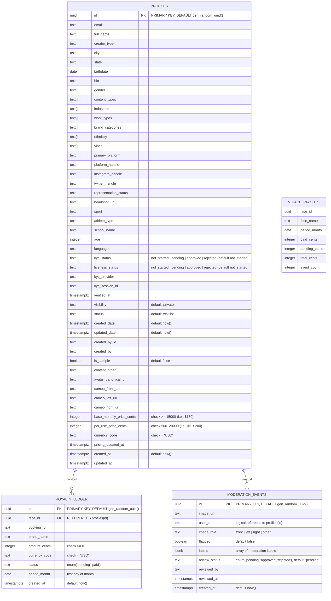

# Database ER Diagram

This ER diagram reflects the current schema defined by the Supabase migrations in `likelee-ui/supabase/migrations` as of the latest change. It is derived from the following files:

- 20251118_profiles.sql
- 20251118_profiles_verification.sql
- 20251119_profiles_fields.sql
- 20251120_profiles_avatar_canonical.sql
- 20251120_profiles_cameo_images.sql
- 20251121_profiles_id_default.sql
- 2025-11-21_royalty_wallet_mvp.sql
- 2025-11-21_consolidated_profiles_wallet.sql
- 2025-11-23_moderation_events.sql

Currently, the schema includes `profiles` and the new `royalty_ledger` table (FK → profiles), plus a read-only aggregation view `v_face_payouts`.

## Mermaid ER Diagram

## Notes
- The initial migration created `profiles.id` as `TEXT PRIMARY KEY`. The later migration `20251121_profiles_id_default.sql` ensures a UUID default via `gen_random_uuid()`. If your environment still has `id` as TEXT, apply a conversion migration.
- `royalty_ledger.face_id` references `profiles(id)`; the view `v_face_payouts` aggregates paid/pending amounts by face and month for read-only dashboard usage.
- The consolidated migration `2025-11-21_consolidated_profiles_wallet.sql` couples minimal `profiles` prerequisites and the Royalty Wallet schema (ledger, view, policies) to provision new environments consistently. Prefer running this single file in greenfield environments to avoid ordering issues.
