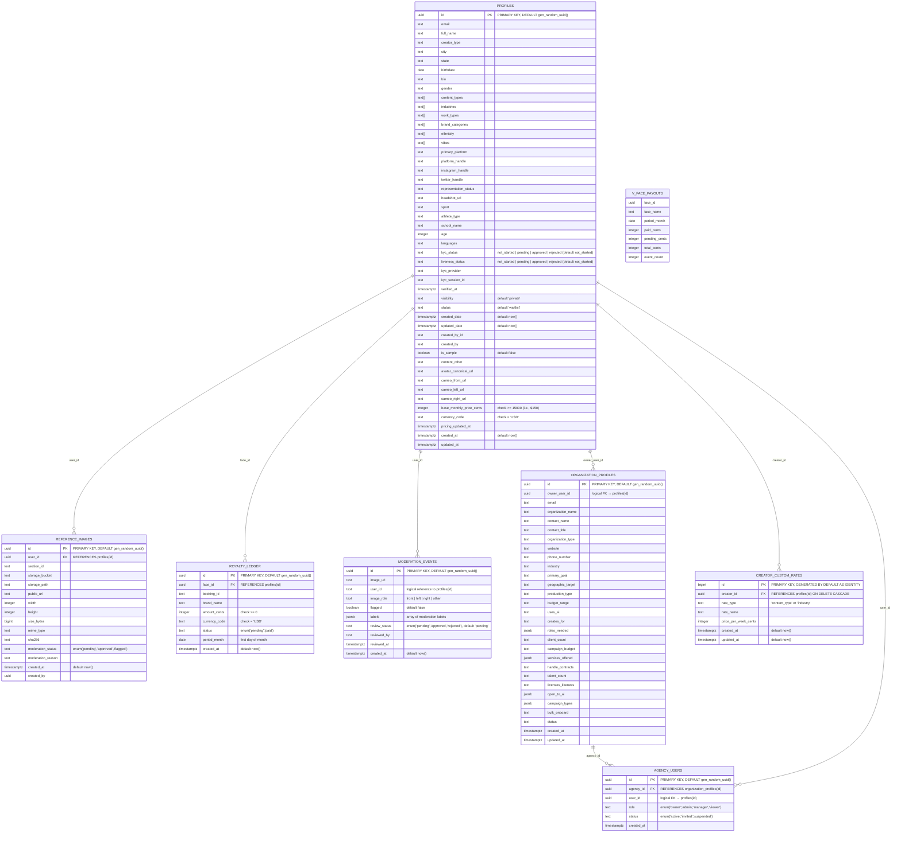

# Database ER Diagram

This ER diagram reflects the current schema defined by the Supabase migrations in `/supabase/migrations` as of the latest change. It is derived from the following files:

- 20251118_profiles.sql
- 20251118_profiles_verification.sql
- 20251119_profiles_fields.sql
- 20251120_profiles_avatar_canonical.sql
- 20251120_profiles_cameo_images.sql
- 20251121_profiles_id_default.sql
- 2025-11-21_royalty_wallet_mvp.sql
- 2025-11-21_consolidated_profiles_wallet.sql
- 2025-11-23_moderation_events.sql
- 20251127_create_org_and_agency_users.sql
- 20251204101400_add_creator_custom_rates.sql

Currently, the schema includes `profiles`, `royalty_ledger`, `creator_custom_rates` (FK → profiles), plus a read-only aggregation view `v_face_payouts`.

## Mermaid ER Diagram

## Notes
- The initial migration created `profiles.id` as `TEXT PRIMARY KEY`. The later migration `20251121_profiles_id_default.sql` ensures a UUID default via `gen_random_uuid()`. If your environment still has `id` as TEXT, apply a conversion migration.
- `royalty_ledger.face_id` references `profiles(id)`; the view `v_face_payouts` aggregates paid/pending amounts by face and month for read-only dashboard usage.
- The consolidated migration `2025-11-21_consolidated_profiles_wallet.sql` couples minimal `profiles` prerequisites and the Royalty Wallet schema (ledger, view, policies) to provision new environments consistently. Prefer running this single file in greenfield environments to avoid ordering issues.

## Relationship Details

- **PROFILES → ORGANIZATION_PROFILES (owner_user_id)**
  - Each organization profile is owned by a single user profile (`owner_user_id`).
  - Cardinality: 1 profile can own 0..N organizations. Each organization has exactly 1 owner.
  - Access: RLS allows only the owner to select/insert/update their own organization rows.

- **ORGANIZATION_PROFILES → AGENCY_USERS (agency_id)**
  - Membership table linking organizations (agencies/brands) to users who have seats/roles.
  - Cardinality: 1 organization has 0..N members; a user can appear in 0..N organizations.
  - Unique constraint `(agency_id, user_id)` prevents duplicates.
  - Roles: `owner | admin | manager | viewer`. Status: `active | invited | suspended`.
  - Access: RLS permits members (or owner) to select rows; only owners can insert/update membership.

- **PROFILES → AGENCY_USERS (user_id)**
  - References the user profile who is a member of an organization.
  - Cardinality: 1 profile can belong to 0..N organizations; each membership row maps exactly 1 profile to 1 organization.

- **PROFILES → ROYALTY_LEDGER (face_id)**
  - Ledger entries attribute earnings to a Face (stored in `profiles`).
  - Cardinality: 1 face can have 0..N ledger entries; each ledger entry references exactly 1 face.
  - Used by dashboards and the `V_FACE_PAYOUTS` view for aggregation.

- **PROFILES → MODERATION_EVENTS (user_id)**
  - Moderation events are tied to the profile that submitted the image or action.
  - Cardinality: 1 profile can have 0..N moderation events; each event references exactly 1 profile.

- **PROFILES → CREATOR_CUSTOM_RATES (creator_id)**
  - Custom licensing rates for specific content types and industries set by creators.
  - Cardinality: 1 profile can have 0..N custom rates; each rate references exactly 1 profile.
  - UNIQUE constraint on `(creator_id, rate_type, rate_name)` prevents duplicate rates.
  - Function `upsert_creator_rates(p_creator_id, p_rates)` handles batch updates with security checks.
  - RLS policies ensure creators can only manage their own rates.

- **V_FACE_PAYOUTS** (view)
  - Read-only aggregation across `ROYALTY_LEDGER` grouped by face and month.
  - No direct writes; used for analytics/overview.

### Compliance and KYC/Liveness Context
- KYC status for user profiles is stored on `PROFILES` and is used to gate sensitive actions.
- Organization owner’s KYC must be approved to unlock “Create Agency” tools in the UI.
- Organization-level KYC (via Veriff) is initiated on creation and tracked via status endpoints.

### Practical Flows
- Create Organization
  - User (owner profile) creates `ORGANIZATION_PROFILES` row → Triggers organization KYC session.
  - On approval, owner can add members by inserting rows into `AGENCY_USERS` (subject to RLS: owner-only insert).

- Membership Management
  - Owner adds team members (emails/users) → rows in `AGENCY_USERS` with role/status.
  - Members gain read access to the organization’s membership list via RLS.

- Earnings Attribution
  - Bookings/payments produce `ROYALTY_LEDGER` entries tied to a Face (in `PROFILES`).
  - `V_FACE_PAYOUTS` aggregates for dashboards.
