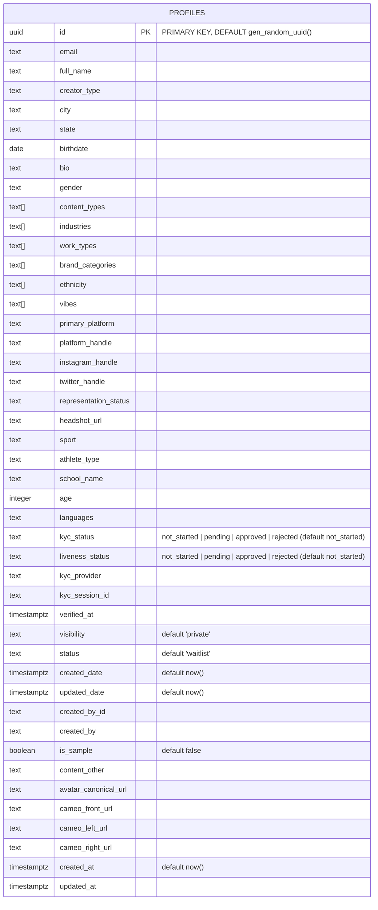

# Database ER Diagram

This ER diagram reflects the current schema defined by the Supabase migrations in `likelee-ui/supabase/migrations` as of the latest change. It is derived from the following files:

- 20251118_profiles.sql
- 20251118_profiles_verification.sql
- 20251119_profiles_fields.sql
- 20251120_profiles_avatar_canonical.sql
- 20251120_profiles_cameo_images.sql
- 20251121_profiles_id_default.sql

Currently, the schema centers on a single table `profiles` with no explicit foreign keys.

## Mermaid ER Diagram

## Notes
- The initial migration created `profiles.id` as `TEXT PRIMARY KEY`. The later migration `20251121_profiles_id_default.sql` ensures a UUID default via `gen_random_uuid()`. If your environment still has `id` as TEXT, apply a conversion migration.
- No foreign keys are defined yet. If you plan to link `profiles.id` to `auth.users(id)`, we can extend the schema and update this diagram.
