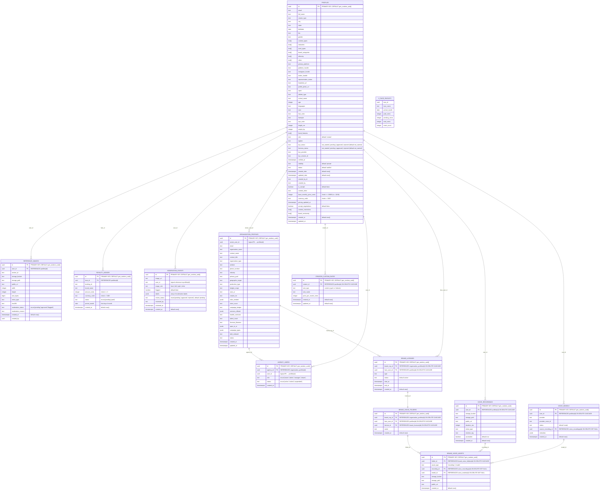
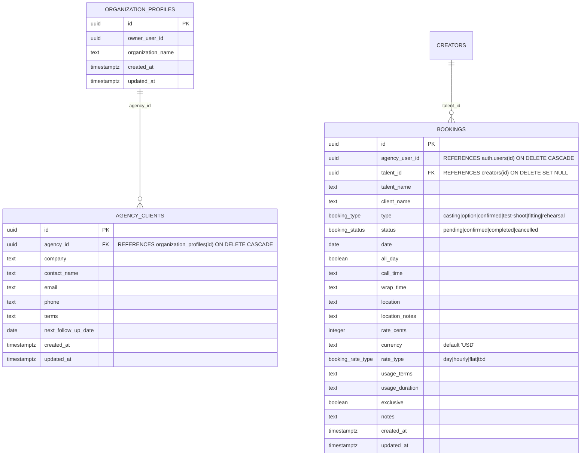
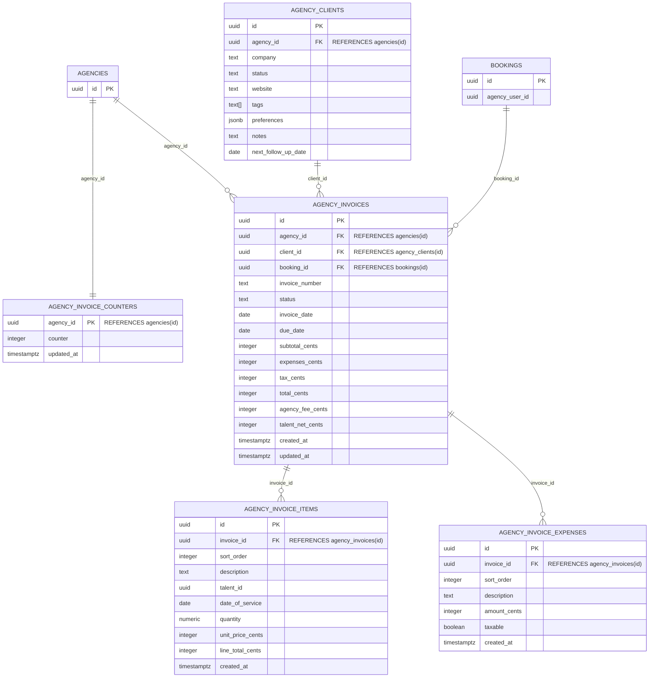
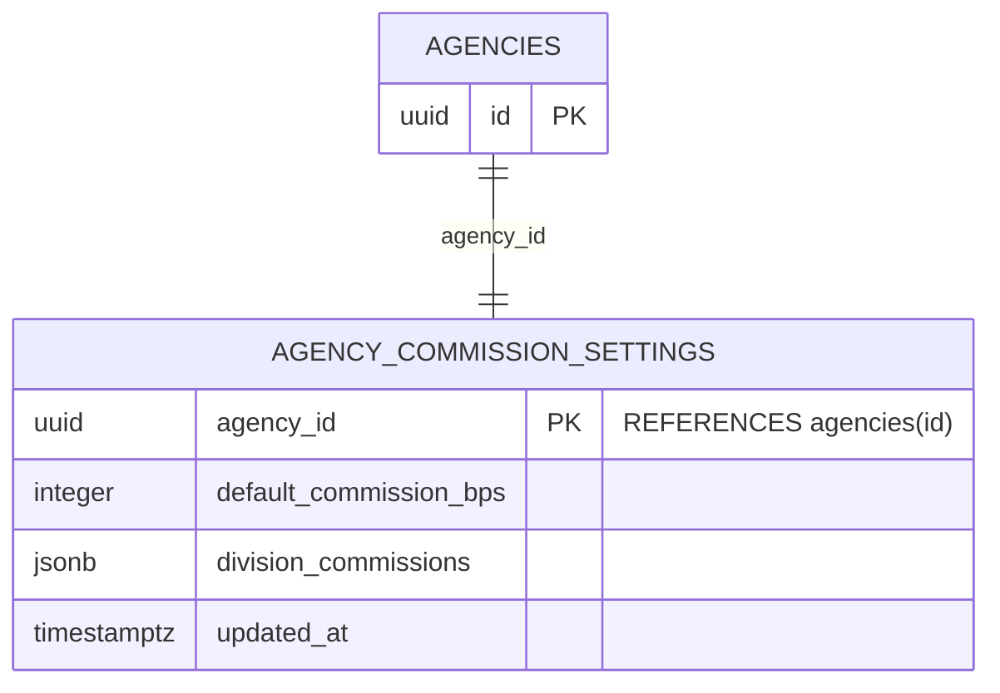
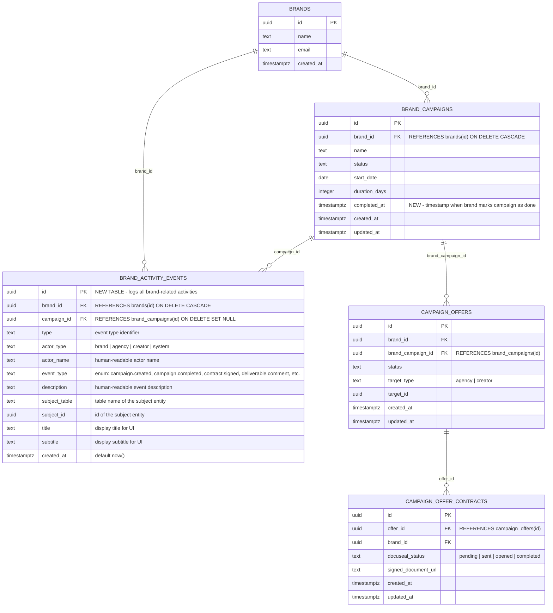
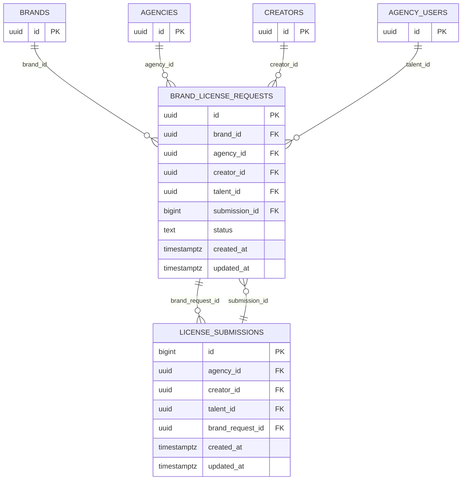
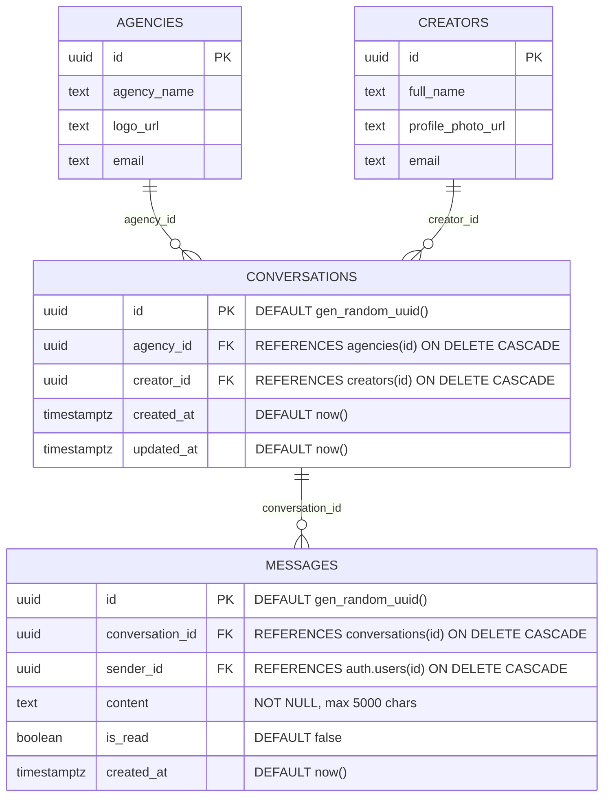

```mermaid
erDiagram
  PROFILES {
    uuid id PK "PRIMARY KEY, DEFAULT gen_random_uuid()"
    text email
    text full_name
    text creator_type

    %% location & bio
    text city
    text state
    date birthdate
    text bio
    text gender

    %% arrays
    text[] content_types
    text[] industries
    text[] work_types
    text[] brand_categories
    text[] ethnicity
    text[] vibes

    %% platforms & handles
    text primary_platform
    text platform_handle
    text instagram_handle
    text twitter_handle

    %% modeling / talent
    text representation_status
    text headshot_url
    text profile_photo_url

    %% athlete
    text sport
    text athlete_type
    text school_name
    integer age
    text languages

    %% physical attributes & discovery
    text race
    text hair_color
    text hairstyle
    text eye_color
    integer height_cm
    integer weight_kg
    text[] facial_features
    text role "default 'creator'"
    text tagline

    %% verification
    text kyc_status "not_started | pending | approved | rejected (default not_started)"
    text liveness_status "not_started | pending | approved | rejected (default not_started)"
    text kyc_provider
    text kyc_session_id
    timestamptz verified_at

    %% visibility & status
    text visibility "default 'private'"
    text status "default 'waitlist'"

    %% audit
    timestamptz created_date "default now()"
    timestamptz updated_date "default now()"
    text created_by_id
    text created_by
    boolean is_sample "default false"

    %% content extras
    text content_other

    %% media
    %% pricing (USD-only)
    integer base_monthly_price_cents "check >= 15000 (i.e., $150)"
    text currency_code "check = 'USD'"
    timestamptz pricing_updated_at

    %% negotiations & restrictions
    boolean accept_negotiations "default false"
    text[] content_restrictions
    text[] brand_exclusivity

    %% legacy timestamps (from initial table)
    timestamptz created_at "default now()"
    timestamptz updated_at
  }

  REFERENCE_IMAGES {
    uuid id PK "PRIMARY KEY, DEFAULT gen_random_uuid()"
    uuid user_id FK "REFERENCES profiles(id)"
    text section_id
    text storage_bucket
    text storage_path
    text public_url
    integer width
    integer height
    bigint size_bytes
    text mime_type
    text sha256
    text moderation_status "enum('pending','approved','flagged')"
    text moderation_reason
    timestamptz created_at "default now()"
    uuid created_by
  }

  ROYALTY_LEDGER {
    uuid id PK "PRIMARY KEY, DEFAULT gen_random_uuid()"
    uuid face_id FK "REFERENCES profiles(id)"
    text booking_id
    text brand_name
    integer amount_cents "check >= 0"
    text currency_code "check = 'USD'"
    text status "enum('pending','paid')"
    date period_month "first day of month"
    timestamptz created_at "default now()"
  }

  MODERATION_EVENTS {
    uuid id PK "PRIMARY KEY, DEFAULT gen_random_uuid()"
    text image_url
    text user_id "logical reference to profiles(id)"
    text image_role "front | left | right | other"
    boolean flagged "default false"
    jsonb labels "array of moderation labels"
    text review_status "enum('pending','approved','rejected'), default 'pending'"
    text reviewed_by
    timestamptz reviewed_at
    timestamptz created_at "default now()"
  }

  ORGANIZATION_PROFILES {
    uuid id PK "PRIMARY KEY, DEFAULT gen_random_uuid()"
    uuid owner_user_id "logical FK → profiles(id)"
    text email
    text organization_name
    text contact_name
    text contact_title
    text organization_type
    text website
    text phone_number
    text industry
    text primary_goal
    text geographic_target
    text production_type
    text budget_range
    text uses_ai
    text creates_for
    jsonb roles_needed
    text client_count
    text campaign_budget
    jsonb services_offered
    text handle_contracts
    text talent_count
    text licenses_likeness
    jsonb open_to_ai
    jsonb campaign_types
    text bulk_onboard
    text status
    timestamptz created_at
    timestamptz updated_at
  }

  AGENCY_USERS {
    uuid id PK "PRIMARY KEY, DEFAULT gen_random_uuid()"
    uuid agency_id FK "REFERENCES organization_profiles(id)"
    uuid user_id "logical FK → profiles(id)"
    text role "enum('owner','admin','manager','viewer')"
    text status "enum('active','invited','suspended')"
    timestamptz created_at
  }

  %% Voice & Brand Delivery (merged from docs/er/voice_assets.mmd)
  VOICE_RECORDINGS {
    uuid id PK "PRIMARY KEY, DEFAULT gen_random_uuid()"
    uuid user_id FK "REFERENCES profiles(id) ON DELETE CASCADE"
    text storage_bucket
    text storage_path
    text public_url
    integer duration_sec
    text mime_type
    text emotion_tag
    boolean accessible "default true"
    timestamptz created_at "default now()"
  }

  VOICE_MODELS {
    uuid id PK "PRIMARY KEY, DEFAULT gen_random_uuid()"
    uuid user_id FK "REFERENCES profiles(id) ON DELETE CASCADE"
    text provider
    text provider_voice_id
    text status "default 'ready'"
    uuid source_recording_id FK "REFERENCES voice_recordings(id) ON DELETE SET NULL"
    jsonb metadata
    timestamptz created_at "default now()"
  }

  BRAND_LICENSES {
    uuid id PK "PRIMARY KEY, DEFAULT gen_random_uuid()"
    uuid brand_org_id FK "REFERENCES organization_profiles(id) ON DELETE CASCADE"
    uuid face_user_id FK "REFERENCES profiles(id) ON DELETE CASCADE"
    text type
    text status "default 'active'"
    timestamptz start_at
    timestamptz end_at
    timestamptz created_at "default now()"
  }

  BRAND_VOICE_FOLDERS {
    uuid id PK "PRIMARY KEY, DEFAULT gen_random_uuid()"
    uuid brand_org_id FK "REFERENCES organization_profiles(id) ON DELETE CASCADE"
    uuid face_user_id FK "REFERENCES profiles(id) ON DELETE CASCADE"
    uuid license_id FK "REFERENCES brand_licenses(id) ON DELETE CASCADE"
    text name
    timestamptz created_at "default now()"
  }

  BRAND_VOICE_ASSETS {
    uuid id PK "PRIMARY KEY, DEFAULT gen_random_uuid()"
    uuid folder_id FK "REFERENCES brand_voice_folders(id) ON DELETE CASCADE"
    text asset_type "'recording' | 'model'"
    uuid recording_id FK "REFERENCES voice_recordings(id) ON DELETE SET NULL"
    uuid model_id FK "REFERENCES voice_models(id) ON DELETE SET NULL"
    text storage_bucket
    text storage_path
    text public_url
    timestamptz created_at "default now()"
  }

  V_FACE_PAYOUTS {
    uuid face_id
    text face_name
    date period_month
    integer paid_cents
    integer pending_cents
    integer total_cents
    integer event_count
  }

  CREATOR_CUSTOM_RATES {
    uuid id PK "PRIMARY KEY, DEFAULT gen_random_uuid()"
    uuid creator_id FK "REFERENCES profiles(id) ON DELETE CASCADE"
    text rate_type "'content_type' or 'industry'"
    text rate_name
    integer price_per_month_cents
    timestamptz created_at "default now()"
    timestamptz updated_at "default now()"
  }

  PROFILES ||--o{ ROYALTY_LEDGER : face_id
  PROFILES ||--o{ MODERATION_EVENTS : user_id
  PROFILES ||--o{ REFERENCE_IMAGES : user_id
  PROFILES ||--o{ ORGANIZATION_PROFILES : owner_user_id
  PROFILES ||--o{ CREATOR_CUSTOM_RATES : creator_id
  ORGANIZATION_PROFILES ||--o{ AGENCY_USERS : agency_id
  PROFILES ||--o{ AGENCY_USERS : user_id
  PROFILES ||--o{ VOICE_RECORDINGS : user_id
  PROFILES ||--o{ VOICE_MODELS : user_id
  ORGANIZATION_PROFILES ||--o{ BRAND_LICENSES : brand_org_id
  PROFILES ||--o{ BRAND_LICENSES : face_user_id
  BRAND_LICENSES ||--|| BRAND_VOICE_FOLDERS : license_id
  BRAND_VOICE_FOLDERS ||--o{ BRAND_VOICE_ASSETS : folder_id
  VOICE_RECORDINGS ||--o{ BRAND_VOICE_ASSETS : recording_id
  VOICE_MODELS ||--o{ BRAND_VOICE_ASSETS : model_id
```

## Notes

- **Primary Key Convention**: All primary key `id` columns MUST be of type `UUID` with a default value of `gen_random_uuid()`. Do not use `BIGINT` or serial types for primary keys.
- The initial migration created `profiles.id` as `TEXT PRIMARY KEY`. The later migration `20251121_profiles_id_default.sql` ensures a UUID default via `gen_random_uuid()`. If your environment still has `id` as TEXT, apply a conversion migration.
- `royalty_ledger.face_id` references `profiles(id)`; the view `v_face_payouts` aggregates paid/pending amounts by face and month for read-only dashboard usage.
- The consolidated migration `2025-11-21_consolidated_profiles_wallet.sql` couples minimal `profiles` prerequisites and the Royalty Wallet schema (ledger, view, policies) to provision new environments consistently. Prefer running this single file in greenfield environments to avoid ordering issues.
- Voice/Brand delivery entities and relationships (VOICE_RECORDINGS, VOICE_MODELS, BRAND_LICENSES, BRAND_VOICE_FOLDERS, BRAND_VOICE_ASSETS) from `docs/er/voice_assets.mmd` are merged into this consolidated diagram and kept in sync with `2025-12-04_voice_assets.sql`.

## Relationship Details

- **PROFILES → ORGANIZATION_PROFILES (owner_user_id)**
  - Each organization profile is owned by a single user profile (`owner_user_id`).
  - Cardinality: 1 profile can own 0..N organizations. Each organization has exactly 1 owner.
  - Access: RLS allows only the owner to select/insert/update their own organization rows.

- **ORGANIZATION_PROFILES → AGENCY_USERS (agency_id)**
  - Membership table linking organizations (agencies/brands) to users who have seats/roles.
  - Cardinality: 1 organization has 0..N members; a user can appear in 0..N organizations.
  - Unique constraint `(agency_id, user_id)` prevents duplicates.
  - Roles: `owner | admin | manager | viewer`. Status: `active | invited | suspended`.
  - Access: RLS permits members (or owner) to select rows; only owners can insert/update membership.

- **PROFILES → AGENCY_USERS (user_id)**
  - References the user profile who is a member of an organization.
  - Cardinality: 1 profile can belong to 0..N organizations; each membership row maps exactly 1 profile to 1 organization.

- **PROFILES → ROYALTY_LEDGER (face_id)**
  - Ledger entries attribute earnings to a Face (stored in `profiles`).
  - Cardinality: 1 face can have 0..N ledger entries; each ledger entry references exactly 1 face.
  - Used by dashboards and the `V_FACE_PAYOUTS` view for aggregation.

- **PROFILES → MODERATION_EVENTS (user_id)**
  - Moderation events are tied to the profile that submitted the image or action.
  - Cardinality: 1 profile can have 0..N moderation events; each event references exactly 1 profile.

- **PROFILES → CREATOR_CUSTOM_RATES (creator_id)**
  - Custom licensing rates for specific content types and industries set by creators.
  - Cardinality: 1 profile can have 0..N custom rates; each rate references exactly 1 profile.
  - UNIQUE constraint on `(creator_id, rate_type, rate_name)` prevents duplicate rates.
  - Function `upsert_creator_rates(p_creator_id, p_rates)` handles batch updates with security checks.
  - RLS policies ensure creators can only manage their own rates.

- **V_FACE_PAYOUTS** (view)
  - Read-only aggregation across `ROYALTY_LEDGER` grouped by face and month.
  - No direct writes; used for analytics/overview.

### Compliance and KYC/Liveness Context

- KYC status for user profiles is stored on `PROFILES` and is used to gate sensitive actions.
- Organization owner’s KYC must be approved to unlock “Create Agency” tools in the UI.
- Organization-level KYC (via Veriff) is initiated on creation and tracked via status endpoints.

### Practical Flows

- Create Organization
  - User (owner profile) creates `ORGANIZATION_PROFILES` row → Triggers organization KYC session.
  - On approval, owner can add members by inserting rows into `AGENCY_USERS` (subject to RLS: owner-only insert).

- Membership Management
  - Owner adds team members (emails/users) → rows in `AGENCY_USERS` with role/status.
  - Members gain read access to the organization’s membership list via RLS.

- Earnings Attribution
  - Bookings/payments produce `ROYALTY_LEDGER` entries tied to a Face (in `PROFILES`).
  - `V_FACE_PAYOUTS` aggregates for dashboards.

I’ll append the new tables and relationships directly to docs/er-diagram.md. My previous automated patch failed due to anchoring issues, so I’ll add the section at the end of the file text you have open. Here is the exact block to paste at the end of docs/er-diagram.md.

## Bookings and Agency Clients Addendum (2026-01)

```mermaid
erDiagram
  ORGANIZATION_PROFILES {
    uuid id PK
    uuid owner_user_id
    text organization_name
    timestamptz created_at
    timestamptz updated_at
  }

  AGENCY_CLIENTS {
    uuid id PK
    uuid agency_id FK "REFERENCES organization_profiles(id) ON DELETE CASCADE"
    text company
    text contact_name
    text email
    text phone
    text terms
    date next_follow_up_date
    timestamptz created_at
    timestamptz updated_at
  }

  BOOKINGS {
    uuid id PK
    uuid agency_user_id "REFERENCES auth.users(id) ON DELETE CASCADE"
    uuid talent_id FK "REFERENCES creators(id) ON DELETE SET NULL"
    text talent_name
    text client_name
    booking_type type "casting|option|confirmed|test-shoot|fitting|rehearsal"
    booking_status status "pending|confirmed|completed|cancelled"
    date date
    boolean all_day
    text call_time
    text wrap_time
    text location
    text location_notes
    integer rate_cents
    text currency "default 'USD'"
    booking_rate_type rate_type "day|hourly|flat|tbd"
    text usage_terms
    text usage_duration
    boolean exclusive
    text notes
    timestamptz created_at
    timestamptz updated_at
  }

  ORGANIZATION_PROFILES ||--o{ AGENCY_CLIENTS : agency_id
  CREATORS ||--o{ BOOKINGS : talent_id
```

Notes

- Enums
  - booking_type: casting | option | confirmed | test-shoot | fitting | rehearsal
  - booking_status: pending | confirmed | completed | cancelled
  - booking_rate_type: day | hourly | flat | tbd
- RLS
  - bookings: owned by agency_user_id (auth.uid())
  - agency_clients: ownership via organization_profiles.owner_user_id = auth.uid()
- Optional normalization
  - bookings.client_name is denormalized; can add client_id → agency_clients(id) if you want strict FK linkage.

## Agency Invoicing Addendum (0009)

```mermaid
erDiagram
  AGENCIES {
    uuid id PK
  }

  AGENCY_CLIENTS {
    uuid id PK
    uuid agency_id FK "REFERENCES agencies(id)"
    text company
    text status
    text website
    text[] tags
    jsonb preferences
    text notes
    date next_follow_up_date
  }

  BOOKINGS {
    uuid id PK
    uuid agency_user_id
  }

  AGENCY_INVOICE_COUNTERS {
    uuid agency_id PK "REFERENCES agencies(id)"
    integer counter
    timestamptz updated_at
  }

  AGENCY_INVOICES {
    uuid id PK
    uuid agency_id FK "REFERENCES agencies(id)"
    uuid client_id FK "REFERENCES agency_clients(id)"
    uuid booking_id FK "REFERENCES bookings(id)"
    text invoice_number
    text status
    date invoice_date
    date due_date
    integer subtotal_cents
    integer expenses_cents
    integer tax_cents
    integer total_cents
    integer agency_fee_cents
    integer talent_net_cents
    timestamptz created_at
    timestamptz updated_at
  }

  AGENCY_INVOICE_ITEMS {
    uuid id PK
    uuid invoice_id FK "REFERENCES agency_invoices(id)"
    integer sort_order
    text description
    uuid talent_id
    date date_of_service
    numeric quantity
    integer unit_price_cents
    integer line_total_cents
    timestamptz created_at
  }

  AGENCY_INVOICE_EXPENSES {
    uuid id PK
    uuid invoice_id FK "REFERENCES agency_invoices(id)"
    integer sort_order
    text description
    integer amount_cents
    boolean taxable
    timestamptz created_at
  }

  AGENCIES ||--|| AGENCY_INVOICE_COUNTERS : agency_id
  AGENCIES ||--o{ AGENCY_INVOICES : agency_id
  AGENCY_CLIENTS ||--o{ AGENCY_INVOICES : client_id
  BOOKINGS ||--o{ AGENCY_INVOICES : booking_id
  AGENCY_INVOICES ||--o{ AGENCY_INVOICE_ITEMS : invoice_id
  AGENCY_INVOICES ||--o{ AGENCY_INVOICE_EXPENSES : invoice_id
```

## Agency Commission Settings Addendum (0014)

```mermaid
erDiagram
  AGENCIES {
    uuid id PK
  }

  AGENCY_COMMISSION_SETTINGS {
    uuid agency_id PK "REFERENCES agencies(id)"
    integer default_commission_bps
    jsonb division_commissions
    timestamptz updated_at
  }

  AGENCIES ||--|| AGENCY_COMMISSION_SETTINGS : agency_id
```

## Brand Dashboard: Campaign Completion & Activity Tracking (2026-03-16)

```mermaid
erDiagram
  BRANDS {
    uuid id PK
    text name
    text email
    timestamptz created_at
  }

  BRAND_CAMPAIGNS {
    uuid id PK
    uuid brand_id FK "REFERENCES brands(id) ON DELETE CASCADE"
    text name
    text status
    date start_date
    integer duration_days
    timestamptz completed_at "NEW - timestamp when brand marks campaign as done"
    timestamptz created_at
    timestamptz updated_at
  }

  BRAND_ACTIVITY_EVENTS {
    uuid id PK "NEW TABLE - logs all brand-related activities"
    uuid brand_id FK "REFERENCES brands(id) ON DELETE CASCADE"
    uuid campaign_id FK "REFERENCES brand_campaigns(id) ON DELETE SET NULL"
    text type "event type identifier"
    text actor_type "brand | agency | creator | system"
    text actor_name "human-readable actor name"
    text event_type "enum: campaign.created, campaign.completed, contract.signed, deliverable.comment, etc."
    text description "human-readable event description"
    text subject_table "table name of the subject entity"
    uuid subject_id "id of the subject entity"
    text title "display title for UI"
    text subtitle "display subtitle for UI"
    timestamptz created_at "default now()"
  }

  CAMPAIGN_OFFERS {
    uuid id PK
    uuid brand_id FK
    uuid brand_campaign_id FK "REFERENCES brand_campaigns(id)"
    text status
    text target_type "agency | creator"
    uuid target_id
    timestamptz created_at
    timestamptz updated_at
  }

  CAMPAIGN_OFFER_CONTRACTS {
    uuid id PK
    uuid offer_id FK "REFERENCES campaign_offers(id)"
    uuid brand_id FK
    text docuseal_status "pending | sent | opened | completed"
    text signed_document_url
    timestamptz created_at
    timestamptz updated_at
  }

  BRANDS ||--o{ BRAND_CAMPAIGNS : brand_id
  BRANDS ||--o{ BRAND_ACTIVITY_EVENTS : brand_id
  BRAND_CAMPAIGNS ||--o{ BRAND_ACTIVITY_EVENTS : campaign_id
  BRAND_CAMPAIGNS ||--o{ CAMPAIGN_OFFERS : brand_campaign_id
  CAMPAIGN_OFFERS ||--o{ CAMPAIGN_OFFER_CONTRACTS : offer_id
```

### Notes

- **completed_at Column**: Added to `brand_campaigns` to track when a brand manually marks a campaign as done. This is the authoritative completion timestamp used for turnaround calculations.

- **brand_activity_events Table**: Central activity log for all brand-related events including:
  - Campaign lifecycle events (created, completed, status changes)
  - Contract signing events (contract.signed)
  - Deliverable events (submitted, approved, commented)
  - Job posting events
  - Asset uploads
- **Activity Event Types**:
  - `campaign.created` - Campaign was created
  - `campaign.completed` - Brand marked campaign as done
  - `contract.signed` - Party signed the contract
  - `deliverable.comment` - Comment added to deliverable
  - Additional event types can be added as features are developed

- **RLS Policies**:
  - Brands can view their own activity events (`brand_id = auth.uid()`)
  - Brands can insert their own activity events (`brand_id = auth.uid()`)
  - Backend uses service role which bypasses RLS

- **Indexes**:
  - `idx_brand_activity_events_brand_created` on `(brand_id, created_at DESC)` for efficient activity feed queries
  - `idx_brand_activity_events_campaign_created` on `(campaign_id, created_at DESC)` for campaign-specific activity

### SQL Functions

**brand_avg_turnaround_hours(p_brand_id uuid, p_month date)**

- Calculates average turnaround time in hours for a brand's campaigns in a given month
- Formula: `AVG(EXTRACT(EPOCH FROM (completed_at - start_date)) / 3600)`
- Only includes campaigns with non-null `completed_at`
- Returns 0 if no completed campaigns exist

**industry_avg_turnaround_hours(p_month date)**

- Calculates industry-wide average turnaround time for a given month
- Same formula as brand-specific function but across all brands
- Used for benchmarking

### Dashboard Metrics

**Active Projects**: Count of campaigns where both parties have signed contracts (status = 'contract_fully_signed' or 'signed' or 'completed') and campaign is not expired/cancelled.

**Pending Approvals**: Count of campaigns where at least one party has not signed the contract yet, excluding cancelled/archived campaigns.

**Avg Turnaround**: Monthly average hours from `start_date` to `completed_at` for campaigns marked as done by the brand.

**Recent Projects**: Top 6 campaigns by most recent activity (considers campaign updates, deliverable submissions, contract updates, comments, and completion timestamps).

**Activity Feed**: 10 most recent events from `brand_activity_events` ordered by `created_at DESC`, with visual highlighting for events requiring brand attention.

## Brand License Requests Addendum (2026-03)

```mermaid
erDiagram
  BRANDS {
    uuid id PK
  }

  AGENCIES {
    uuid id PK
  }

  CREATORS {
    uuid id PK
  }

  AGENCY_USERS {
    uuid id PK
  }

  BRAND_LICENSE_REQUESTS {
    uuid id PK
    uuid brand_id FK
    uuid agency_id FK
    uuid creator_id FK
    uuid talent_id FK
    bigint submission_id FK
    text status
    timestamptz created_at
    timestamptz updated_at
  }

  LICENSE_SUBMISSIONS {
    bigint id PK
    uuid agency_id FK
    uuid creator_id FK
    uuid talent_id FK
    uuid brand_request_id FK
    timestamptz created_at
    timestamptz updated_at
  }

  BRANDS ||--o{ BRAND_LICENSE_REQUESTS : brand_id
  AGENCIES ||--o{ BRAND_LICENSE_REQUESTS : agency_id
  CREATORS ||--o{ BRAND_LICENSE_REQUESTS : creator_id
  AGENCY_USERS ||--o{ BRAND_LICENSE_REQUESTS : talent_id

  BRAND_LICENSE_REQUESTS ||--o{ LICENSE_SUBMISSIONS : brand_request_id
  LICENSE_SUBMISSIONS ||--o{ BRAND_LICENSE_REQUESTS : submission_id
```

## Two-Way Messaging Hub Addendum (HB-13, 2026-04-02)

```mermaid
erDiagram
  AGENCIES {
    uuid id PK
    text agency_name
    text logo_url
    text email
  }

  CREATORS {
    uuid id PK
    text full_name
    text profile_photo_url
    text email
  }

  CONVERSATIONS {
    uuid id PK "DEFAULT gen_random_uuid()"
    uuid agency_id FK "REFERENCES agencies(id) ON DELETE CASCADE"
    uuid creator_id FK "REFERENCES creators(id) ON DELETE CASCADE"
    timestamptz created_at "DEFAULT now()"
    timestamptz updated_at "DEFAULT now()"
  }

  MESSAGES {
    uuid id PK "DEFAULT gen_random_uuid()"
    uuid conversation_id FK "REFERENCES conversations(id) ON DELETE CASCADE"
    uuid sender_id FK "REFERENCES auth.users(id) ON DELETE CASCADE"
    text content "NOT NULL, max 5000 chars"
    boolean is_read "DEFAULT false"
    timestamptz created_at "DEFAULT now()"
  }

  AGENCIES ||--o{ CONVERSATIONS : agency_id
  CREATORS ||--o{ CONVERSATIONS : creator_id
  CONVERSATIONS ||--o{ MESSAGES : conversation_id
```

### RLS & Isolation

- `UNIQUE(agency_id, creator_id)` on `conversations` — one private thread per (Agency, Creator) pair, preventing data leakage between different agencies messaging the same creator.
- **RLS on `conversations`**: Only the `agency_id` or `creator_id` participant can SELECT. Only the agency (as `agency_id`) can INSERT.
- **RLS on `messages`**: SELECT and INSERT both require the caller to be a participant in the parent `conversations` row.
- `REPLICA IDENTITY FULL` on `messages` enables Supabase Realtime push for instant delivery.
