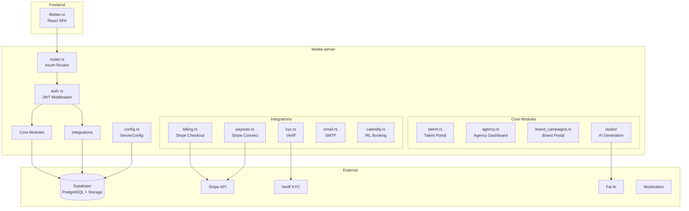

# Architecture Overview — likelee-server

## System Overview

Likelee Server is a **monolithic Rust backend** that powers a talent management and licensing platform. It serves three main user types:

- **Agencies**: Manage talent rosters, handle licensing requests, create invoices, process payouts
- **Creators (Faces/Talents)**: Manage profiles, approve licenses, track earnings, receive payouts
- **Brands**: Discover talent, create campaigns, make offers, manage deliverables

The system also includes a **Studio module** for AI-powered image/video generation using external providers.

## Component Diagram

## Key Components

| Component        | Responsibility                        | Tech Stack     | Source File                 |
| ---------------- | ------------------------------------- | -------------- | --------------------------- |
| Router           | API route definitions, middleware     | Axum           | `router.rs`                 |
| Config           | Centralized environment configuration | envconfig      | `config.rs`                 |
| Auth             | JWT validation, user extraction       | Supabase JWT   | `auth.rs`                   |
| Talent Portal    | Creator profile, earnings, payouts    | PostgREST      | `talent.rs`                 |
| Agency Dashboard | Roster, invoices, payouts             | PostgREST      | `invoices.rs`, `payouts.rs` |
| Brand Portal     | Campaigns, offers, deliverables       | PostgREST      | `brand_campaigns.rs`        |
| Studio           | AI generation, wallet, credits        | Fal API        | `studio/`                   |
| KYC              | Identity verification                 | Veriff API     | `kyc.rs`                    |
| Billing          | Subscription checkout                 | Stripe API     | `billing.rs`                |
| Payouts          | Connect onboarding, transfers         | Stripe Connect | `payouts.rs`                |
| Background Jobs  | Payment reminders, scheduler          | Tokio spawn    | `jobs.rs`                   |

## Data Flow

### Request Flow

1. Client sends request with JWT in `Authorization` header
2. `auth.rs` middleware validates JWT against `SUPABASE_JWT_SECRET`
3. Extracted `user_id` injected into handlers via `AuthUser` extractor
4. Handler queries Supabase via PostgREST client
5. Response serialized and returned

### Cache Flow

The system uses a three-level caching strategy for performance optimization:

1. **L1 (Request Cache)**: Per-request scoped cache in memory
2. **L2 (Session Cache)**: User session-scoped cache with 5-30 min TTL
3. **L3 (Application Cache)**: Application-wide cache with 1-60 min TTL

**Key Cache Invalidation Points**:
- Role changes → `invalidate_org_access_cache()` (L2)
- Connection changes → `invalidate_brand_agency_connection_cache()` (L3)
- Security events → `invalidate_session()` (L2)

See [Cache Invalidation System](../CACHE_INVALIDATION.md) for detailed documentation.

### Webhook Flow

1. External service (Stripe, Veriff, Calendly, DocuSeal) sends POST to `/webhooks/*` (DocuSeal has multiple endpoints by flow)
2. Handler validates signature/secret
3. Handler processes event and updates database
4. Background jobs may be triggered

### Background Job Flow

1. `jobs.rs` spawns tokio tasks on server start
2. Jobs run at configured intervals
3. Jobs query database and perform actions (send emails, schedule payouts)

## Key Design Decisions

| Decision                              | Rationale                                            | Status   |
| ------------------------------------- | ---------------------------------------------------- | -------- |
| Monolithic architecture               | Simpler deployment, shared database, team size       | Accepted |
| Centralized config via `ServerConfig` | Single source of truth, type-safe, env-driven        | Accepted |
| PostgREST for database access         | RESTful mapping, leverages Supabase, no ORM overhead | Accepted |
| Stripe Connect for payouts            | Industry standard, supports instant payouts          | Accepted |
| Fal Queue API for AI generation       | Async job model, cost tracking, status polling       | Accepted |
| Separate SMTP for sales/contact       | Different sender identity, separate deliverability   | Accepted |

## Infrastructure Overview

| Environment | Platform | Database             | URL Pattern      |
| ----------- | -------- | -------------------- | ---------------- |
| Development | Local    | Supabase Dev Project | `localhost:8787` |
| Staging     | TBD      | Supabase Staging     | TBD              |
| Production  | TBD      | Supabase Production  | TBD              |

### Background Services

- **Payment Reminders**: Daily check for overdue invoices, sends reminder emails
- **Agency Payout Scheduler**: Configurable interval, processes due payouts

## External Dependencies

| Service    | Purpose                 | Config Key           | Fallback         |
| ---------- | ----------------------- | -------------------- | ---------------- |
| Supabase   | Database, Storage, Auth | `SUPABASE_URL`       | None (required)  |
| Stripe     | Payments, Connect       | `STRIPE_SECRET_KEY`  | Returns error    |
| Veriff     | KYC verification        | `VERIFF_API_KEY`     | Feature disabled |
| Fal        | AI generation           | `FAL_API_KEY`        | Returns error    |
| DocuSeal   | Contract signing        | `DOCUSEAL_API_KEY`   | Returns error    |
| Calendly   | IRL booking             | `CALENDLY_API_TOKEN` | Feature disabled |
| ElevenLabs | Voice synthesis         | `ELEVENLABS_API_KEY` | Feature disabled |

## Security Architecture

### Authentication

- **Method**: JWT Bearer tokens
- **Provider**: Supabase Auth
- **Validation**: `auth.rs` middleware validates signature and expiration
- **User ID**: Extracted from JWT `sub` claim

### Authorization

- **Row Level Security (RLS)**: Enforced at Supabase/PostgreSQL level
- **Server-side**: Additional checks in handlers for resource ownership
- **Role-based**: User type (agency/creator/brand) stored in profiles table

### Secrets Management

- Environment variables loaded via `envconfig`
- Never committed to repository
- `.env.example` documents required variables
- Production secrets managed by deployment platform

### Data Protection

- Private files stored in `likelee-private` bucket and accessed via backend proxy endpoints (service role)
- Direct client `SELECT` access to `likelee-private` is intentionally blocked (policies removed); do not rely on signed URLs for private bucket reads
- Public files in `likelee-public` bucket
- Temp uploads in `likelee-temp` bucket with TTL
