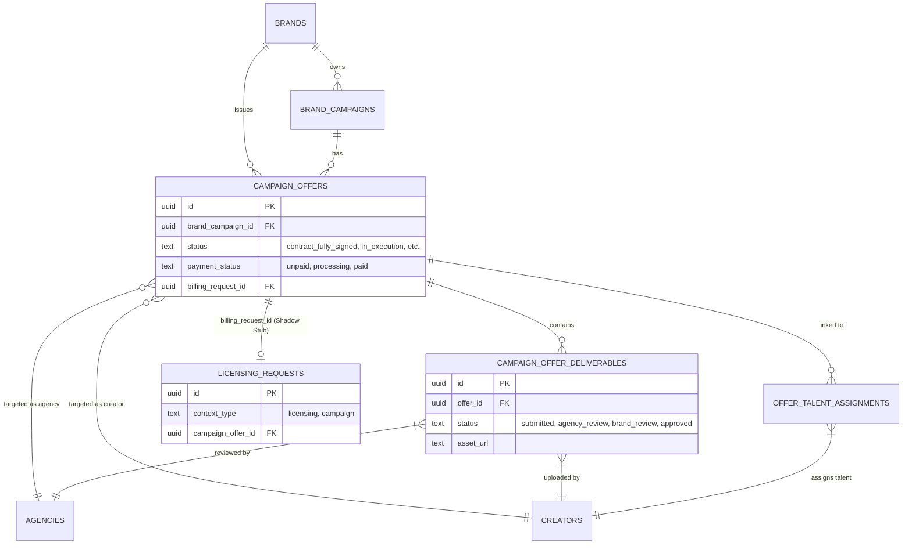
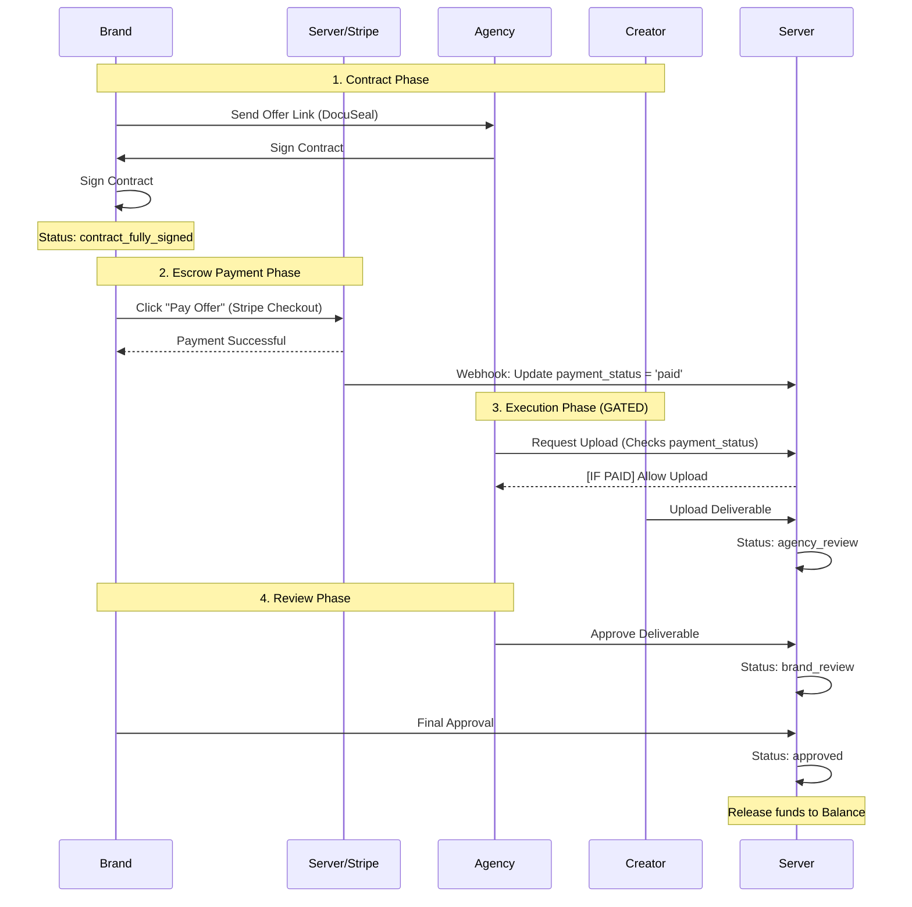

# Repository Architecture & Database Relationships

This document outlines the core relationships and interaction flows between Brands, Agencies, and Creators, specifically focusing on the **Campaign Deliverables & Payment Gating** system.

## Database ER Diagram

The following diagram shows the relationships between campaigns, offers, payments (billing stubs), and deliverables.

## Interaction Flow (Payment & Deliverables)

This sequence diagram illustrates the lifecycle of a campaign offer from signing to final deliverable approval, highlighting the **Payment Gate**.

## Key Interactions

### 1. The Payment Gate
The system enforces a financial boundary at the start of the `in_execution` phase. 
- **Back-end Check**: API endpoints for uploading and submitting deliverables verify that the parent `campaign_offer.payment_status` is `'paid'`.
- **Front-end Gating**: UI components (Agency & Creator dashboards) disable action buttons and show warning indicators if the offer is unpaid.

### 2. The Billing Shadow Stub
To leverage existing financial infrastructure without duplicating logic, campaign payments utilize a "Shadow Stub" in the `licensing_requests` table:
- **`licensing_requests.context_type = 'campaign'`**: Distinguishes it from standard licensing deals.
- **`campaign_offers.billing_request_id`**: Links the offer to its financial record for tracking escrow and payouts.

### 3. Review Hierarchy
Deliverables follow a strictly enforced pipeline:
1. **Creator Draft**: Private to the creator.
2. **Submitted to Agency**: Visible to Agency for review.
3. **Submitted to Brand**: Agency-approved work is sent to the Brand.
4. **Approved**: Brand-approved work marks the deliverable as finalized.
