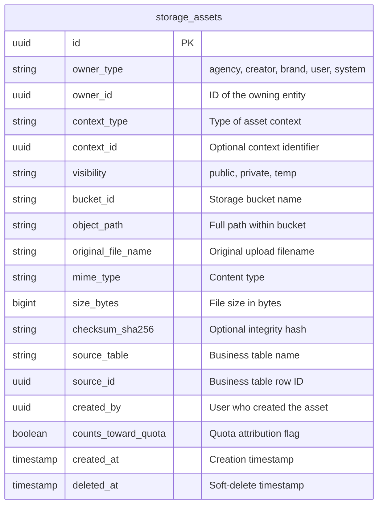
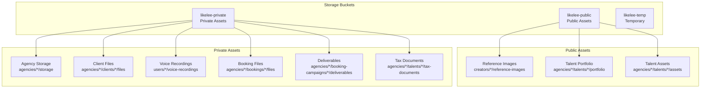
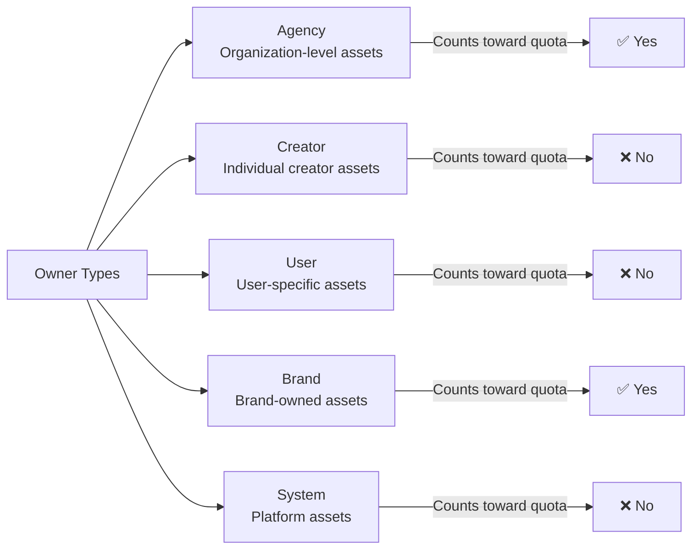
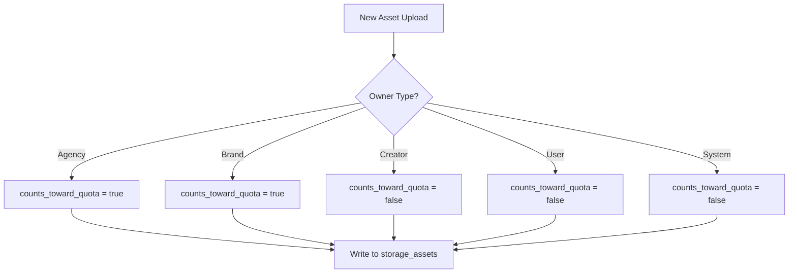
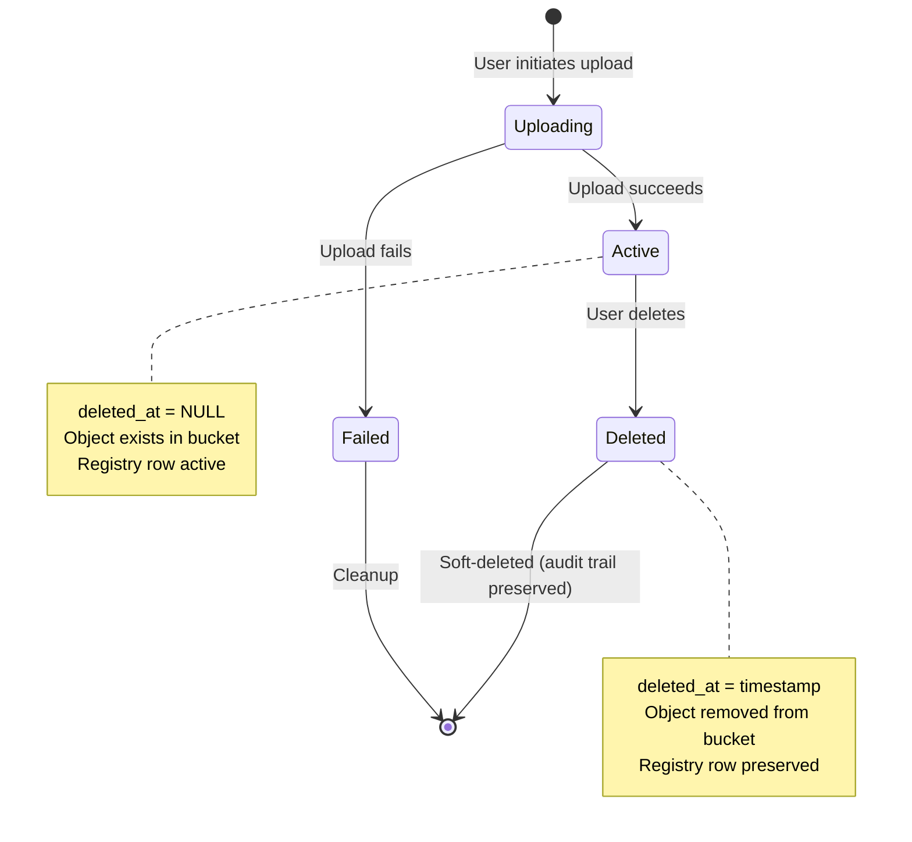
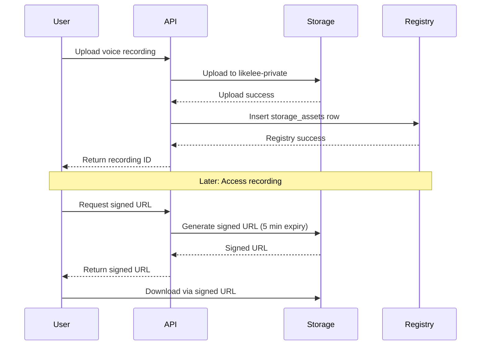

# Storage Architecture

**Version**: 2.1  
**Last Updated**: 2026-04-23  
**Status**: Active

This document defines the canonical storage model for Likelee AI. The goal is to keep business tables focused on domain semantics while centralizing storage ownership, object metadata, and lifecycle tracking in `public.storage_assets`.

## Table of Contents

1. [Overview](#overview)
2. [Storage Buckets](#storage-buckets)
3. [Storage Registry](#storage-registry)
4. [Asset Organization](#asset-organization)
5. [Path Structure](#path-structure)
6. [Ownership Model](#ownership-model)
7. [Quota Attribution](#quota-attribution)
8. [Lifecycle Management](#lifecycle-management)
9. [Migration Status](#migration-status)

---

## Overview

The Likelee AI storage system uses a **dual-layer architecture**:

1. **Business Tables**: Store domain-specific metadata, workflow state, and relationships
2. **Storage Registry** (`storage_assets`): Centralized tracking of all storage objects

This separation allows:
- Clean domain models without storage implementation details
- Centralized quota management and auditing
- Flexible storage backend changes without business logic updates
- Complete audit trail of all storage operations

---

## Storage Buckets

Likelee AI uses three primary storage buckets, each serving a specific access pattern:

### 🌐 likelee-public
**Purpose**: Publicly accessible media that can be rendered directly in browsers

**Use Cases**:
- Reference images for AI training
- Talent portfolio media (photos, videos)
- Agency-managed talent assets
- Public profile images

**Access**: Direct URL access, no authentication required

**CDN**: Optimized for fast global delivery

---

### 🔒 likelee-private
**Purpose**: Permission-gated operational assets requiring authentication

**Use Cases**:
- Agency storage files and documents
- Client files and contracts
- Booking files and deliverables
- Voice recordings for voice cloning
- Tax documents
- Brand voice assets
- Campaign documents

**Access**: Signed URLs with expiration, authentication required

**Security**: Access control enforced at application layer

---

### ⏱️ likelee-temp
**Purpose**: Short-lived staging area for uploads and processing

**Use Cases**:
- Staged uploads before validation
- Temporary processing artifacts
- Preview generation intermediates

**Access**: Internal only

**Lifecycle**: Automatic cleanup after expiration

---

## Storage Registry

The `public.storage_assets` table serves as the **canonical registry** for all storage objects.

### Registry Schema



### Registry Fields Explained

| Field | Purpose | Example |
|-------|---------|---------|
| `owner_type` | Who owns this asset | `agency`, `creator`, `user` |
| `owner_id` | ID of the owner | `550e8400-e29b-41d4-a716-446655440000` |
| `context_type` | What type of asset | `voice_recording`, `reference_image` |
| `context_id` | Additional context | Section ID, folder ID, etc. |
| `visibility` | Access level | `public`, `private`, `temp` |
| `bucket_id` | Which bucket | `likelee-private` |
| `object_path` | Full path in bucket | `users/123/voice-recordings/1234567890_audio.webm` |
| `original_file_name` | User's filename | `my-voice-sample.webm` |
| `mime_type` | Content type | `audio/webm` |
| `size_bytes` | File size | `1048576` (1 MB) |
| `source_table` | Business table | `voice_recordings` |
| `source_id` | Business row ID | `abc-123-def-456` |
| `counts_toward_quota` | Quota flag | `true` for agency assets, `false` for creator assets |
| `deleted_at` | Soft-delete time | `null` (active) or timestamp (deleted) |

### Why Dual-Write?

Every storage operation writes to **both** locations:

1. **Business Table** (`voice_recordings`, `agency_files`, etc.)
   - Domain-specific fields (emotion_tag, folder_id, approval_status)
   - Workflow state and relationships
   - Application queries use these tables

2. **Storage Registry** (`storage_assets`)
   - Centralized storage metadata
   - Quota calculations
   - Audit trails
   - Cross-cutting queries (all assets by owner, total storage used)

---

---

## Asset Organization

### Storage Hierarchy Diagram



### Asset Matrix

| Asset Type | Owner | Visibility | Bucket | Path Pattern | Business Table | Quota |
|------------|-------|------------|--------|--------------|----------------|-------|
| **Agency Storage** | Agency | Private | `likelee-private` | `agencies/{agency_id}/storage/...` | `agency_files` | ✅ Yes |
| **Client Files** | Agency | Private | `likelee-private` | `agencies/{agency_id}/clients/{client_id}/files/...` | `agency_files` | ✅ Yes |
| **Agency Talent Assets** | Agency | Public | `likelee-public` | `agencies/{agency_id}/talents/{talent_id}/assets/...` | `agency_files` | ✅ Yes |
| **Booking Files** | Agency | Private | `likelee-private` | `agencies/{agency_id}/bookings/{booking_id}/files/...` | `booking_files` | ✅ Yes |
| **Booking Deliverables** | Agency/Creator | Private | `likelee-private` | `agencies/{agency_id}/booking-campaigns/{campaign_id}/deliverables/...` | `booking_deliverables` | ✅ Yes |
| **Campaign Offer Deliverables** | Agency/Creator | Private | `likelee-private` | `campaign-offers/{offer_id}/deliverables/...` | `campaign_offer_deliverables` | ✅ Yes |
| **Reference Images** | Creator | Public | `likelee-public` | `creators/{creator_id}/reference-images/{section_id}/...` | `reference_images` | ❌ No |
| **Voice Recordings** | User | Private | `likelee-private` | `users/{user_id}/voice-recordings/...` | `voice_recordings` | ❌ No |
| **Talent Portfolio** | Agency | Public | `likelee-public` | `agencies/{agency_id}/talents/{talent_id}/portfolio/...` | `talent_portfolio_items` | ✅ Yes |
| **Tax Documents** | Agency | Private | `likelee-private` | `agencies/{agency_id}/talents/{talent_id}/tax-documents/...` | `talent_tax_documents` | ✅ Yes |
| **Brand Voice Assets** | Brand | Private | `likelee-private` | `brands/{brand_id}/voice-assets/...` | `brand_voice_assets` | ✅ Yes |
| **Brand Storage** | Brand | Private | `likelee-private` | `brands/{brand_id}/storage/...` | `brand_files` | ✅ Yes |
| **Studio Campaign Docs** | User | Private | `likelee-private` | `studio/campaigns/{campaign_id}/documents/...` | `studio_campaign_documents` | ❌ No |

---

## Brand Asset Library

### Overview

The Brand Asset Library provides organized storage for brand-owned assets, with automatic organization for studio-generated content.

### Default Folder System

When a new brand is created, a trigger automatically creates a "Studio Generations" default folder:

```sql
-- Automatic default folder creation
CREATE TRIGGER on_brand_created
  AFTER INSERT ON brands
  FOR EACH ROW EXECUTE FUNCTION create_brand_default_folder();
```

### Source Type Tracking

All files in the Brand Asset Library are tagged with their origin:

| Source Type | Description |
|-------------|-------------|
| `upload` | Files uploaded directly by the brand |
| `studio_generation` | Files generated by Likelee Studio |
| `external` | Files imported from external sources |

### Studio Integration

When a studio generation is saved to storage:
1. The system automatically finds or creates the default "Studio Generations" folder
2. The file is tagged with `source_type: studio_generation`
3. The `generation_id` links the file back to the original studio generation

### Analytics

The `brand_storage_analytics` view provides aggregated insights:

```sql
SELECT * FROM brand_storage_analytics
WHERE brand_id = 'brand-uuid';
```

Returns breakdown by source_type and mime_type including:
- `file_count` - Number of files
- `total_bytes` - Total storage used
- `avg_file_size` - Average file size

---

## Path Structure

All storage paths follow a consistent pattern for easy organization and access control.

### Path Format

```
{owner_type}/{owner_id}/{context}/{timestamp}_{sanitized_filename}
```

### Path Components

1. **Owner Type**: `agencies`, `creators`, `users`, `brands`, `studio`
2. **Owner ID**: UUID or identifier of the owning entity
3. **Context**: Specific asset type or category
4. **Timestamp**: Milliseconds since epoch (prevents collisions)
5. **Filename**: Sanitized original filename

### Example Paths

```
✅ Good Examples:
agencies/550e8400-e29b-41d4-a716-446655440000/storage/1234567890123_contract.pdf
users/abc-123-def-456/voice-recordings/1234567890123_sample.webm
creators/xyz-789/reference-images/section-1/1234567890123_portrait.jpg
agencies/550e8400/talents/talent-123/portfolio/1234567890123_headshot.jpg

❌ Bad Examples (Old Format):
likeness/user_123/voice/recordings/1234567890123.webm  ← Old format
agencies/123/files/document.pdf  ← Missing timestamp
users/abc/../../etc/passwd  ← Path traversal attempt
```

### Filename Sanitization

All filenames are sanitized to prevent security issues:

- **Allowed**: Alphanumeric, dots (.), underscores (_), hyphens (-)
- **Replaced**: All other characters become underscores
- **Empty**: Defaults to `upload.bin`

**Examples**:
- `my document.pdf` → `my_document.pdf`
- `file@#$%.txt` → `file____.txt`
- `../../../etc/passwd` → `.._.._etc_passwd`

---

## Ownership Model

### Owner Types



### Ownership Rules

| Owner Type | Description | Quota | Examples |
|------------|-------------|-------|----------|
| **Agency** | Assets owned by an agency organization | ✅ Yes | Agency files, client files, talent portfolios |
| **Creator** | Assets owned by individual creators | ❌ No | Reference images, personal media |
| **User** | Assets owned by platform users | ❌ No | Voice recordings, personal documents |
| **Brand** | Assets owned by brand accounts | ✅ Yes | Brand voice assets, brand materials |
| **System** | Platform-owned assets | ❌ No | System templates, default assets |

### Important: Agency vs User Ownership

When an agency team member uploads a file:
- ✅ **Correct**: Use `organization_id` as owner (agency-owned)
- ❌ **Wrong**: Use team member's `user_id` (user-owned)

**Why?** Agency assets should count toward the agency's quota, not the individual team member's quota.

---

## Quota Attribution

### Quota Rules



### Why Some Assets Don't Count Toward Quota

**Creator-Owned Source Assets** (Reference Images, Voice Recordings):
- These are **source materials** provided by creators
- Used for AI training and voice cloning
- Should not consume agency storage quota
- Agencies don't "own" these assets, they just use them

**Agency-Owned Assets** (Agency Files, Client Files, Portfolios):
- These are **operational assets** managed by agencies
- Directly related to agency business operations
- Should count toward agency storage quota
- Agencies have full control and ownership

### Quota Calculation

```sql
-- Calculate total storage used by an agency
SELECT 
    owner_id,
    SUM(size_bytes) as total_bytes,
    COUNT(*) as total_files
FROM storage_assets
WHERE owner_type = 'agency'
  AND owner_id = 'agency-uuid-here'
  AND counts_toward_quota = true
  AND deleted_at IS NULL
GROUP BY owner_id;
```

---

## Lifecycle Management

### Asset Lifecycle States



### Deletion Strategy

**STRICT Deletion** (Current Implementation):
1. Delete object from storage bucket (must succeed)
2. Soft-delete registry row (set `deleted_at`)
3. Delete business table row

**Why STRICT?**
- Prevents orphaned database records
- Ensures storage and database stay in sync
- If storage deletion fails, operation fails (no partial state)

**Soft-Delete Benefits**:
- Preserves audit trail
- Enables quota history tracking
- Supports backfill verification
- Allows recovery analysis

### Example Deletion Flow

```
User requests deletion
    ↓
Verify ownership & permissions
    ↓
Delete from storage bucket (STRICT - must succeed)
    ↓ (if fails, abort entire operation)
Soft-delete storage_assets row (set deleted_at)
    ↓ (if fails, log warning but continue)
Delete business table row
    ↓
Verify deletion succeeded
    ↓
Return success
```

---


## Migration Status

### Migration Progress

| Asset Type | Status | Migration Date | Notes |
|------------|--------|----------------|-------|
| Storage Module Foundation | ✅ Complete | Initial | Shared storage module created |
| Agency Storage Files | ✅ Complete | Initial | Migrated to shared module |
| Client Files | ✅ Complete | Initial | Migrated to shared module |
| Booking Files | ✅ Complete | Initial | Migrated to shared module |
| Booking Deliverables | ✅ Complete | Initial | Migrated to shared module |
| Campaign Offer Deliverables | ✅ Complete | Initial | Migrated to shared module |
| Reference Images | ✅ Complete | Initial | Migrated to shared module |
| **Voice Recordings** | ✅ Complete | 2026-04-15 | **Recently migrated** |
| **Brand Asset Library** | ✅ Complete | 2026-04-23 | Source type tracking, default folders, analytics |
| Talent Portfolio | 🔄 In Progress | Pending | Next priority |
| Tax Documents | ⏳ Pending | TBD | Awaiting migration |
| Brand Voice Assets | ⏳ Pending | TBD | Awaiting migration |
| Studio Campaign Docs | ⏳ Pending | TBD | Awaiting migration |

### Migration Approach

Each asset type follows this migration pattern:

1. **Update Upload Handler**
   - Use `canonical_object_path()` for path generation
   - Use `upload_object()` for storage upload
   - Mirror metadata to `storage_assets` registry

2. **Update Delete Handler**
   - Use STRICT `delete_object()` (must succeed)
   - Soft-delete registry row via `soft_delete_asset_record()`
   - Delete business table row

3. **Update Access Handlers**
   - Use `generate_signed_url()` for private assets
   - Use `download_object()` for proxy downloads
   - Use `public_object_url()` for public assets

4. **Add Tests**
   - Unit tests for path generation
   - Unit tests for storage operations
   - Integration tests for end-to-end flows

---

## Detailed Asset Examples

### Voice Recordings (Recently Migrated)

**Purpose**: Audio recordings used for voice cloning and AI voice generation

**Storage Details**:
- **Owner**: User (the person who recorded their voice)
- **Visibility**: Private (requires authentication)
- **Bucket**: `likelee-private`
- **Path Pattern**: `users/{user_id}/voice-recordings/{timestamp}_{filename}`
- **Quota**: Does NOT count toward agency quota (creator-owned source asset)

**Example Path**:
```
users/550e8400-e29b-41d4-a716-446655440000/voice-recordings/1234567890123_sample.webm
```

**Supported Formats**:
- WebM (`.webm`) - Default
- WAV (`.wav`) - Uncompressed audio
- OGG (`.ogg`) - Ogg Vorbis
- MP4/M4A (`.mp4`, `.m4a`) - MPEG-4 audio

**Access Pattern**:


**Business Table** (`voice_recordings`):
```sql
CREATE TABLE voice_recordings (
    id UUID PRIMARY KEY,
    user_id UUID NOT NULL,
    storage_bucket TEXT NOT NULL,
    storage_path TEXT NOT NULL,
    mime_type TEXT,
    emotion_tag TEXT,  -- Domain-specific field
    accessible BOOLEAN DEFAULT true,
    created_at TIMESTAMP DEFAULT NOW()
);
```

**Registry Entry** (`storage_assets`):
```sql
INSERT INTO storage_assets (
    owner_type,
    owner_id,
    context_type,
    visibility,
    bucket_id,
    object_path,
    original_file_name,
    mime_type,
    size_bytes,
    source_table,
    source_id,
    created_by,
    counts_toward_quota
) VALUES (
    'user',
    '550e8400-e29b-41d4-a716-446655440000',
    'voice_recording',
    'private',
    'likelee-private',
    'users/550e8400/voice-recordings/1234567890123_sample.webm',
    'my-voice-sample.webm',
    'audio/webm',
    1048576,
    'voice_recordings',
    'rec-abc-123',
    '550e8400-e29b-41d4-a716-446655440000',
    false  -- Does NOT count toward quota
);
```

**Migration Changes**:
- ✅ Path format changed from `likeness/{user}/voice/recordings/` to `users/{user_id}/voice-recordings/`
- ✅ Upload now uses shared `upload_object()` function
- ✅ Delete now uses STRICT deletion (storage must succeed before DB delete)
- ✅ Signed URLs now use shared `generate_signed_url()` function
- ✅ Registry mirroring on all operations
- ✅ 8 unit tests added for voice recording operations

---

### Reference Images

**Purpose**: Images used for AI training and likeness generation

**Storage Details**:
- **Owner**: Creator (the person whose likeness is being captured)
- **Visibility**: Public (can be rendered directly)
- **Bucket**: `likelee-public`
- **Path Pattern**: `creators/{creator_id}/reference-images/{section_id}/{timestamp}_{filename}`
- **Quota**: Does NOT count toward agency quota (creator-owned source asset)

**Example Path**:
```
creators/abc-123-def-456/reference-images/section-1/1234567890123_portrait.jpg
```

**Supported Formats**:
- JPEG (`.jpg`, `.jpeg`)
- PNG (`.png`)
- WebP (`.webp`)

**Access Pattern**: Direct URL (public bucket)

---

### Agency Storage Files

**Purpose**: General file storage for agency operations

**Storage Details**:
- **Owner**: Agency (organization)
- **Visibility**: Private (requires authentication)
- **Bucket**: `likelee-private`
- **Path Pattern**: `agencies/{agency_id}/storage/{folder_path}/{timestamp}_{filename}`
- **Quota**: DOES count toward agency quota

**Example Path**:
```
agencies/550e8400-e29b-41d4-a716-446655440000/storage/contracts/1234567890123_agreement.pdf
```

**Access Pattern**: Signed URLs with expiration

---

### Talent Portfolio

**Purpose**: Portfolio media for agency-managed talent

**Storage Details**:
- **Owner**: Agency (manages the talent)
- **Visibility**: Public (portfolio is publicly viewable)
- **Bucket**: `likelee-public`
- **Path Pattern**: `agencies/{agency_id}/talents/{talent_id}/portfolio/{timestamp}_{filename}`
- **Quota**: DOES count toward agency quota

**Example Path**:
```
agencies/550e8400/talents/talent-123/portfolio/1234567890123_headshot.jpg
```

**Access Pattern**: Direct URL (public bucket)

---

## Implementation Guidelines

### For Developers

When implementing storage for a new asset type:

1. **Determine Ownership**
   - Who owns this asset? (Agency, Creator, User, Brand, System)
   - Should it count toward quota?

2. **Choose Visibility**
   - Public: Can be accessed via direct URL
   - Private: Requires signed URL with authentication

3. **Design Path Structure**
   - Follow pattern: `{owner_type}/{owner_id}/{context}/...`
   - Include timestamp to prevent collisions
   - Sanitize filenames

4. **Use Shared Module**
   ```rust
   // Upload
   let path = canonical_object_path(&prefix, &filename, timestamp);
   let uploaded = upload_object(&state, visibility, &path, bytes, mime_type).await?;
   
   // Mirror to registry
   let record = StorageAssetRecord { /* ... */ };
   insert_asset_record(&state, &record).await?;
   
   // Delete
   delete_object(&state, &bucket, &path).await?;
   soft_delete_asset_record(&state, "table_name", &id).await?;
   
   // Signed URL
   let url = generate_signed_url(&state, &bucket, &path, expires_sec).await?;
   ```

5. **Write Tests**
   - Path generation
   - Upload/delete operations
   - Registry mirroring
   - Access control

### For Product/Business

When planning new features involving file storage:

1. **Identify Asset Type**
   - What is being stored?
   - Who owns it?
   - Who can access it?

2. **Quota Implications**
   - Should this count toward user/agency quota?
   - What are the size limits?

3. **Access Patterns**
   - Public or private?
   - How long should access URLs be valid?
   - Any special access control rules?

4. **Lifecycle**
   - When should assets be deleted?
   - Should there be an archive/retention period?

---

## Frequently Asked Questions

### Why dual-write to both business tables and storage_assets?

**Business tables** contain domain-specific fields and relationships that applications need for queries. **Storage registry** provides centralized storage metadata for quota, auditing, and cross-cutting concerns. Separating these concerns keeps the domain model clean while enabling powerful storage management.

### Why don't voice recordings count toward agency quota?

Voice recordings are **creator-owned source assets**. They're provided by creators for AI training and voice cloning. Agencies use these assets but don't own them. Charging agencies for creator-provided source materials would be unfair.

### What happens if storage deletion fails?

With **STRICT deletion**, if the storage deletion fails, the entire operation fails. This prevents orphaned database records that reference non-existent storage objects. The user sees an error and can retry.

### Can I query all assets owned by an agency?

Yes! That's the power of the registry:

```sql
SELECT * FROM storage_assets
WHERE owner_type = 'agency'
  AND owner_id = 'agency-uuid'
  AND deleted_at IS NULL;
```

### How do I calculate total storage used?

```sql
SELECT 
    owner_type,
    owner_id,
    SUM(size_bytes) as total_bytes,
    COUNT(*) as total_files
FROM storage_assets
WHERE deleted_at IS NULL
  AND counts_toward_quota = true
GROUP BY owner_type, owner_id;
```

### What's the difference between deleted_at and actually deleting the row?

**Soft-delete** (setting `deleted_at`) preserves the audit trail. You can see what was deleted, when, and by whom. This is crucial for:
- Quota history tracking
- Compliance and auditing
- Debugging storage issues
- Backfill verification

### How are filenames sanitized?

Only alphanumeric characters, dots, underscores, and hyphens are allowed. Everything else becomes an underscore. This prevents:
- Path traversal attacks (`../../../etc/passwd`)
- Special character issues in URLs
- File system incompatibilities

---

## Summary

The Likelee AI storage architecture provides:

✅ **Centralized Management**: All storage metadata in one place  
✅ **Clean Domain Models**: Business tables focus on domain logic  
✅ **Flexible Quota Rules**: Fine-grained control over what counts  
✅ **Complete Audit Trail**: Soft-delete preserves history  
✅ **Security**: Sanitization and access control built-in  
✅ **Scalability**: Easy to add new asset types  
✅ **Consistency**: Shared module ensures uniform behavior  

**Key Principle**: Separate storage concerns from business logic while maintaining a complete audit trail and enabling powerful cross-cutting queries.

---

**Document Version**: 2.0  
**Last Updated**: 2026-04-15  
**Maintained By**: Engineering Team  
**Related Documents**:
- `docs/ticket-499-implementation-checklist.md` - Migration progress
- `docs/voice-recording-migration-summary.md` - Voice recording details
- `likelee-server/src/storage/mod.rs` - Implementation code
