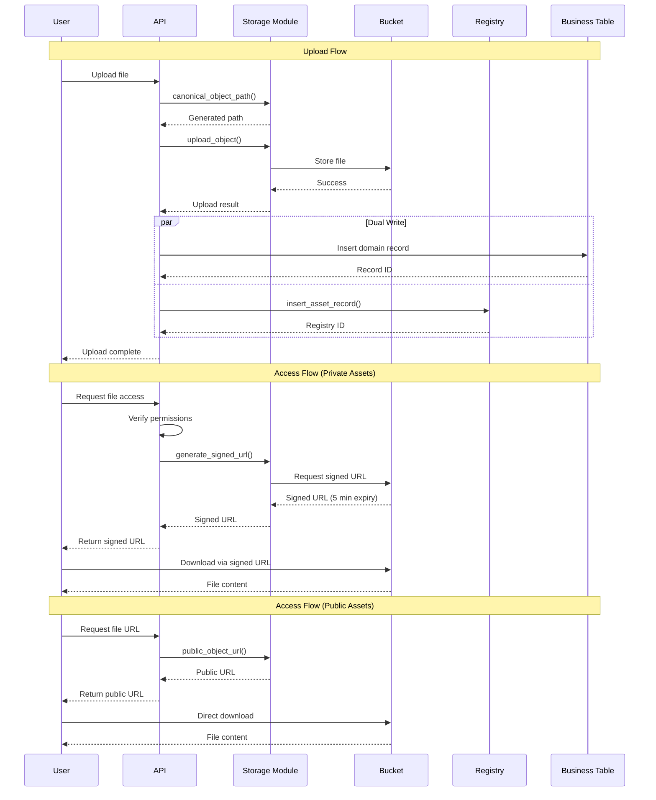
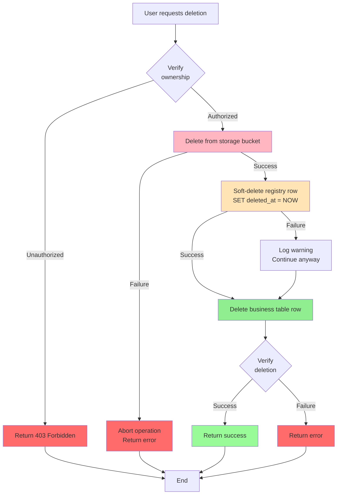
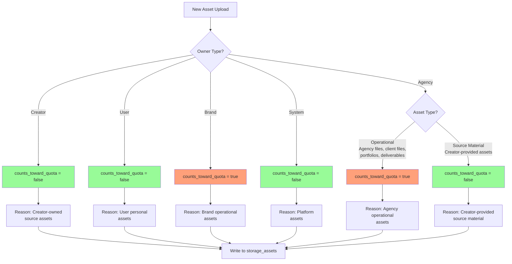
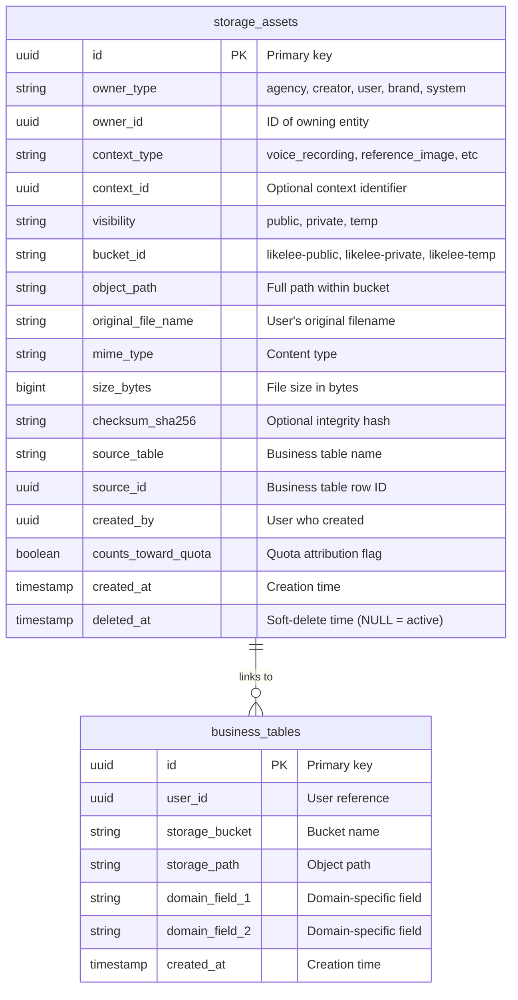
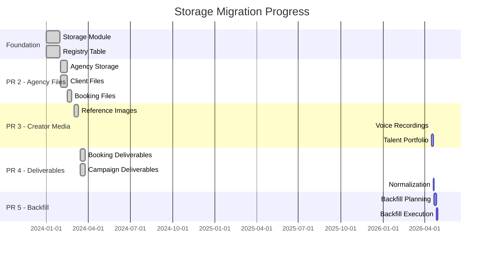

# Storage Organization Visual Guide

This document provides visual diagrams to understand the Likelee AI storage organization at a glance.

---

## Complete Storage Hierarchy

```mermaid
graph TB
    ROOT[Likelee AI Storage]

    ROOT --> PUBLIC[likelee-public<br/>Public Bucket]
    ROOT --> PRIVATE[likelee-private<br/>Private Bucket]
    ROOT --> TEMP[likelee-temp<br/>Temporary Bucket]

    subgraph "Public Assets - Direct URL Access"
        PUBLIC --> PUB1["creators/{id}/reference-images"]
        PUBLIC --> PUB2["agencies/{id}/talents/{tid}/portfolio"]
        PUBLIC --> PUB3["agencies/{id}/talents/{tid}/assets"]

        PUB1 --> PUB1A[Creator-owned<br/>No quota]
        PUB2 --> PUB2A[Agency-owned<br/>Counts quota]
        PUB3 --> PUB3A[Agency-owned<br/>Counts quota]
    end

    subgraph "Private Assets - Signed URL Access"
        PRIVATE --> PRIV1["agencies/{id}/storage"]
        PRIVATE --> PRIV2["agencies/{id}/clients/{cid}/files"]
        PRIVATE --> PRIV3["users/{id}/voice-recordings"]
        PRIVATE --> PRIV4["agencies/{id}/bookings/{bid}/files"]
        PRIVATE --> PRIV5["agencies/{id}/booking-campaigns/{cid}/deliverables"]
        PRIVATE --> PRIV6["agencies/{id}/talents/{tid}/tax-documents"]
        PRIVATE --> PRIV7["brands/{id}/voice-assets"]

        PRIV1 --> PRIV1A[Agency-owned<br/>Counts quota]
        PRIV2 --> PRIV2A[Agency-owned<br/>Counts quota]
        PRIV3 --> PRIV3A[User-owned<br/>No quota]
        PRIV4 --> PRIV4A[Agency-owned<br/>Counts quota]
        PRIV5 --> PRIV5A[Agency-owned<br/>Counts quota]
        PRIV6 --> PRIV6A[Agency-owned<br/>Counts quota]
        PRIV7 --> PRIV7A[Brand-owned<br/>Counts quota]
    end

    subgraph "Temporary Assets - Internal Only"
        TEMP --> TEMP1[Staged uploads]
        TEMP --> TEMP2[Processing artifacts]
        TEMP --> TEMP3[Preview generation]
    end

    style PUBLIC fill:#90EE90
    style PRIVATE fill:#FFB6C1
    style TEMP fill:#FFE4B5
    style PUB1A fill:#98FB98
    style PUB2A fill:#FFA07A
    style PUB3A fill:#FFA07A
    style PRIV1A fill:#FFA07A
    style PRIV2A fill:#FFA07A
    style PRIV3A fill:#98FB98
    style PRIV4A fill:#FFA07A
    style PRIV5A fill:#FFA07A
    style PRIV6A fill:#FFA07A
    style PRIV7A fill:#FFA07A
```



**Legend**:

- 🟢 Green = No quota (creator/user-owned source assets)
- 🟠 Orange = Counts quota (agency/brand-owned operational assets)

---

## Storage Flow: Upload to Access



---

## Deletion Flow with Audit Trail



**Key Points**:

- Storage deletion is **STRICT** - must succeed
- Registry soft-delete preserves audit trail
- Business table deletion is final
- Verification ensures consistency

---

## Quota Attribution Decision Tree



---

## Asset Type Comparison Table

| Asset Type                | Owner   | Bucket  | Visibility | Quota  | Path Example                                                |
| ------------------------- | ------- | ------- | ---------- | ------ | ----------------------------------------------------------- |
| 📁 **Agency Storage**     | Agency  | Private | Private    | ✅ Yes | `agencies/123/storage/contracts/file.pdf`                   |
| 📄 **Client Files**       | Agency  | Private | Private    | ✅ Yes | `agencies/123/clients/456/files/doc.pdf`                    |
| 🎭 **Talent Assets**      | Agency  | Public  | Public     | ✅ Yes | `agencies/123/talents/789/assets/photo.jpg`                 |
| 📸 **Talent Portfolio**   | Agency  | Public  | Public     | ✅ Yes | `agencies/123/talents/789/portfolio/headshot.jpg`           |
| 📋 **Booking Files**      | Agency  | Private | Private    | ✅ Yes | `agencies/123/bookings/456/files/brief.pdf`                 |
| 📦 **Deliverables**       | Agency  | Private | Private    | ✅ Yes | `agencies/123/booking-campaigns/456/deliverables/video.mp4` |
| 🖼️ **Reference Images**   | Creator | Public  | Public     | ❌ No  | `creators/abc/reference-images/section1/portrait.jpg`       |
| 🎤 **Voice Recordings**   | User    | Private | Private    | ❌ No  | `users/xyz/voice-recordings/sample.webm`                    |
| 💼 **Tax Documents**      | Agency  | Private | Private    | ✅ Yes | `agencies/123/talents/789/tax-documents/w9.pdf`             |
| 🎵 **Brand Voice Assets** | Brand   | Private | Private    | ✅ Yes | `brands/456/voice-assets/jingle.mp3`                        |

**Color Key**:

- ✅ Green = Counts toward quota
- ❌ Red = Does NOT count toward quota

---

## Path Structure Breakdown

```
┌─────────────────────────────────────────────────────────────────────┐
│  Full Path Example:                                                 │
│  agencies/550e8400/talents/talent-123/portfolio/1234567890_photo.jpg│
└─────────────────────────────────────────────────────────────────────┘
     │         │          │          │            │            │
     │         │          │          │            │            └─ Sanitized filename
     │         │          │          │            └────────────── Timestamp (ms)
     │         │          │          └─────────────────────────── Context ID
     │         │          └────────────────────────────────────── Context type
     │         └───────────────────────────────────────────────── Owner ID
     └─────────────────────────────────────────────────────────── Owner type

Components:
1. Owner Type:  agencies, creators, users, brands, studio
2. Owner ID:    UUID or identifier of the owning entity
3. Context:     Specific asset category (talents, storage, voice-recordings)
4. Context ID:  Optional sub-context (talent ID, section ID, etc.)
5. Timestamp:   Milliseconds since epoch (prevents collisions)
6. Filename:    Sanitized original filename
```

---

## Storage Registry Schema



**Key Relationships**:

- `storage_assets.source_table` → Business table name
- `storage_assets.source_id` → Business table row ID
- One business row → One registry row (1:1)
- Registry preserves history via soft-delete

---

## Migration Status Overview



**Status Legend**:

- ✅ Done (Green)
- 🔄 Active (Blue)
- ⏳ Pending (Gray)

---

## Quick Reference: Where Things Live

### Public Assets (Direct URL)

```
likelee-public/
├── creators/
│   └── {creator_id}/
│       └── reference-images/
│           └── {section_id}/
│               └── {timestamp}_{filename}
│
└── agencies/
    └── {agency_id}/
        └── talents/
            └── {talent_id}/
                ├── portfolio/
                │   └── {timestamp}_{filename}
                └── assets/
                    └── {timestamp}_{filename}
```

### Private Assets (Signed URL)

```
likelee-private/
├── users/
│   └── {user_id}/
│       └── voice-recordings/
│           └── {timestamp}_{filename}
│
├── agencies/
│   └── {agency_id}/
│       ├── storage/
│       │   └── {folder_path}/
│       │       └── {timestamp}_{filename}
│       ├── clients/
│       │   └── {client_id}/
│       │       └── files/
│       │           └── {timestamp}_{filename}
│       ├── bookings/
│       │   └── {booking_id}/
│       │       └── files/
│       │           └── {timestamp}_{filename}
│       ├── booking-campaigns/
│       │   └── {campaign_id}/
│       │       └── deliverables/
│       │           └── {timestamp}_{filename}
│       └── talents/
│           └── {talent_id}/
│               └── tax-documents/
│                   └── {timestamp}_{filename}
│
├── brands/
│   └── {brand_id}/
│       └── voice-assets/
│           └── {timestamp}_{filename}
│
└── studio/
    └── campaigns/
        └── {campaign_id}/
            └── documents/
                └── {timestamp}_{filename}
```

---

**Document Purpose**: Visual reference for understanding storage organization  
**Audience**: Developers, Product Managers, Operations  
**Last Updated**: 2026-04-15  
**Related**: `docs/storage-architecture.md` (detailed documentation)
